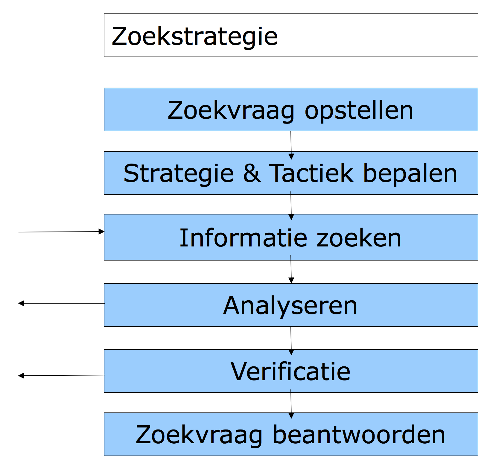

% Samenvatting IBROZ
% Mathijs Bernson

# Samenvatting IBROZ

## Informatie

* Studiepunten: 3 ECTS
* Studiebelasting: 84 SBU
* Modulecode: IBROZ, eerder bekend als IFINR

## Literatuur

* The Shallows, Nicholas Carr - ISBN 9780393339758 (niet verplicht)
* Slides
* Handboek Internetresearch, Arjan Dasselaar (verplicht)

## Leerdoelen

De student kan:

* de opbouw van het internet benoemen en deze kennis inzetten ten
behoeve van zijn/haar onderzoeksstrategie
* de werking van (internet) zoekmachines benoemen en hiermee effectief gebruik maken van deze zoekmachines
* de invloed van het schrift (sinds invoering in de tijden van Plato e.a) op het menselijk brein duiden.
* de basisregels voor anonimiteit op het internet benoemen en met behulp van enige tools en het toepassen van specifiek gedrag zijn anonimiteit op het internet in de basis waarborgen
* met behulp van freemind een onderzoeksstrategie ontwikkelen en met behulp van freemind een onderzoek gestructureerd vastleggen
* de werking, sturing en gebruik van enkele verschillende typen spiders benoemen en toepassen
* enige tools ten behoeve van internetonderzoek benoemen en toepassen
* kan de maatschappelijke betekenis en invloed van het internet benoemen
* diverse internetbronnen gebruiken
* nieuwe internetbronnen op effectieve wijze op te zoeken
* Search Engine Optimization (SEO) inzetten t.b.v. zoekstrategie
* De invloed van het internet op het denken. Vanuit historisch perspectief en hedendaagse metingen en waarnemingen. (Bron: Het Ondiepe)
* enige wettelijke aspecten benoemen van internetonderzoek

## Inhoud

* [Internetonderzoek](#internetonderzoek)
	* [Waarom internetonderzoek?](#waarom-internetonderzoek)
	* [Opdracht: belangen in journalistiek](#opdracht-belangen-in-journalistiek)
* [Zoekmachines](#zoekmachines)
	* [Gebruik van zoekmacines](#gebruik-van-zoekmacines)
	* [Deep web &amp; IANA](#deep-web-iana)
* [Hoe het internet werkt (min of meer)](#hoe-het-internet-werkt-min-of-meer)
* [Anonimiteit](#anonimiteit)
	* [Datacollectie](#datacollectie)
	* [Onion routing](#onion-routing)
	* [Mix-cascade](#mix-cascade)
* [Invloed van het internet op mensen](#invloed-van-het-internet-op-mensen)
	* [Lezen](#lezen)

## Mindmapping

Aanbevolen om te gebruiken bij bronnenonderzoek. Ook bij dit vak en andere vakken zeker nuttig.

## Internetonderzoek

### Waarom internetonderzoek?

Internet als bron bij onderzoek. Onderzoek t.b.v.:

* Open bronnen
* Intelligence
* Trends

Moraal van het verhaal: vertrouw niet zomaar alles.
Zowel bij het geschreven woord als bij online bronnen en software moet je nadenken over:

* Wie/wat is de bron?  
* Authenticiteit
* Autoriteit
* Wie heeft geschreven/gemaakt?
* Wie is de publicist?
* Wie is de distributeur?

Foute bronnen zijn het gevolg van gemakzucht of goedgelovigheid.
Blijf critisch! Dubbelcheck alles. Eén bron is geen bron. Twee bronnen zijn een halve bron. Drie bronnen zijn een goede bron.

O.a. layout, design, naamgeving en schrijfstijl helpen bij het misleiden van de lezer. Denk bij schrijfstijl bijv. aan speld.nl.

### Opdracht: belangen in journalistiek

Wat is de rol van:

* Auteurs
* Uitgevers
* Publicisten
* Journalisten

Breng dit m.b.v. een mindmap in kaart.

### Zoekstrategie

## Zoekmachines

Zoekmachines zijn belangrijk bij het doen van een bronnenonderzoek.

Ze werken met 3 stappen:

1. Spiders/crawlers
	* Lopen systematisch het web af
	* Haalt de inhoud van webpagina's op
2. Indexeren
	* Tekst
3. Zoeken
	* Zoekprogramma
	* Zoekopdracht
	* PageRank
	* Info presenteren

Zoekmachines hebben ook beperkingen. Websites kunnen hun inhoud opt-outen uit zoekmachines d.m.v. `robots.txt`. De inhoud staat er nog steeds, maar het zal door alle (bonafide) zoekmachines worden overgeslagen.
De `robots.txt` is echter voor iedereen leesbaar, dus iedereen kan zien wat je probeert te verbergen!

Als er nergens naar een bepaalde pagina/site wordt toe gelinkt, zullen zoekmachines het waarschijnlijk ook niet vinden.

Sites die de diep gaan of te groot zijn (vele duizenden op elkaar lijkende pagina's) zullen standaard niet diep geïndexeerd worden. Pas als er veel belangstelling naar de site ontstaat zal bijv. Google slim genoeg zijn om meer te indexeren.

Databases die niet/amper aan het web gekoppeld zijn zullen vanzelfsprekend niet in zoekmachines verschijnen.
Denk aan databases met onderzoeksmateriaal/papers, of interne databases van bibliotheken. Hier zul je zelf naartoe moeten gaan om ze te doorzoeken.

### Gebruik van zoekmacines

Gebruik:

* Verschillende zoekmachines
* Geavanceerd zoeken
	* Verfijn je criteria
* Booleaanse operatoren
* "In Cache", kan handig zijn

Kijk uit voor:

* Metazoekmachines
* Land-/locatie gebonden zoekmachines

### Deep web & IANA

*Dit zelf researchen*

## Hoe het internet werkt (min of meer)

Vanuit gebruikers perspectief

## Anonimiteit

We spreken van **anonimiteit** als de identiteit van een persoon niet bekend is,
of als hij/zij die niet bekend wil maken.
Het woord "anoniem" komt van het Griekse *anoonumos*, wat 'zonder naa, ongenoemd' betekent.

Naarmate het internet belangrijker wordt in onze samenleving, zal de behoefte aan anonimiteit steeds groter worden.
Soms is het beter als je echte naam niet vast zit aan wat je doet.

Je anonimiteit wordt bepaald door drie factoren:

1. Software (instellingen)
	* OS instellingen, firewall
	* Browser
		* Cookies (tracking cookies en supercookies)
2. Infrastructuur
	* IP-adres zegt al veel / is identificerend
		* Te maskeren met VPN, [TOR](#onion-routing), [cascade](#mix-cascade) of proxy
		* Of ga op een openbaar netwerk zitten
3. Gedrag

### Datacollectie

TODO

### Onion routing

Bij *onion routing* 

### Mix-cascade

Mix-cascade zijn ketens van [proxy-]servers (mixes) die versleutelde datapakketten van gebruikers doorsturen.
Pakketten zijn zo inelkaar versleuteld dat alleen de laatste server ze [volledig] kan ontsleutelen.
Pakketten worden eerst verzameld, en dan in willekeurige volgorde doorgestuurd.

## Invloed van het internet op mensen

> The medium is the message

Understanding media (McLuhan), 1964

Volgens McLuhan vormt een medium de "schaal en vorm van menselijke associatie en actie".

Op de lange duur heeft het medium zelf **meer invloed** op onze manier van denken en handelen dan de **inhoud** van dat medium.

Onze aandacht voor de inhoud van een medium kan ons blind maken voor de effecten die het medium zelf op ons heeft.
We maken ons wijs dat het gaat om de **manier waarop** we het medium gebruiken. Terwijl het **feit dat** we het medium gebruiken al alle verschil maakt. [eigen mening]

### Lezen

Het "vergrote bewustzijn" dat je nodig hebt om te lezen was in de tijd van Plato (en eeuwen daarna) voorbehouden aan een elite.
Voordat de massa kon profiteren van de cognitieve voordelen van het alfabet, moest eerst een andere reeks intellectuele technologieën uitgevonden worden, op het gebied van de transcriptie, productie en verspreiding van geschreven werken. [slides]

Spreken had eerst nog een sterke invloed op hoe er werd geschreven en gelezen. Zo werden tabletten en rollen bijna altijd hardop gelezen.
Het stil lezen werd aanvankelijk gezien als **vreemd gedrag**.

Het geschreven woord begon als transcripties van spraak. Zo werden woorden aan elkaar geplakt en was er amper interpunctie.
Het ontbreken van dit, en andere conventies leidde tot **extra cognitieve last** bij de eerste lezers. Dit leidde weer tot meer neurale activiteiten.

Men is van nature in een **staat van afleiding**. De mentale discipline om een lang boek in stilte te lezen, was moeilijk om te ontwikkelen.

#### Verandering

Socrates dacht dat het schrift ons tot "oppervlakkige denkers" zou maken, omdat we dingen buiten ons innerlijk geheugen zetten.
Hij vreesde dat we zodoende niet de intellectuele diepgang bereiken die leidt tot wijsheid en waar geluk.

Boeken stellen mensen in staat om hun gedachten en ervaringen te **vergelijken**, - niet alleen met religieuze concepten (ingebed in symbolen of verwoord door de geestelijkheid) maar ook met de gedachten en ervaring van anderen.

#### Nieuwe tijd

De wereld van het scherm is weer heel anders dan die van de bladzijde. Een nieuwe **intellectuele ethiek** dient zich aan. **Opnieuw** worden de paden in onze hersenen verlegd.