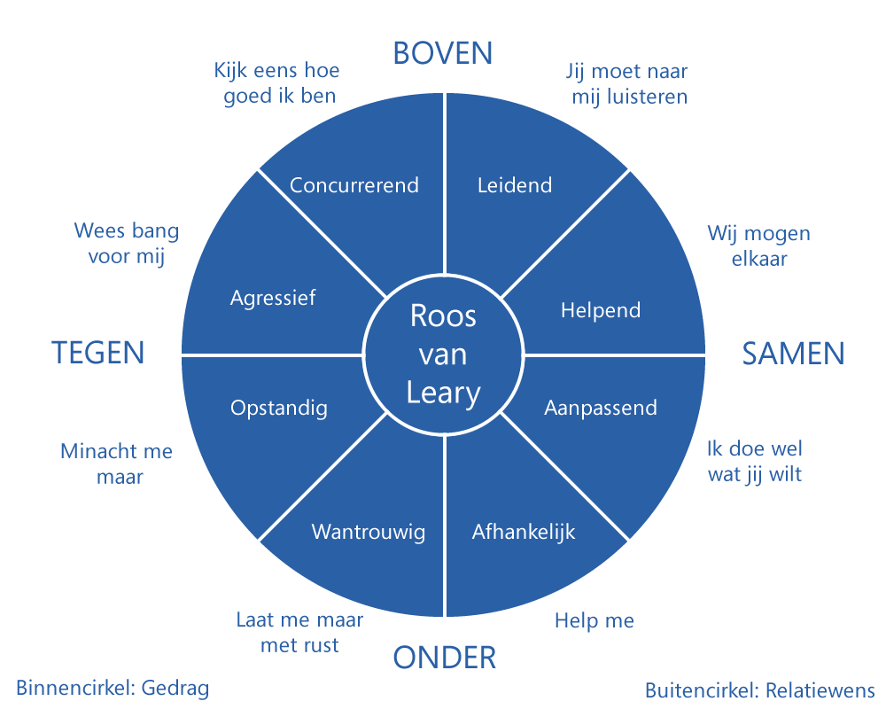
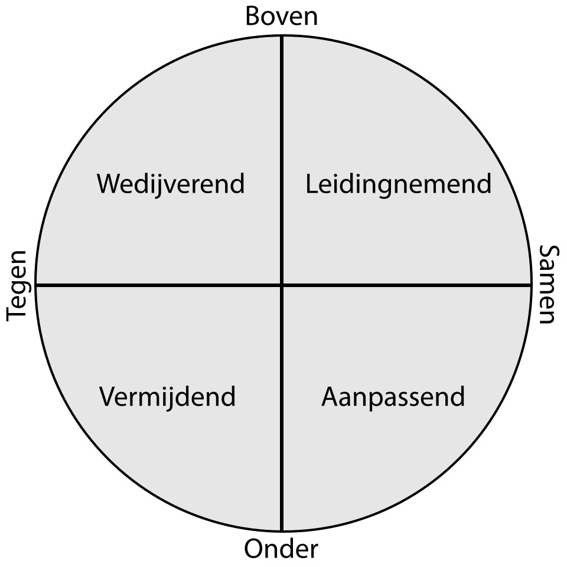

% Samenvatting ICOMMH
% Mathijs Bernson

## Portfolio opdrachten

* Opdracht 1 - Opname van een projectgroep vergadering
* Opdracht 2 - Beschrijf een situatie waarin je een onderhandeling moest voeren
* Opdracht 3 - Adviseren en implementeren - Zie casus op ELO
* Opdracht 4 - Omgaan met weerstand - Zie casus op ELO
* Opdracht 5 - Zet in portfolio: vacature, profiel, basis CV, CV op maat, sollicitatiebrief, opname van elevator pitch

Portfolio opleveren als PDF. Moet in periode 3 af zijn.

## Inhoud

### Herhaling propedeuse

* [Bekwaam/onbekwaam](#bewustonbewust-bekwaamonbekwaam)
* [LSD](#lsd)

* Kennismaken met samenwerken
* [Theorie Tuckman](#tuckman)
* [Belbin teamrollen](#belbin-teamrollen)
* Waarnemen en interpretatie
* [Roos van Leary](#roos-van-leary)
* [Communicatiestijlen](#communicatiestijlen)
* [Vergaderen en besluitvorming](#vergaderen-en-besluitvorming)
* [Conflicthantering](#conflicthantering)
* [Feedback geven en ontvangen](#feedback)

## Bewust/onbewust bekwaam/onbekwaam

Elk leerproces, waaronder dat van communiceren bestaat uit de volgende stappen:

### Stap 1: onbewust-onbekwaam

Je bent je niet bewust van wat er mist, en doet dus maar wat. Er wordt niet nagedacht over dingen en men is er niet bewust mee bezig.

### Stap 2: bewust-onbekwaam

Je beseft dat je iets nog niet goed beheerst en er nog het e.e.a. te leren valt.

Er wordt pijnlijk duidelijk waar de knelpunten zitten. Je zelfvertrouwen kan hierdoor een deuk oplopen, maar het is noodzakelijk om door te kunnen naar de derde stap.

### Stap 3: bewust-bekwaam

Je bent bewust bezig met het leren van nieuwe vaardigheden en deze af en toe toe te passen.

### Stap 4: onbewust-bekwaam

## LSD

* Luisteren
* Samenvatten
* Doorvragen

## Schulz von Thun

Herhalen! Alweer vergeten.

## Belbin teamrollen

1. Bedrijfsman
	* Is een harde werker die dingen organiseert.
	* Houdt minder van nieuwe ideeën en is niet heel flexibel. 
2. Voorzitter
	* Is dominant en benut capaciteiten van anderen.
	* Doelgericht, maar niet alstijd even creatief/intelligent.
3. Vormer
	* Heeft veel energie, is gedreven, ambitieus en dynamisch.
	* Ongeduldig, drammerig en snel geïrriteerd
4. Plant
	* Onafhankelijke creatieveling met ideeën.
	* Geen oog voor praktische details, is slordig en gevoelig voor kritiek.
5. Brononderzoeker
	* Netwerker, is nieuwsgierig enthousiast en communicatief. Goed in improviseren.
	* Soms te optimistisch, snel veveeld en komt afspraken niet altijd goed na.
6. Monitor
	* Goed beoordelingsvermogen, kundig, kritisch, zakelijk, nuchter en voorzichtig.
	* Heeft vaak weinig inspiratie, weinig enthousiast. Kan grof en tactloos zijn.
7. Groepswerker
	* Denkt aan de menselijke kant, is diplomatiek en bevordert de teamgeest. Stimuleert sterke teamleden en helpt de minder sterke.
	* Kan geen moeilijke besluiten nemen, is vaak passief.
8. Zorgdrager (afmaker)
	* Ordelijk, kwaliteitsbewust, perfectionistisch. Maakt dingen af, stimuleert en controleert anderen.
	* Heeft moeite met delegeren en maakt zich soms teveel zorgen over details.
9. Specialist
	* Heeft veel vakkennis en probeert dit uit te breiden.
	* Is een solist die vaak blijft steken in technische details. Blijft binnen zijn vakgebied.

## Roos van Leary

> Mensen reageren op een voorspelbare manier op elkaar.

De roos van Leary is een manier om de reacties van mensen op elkaar te voorspellen. Het model richt zich uitsluitend op **hoe** iemand communiceert (betrekkingsniveau), en niet op **wat** hij inbrengt (inhoudsniveau).
De inhoud is puur en zakelijk waar het gesprek over gaat. Betrekking is hoe het wordt overgebracht. Denk aan woordkeuze, toon, verkleinwoorden. Het conflict zit 'm vaak in het laatste.

De verticale as verwijst naar hiërarchisch gedrag: wie neemt de leiding? ('Bovengedrag' en 'ondergedrag'). Het gaat hier **niet** om een formele hiërarchie, maar om hoe mensen dit interpreteren.

De horizontale as verwijst naar het klimaat waarin mensen met elkaar communiceren. Dit is een spectrum van 'samengedrag' tot 'tegengedrag'.

Het assenstelsel wordt in acht kwadranten verdeeld, die overeenkomen met acht soorten gedrag:

### Leary gedragsstijlen

In de praktijk is het makkelijker om te werken met een vereenvoudigde versie, bestaande uit vier gedragssoorten ipv acht.

* Leidingnemend
* Aanpassend
* Vermijdend
* Wedijverend

### Actie-reactie

* Onder roept boven op
geen initiatief, dan staat wel iemand om
* Boven roept onder op
leiding geven, dan volgen anderen
* Mee roept mee op
werken vanuit vertrouwen is aanstekelijk
* Tegen roept tegen op
ook die sfeer is besmettelijk

## Kernkwadranten van Ofman

Aantekeningen en slides hierin meenemen!

(Plaatje)

## Conflicthantering

### Escalatieladder van Glasl

* Fase 1 win-win
* Fase 2 win-lose
* Fase 3 lose-lose

(Plaatje)

### Fasen van conflicthantering

* Voorbereidingsfase
  * Wat wil ik bereiken?
  * Is de ander bereid om mee te werken?
  * Wat is het doel van de ander?
* Openingsfase
  * Waarom ben je bij elkaar, afspraken maken.
* Verkennende fase

* Onderhandelingsfase
* Afronding

## Feedback

## Tuckman

Forming storming etc

(Plaatje)

## Vergaderen en besluitvorming

## Communicatiestijlen

## Teams

Pijlers van een team

* Veiligheid
* Vertrouwen
* Ondersteuning

Een team is altijd een groep, maar een groep is niet altijd een team.