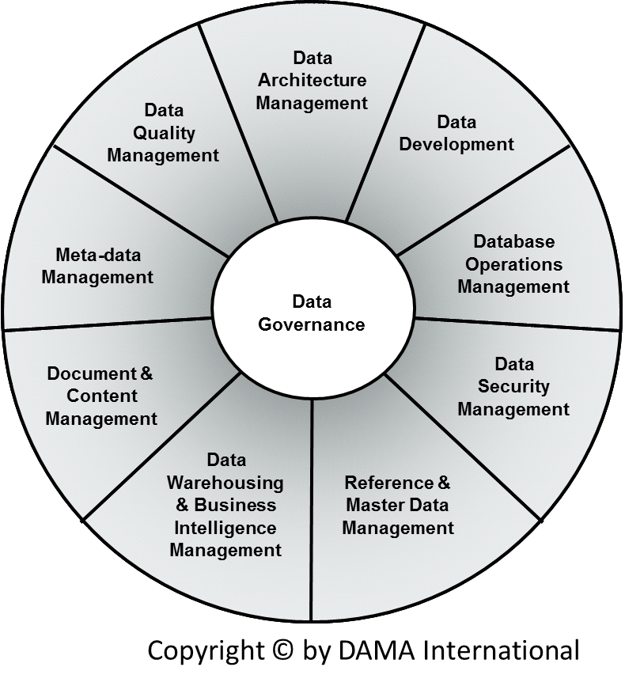

% Samenvatting IDAM
% Mathijs Bernson

# Samenvatting Inleiding Data Management

## Informatie

* Studiepunten: 3 ECTS
* Studiebelasting: 00 SBU
* Modulecode: IDAM (eerder bekend als IDAMA)

## Literatuur

* Master Data Management and Data Governance, Alex Berson, Larry Dubov - ISBN 9780071744584 
* Slides
* Materiaal op ELO

## Leerdoelen

De student leert tijdens de module een aantal componenten van het DAMA DMBOK Framework, te weten: 

* Inzicht in het belang van Data Management binnen de ICT en organisaties
* Kennis van het DAMA DMBOK Framework
* Toepassen Data Governance
* Toepassen van Data Architectuur, Analyse en Ontwerp 
* Toepassen van Data Quality Management
* Inzicht in trends en ontwikkelingen op het gebied van Data Management 

## Inhoud

**TODO**

## Inleiding

## Data Governance

## Data entry

## DMBOK Framework

## Data Architectuur, Analyse en Ontwerp 

## Data Quality Management

## Trends en ontwikkelingen

Op het gebied van data management.

### Big nogwattes

### Graph iets