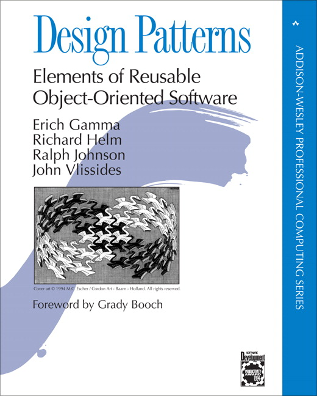

% Samenvatting IDPI
% Mathijs Bernson

## Inleiding Design Patterns

## Literatuur



* Design Patterns - ISBN 9780201633610
* Head First Design Patterns - ISBN 0596007124
* Slides

## Leerdoelen

De student leert Design Patterns toe te passen tijdens het ontwerpen en realiseren van software. Het gaat hierbij om de volgende 15 GoF-patterns:

Strategy, Observer, Decorator, Factory Method, Abstract Factory, Singleton, Command, Adapter, Facade, Template Method, Iterator, Composite, State, Proxy en MVC.

De student leert:

* Wat een Design Pattern is en wat de classificatie van Patterns is; 
* De werking en toepassing van deze 15 GoF (Gang of Four) Design Patterns in hun afzonderlijkheid.
* Vaardigheden in het analyseren van kleinschalige softwaresystemen op zowel functioneel als technisch niveau. 
* Om verbanden te leggen tussen de verschillende patterns en combinaties van patterns toe te passen. 

## Inhoudelijke beschrijving

De student leert Design Patterns toe te passen tijdens het ontwerpen en realiseren van software. Het gaat hierbij om 15 GoF-patterns.

Eerst worden de Patterns afzondelijkheid behandeld. Waartoe dient het Pattern, welk probleem wordt ermee opgelost, tot welke klasse behoort het Pattern.

Ook leert de student om verbanden te leggen tussen de verschillende patterns en combinaties van patterns toe te passen.

## Eindeisen

De student kan:

* Uitleggen wat een _design pattern_ is en wat de classificatie van patterns is.
* De werking en toepassing van de 15 GoF design patterns in hun afzonderlijkheid uitleggen.
* Verbanden leggen tussen de verschillende patterns en combinaties van patterns toepassen.

## Inhoudsopgave

* [Inleiding en introductie](#inleiding-en-introductie)
* [Termen](#termen)
	* [Single Responsibility Principle](#single-responsibility)
	* [Hollywood principle](#hollywood-principle)
	* [Tell, don't ask](#tell-dont-ask)
	* [Dependency injection](#dependency-injection)
* [Patterns](#patterns)
	* [Creational](#creational-patterns)
		* [Abstract factory](#abstract-factory)
		* [Singleton](#singleton)
		* [Factory method](#factory-method)
	* [Structural](#structural-patterns)
		* [Adapter](#adapter)
		* [Proxy](#proxy)
		* [Composite](#composite)
		* [Decorator](#decorator)
		* [Façade](#façade)
	* [Behavioral](#behavioral-patterns)
		* [Command](#command)
		* [Iterator](#iterator)
		* [Observer](#observer)
		* [Strategy](#strategy)
		* [Template Method](#template)
		* [State](#state)
	* [MVC](#mvc)

## Inleiding en introductie

### Wat zijn design patterns

> Een *design pattern* is een formele manier om een oplossing te documenteren voor een ontwerpprobleem in een bepaald veld.

> Binnen de software-ontwikkeling is een *design pattern* een generieke, herbruikbare oplossing voor een vaak voorkomend probleem (binnen een bepaalde context) in software-ontwerp.

### Waarom _design patterns_?

Het ontwerpen van OO-software is moeilijk, en om dit ook nog eens herbruikbaar te maken is nog moeilijker.

Tegenwoordig laat men vaak het idee van **herbruikbaarheid** (het hergebruiken van classes tussen projecten) vallen, en richt zich vooral op **onderhoudbaarheid** van software.

### Soorten patterns

We onderscheiden drie soorten van design patterns, *structural*, *creational* en *behavioral* patterns.

## Composition over inheritance

Inheritance breekt compositie. Compositie is flexibeler omdat de onderdelen uitwisselbaar zijn.

> Favor object composition over class inheritance.

(Gang of Four 1995:20)

**TODO**: *White-box reuse* wat betreft zichtbaarheid.

## Interface/implementation

> Program to an interface, not an **implementation**.

(Gang of Four 1995:18)

Volgens de GoF is dit een belangrijke eigenschap van goed OO software design, omdat:

* Clients zich niet bewust hoeven zijn van het specifieke object dat ze gebruiken.
* Clients zich niet bewust zijn van de class(es) van de implementatie, alleen de abstracte class(es) die de interface definiëren.

Het gebruik van een interface leidt ook tot *dynamic binding* en polymorfisme, wat centrale features van OOP zijn.

## Termen

### Single Responsibility Principle

Eén verantwoordelijkheid voor iedere *context* (class, functie, variabele).

### Hollywood principle

> Don't call us, we'll call you.

Het Hollywood principe is belangrijk als je class of component in een bestaand framework moet passen. Je hoeft alleen maar aan juiste interface(s) te voldoen, en het framework roept je op het juiste moment aan.
Je kunt het Hollywood principe zien als een speciale *tell don't ask*.

### Tell, don't ask

> Very very short summary: It is okay to use accessors to get the state of an object, as long as you don't use the result to make decisions outside the object. Any decisions based entirely upon the state of one object should be made 'inside' the object itself.

([http://c2.com/cgi/wiki?TellDontAsk](http://c2.com/cgi/wiki?TellDontAsk))

### Dependency injection

Het toepassen van constructor-injectie of setter-injectie om *Inversion of Control* te bereiken.

## Creational patterns

Creational patterns vormen een abstractie rond het instantiëren van objecten.
Hiermee kan een systeem onafhankelijk worden van hoe zijn objecten worden aangemaakt en samengesteld. Met dit laatste bedoelen we dat objecten kunnen worden opgebouwd met andere objecten (**composition**).

Naarmate je systeem meer gebruik maakt van compositie [in plaats van overerving], worden creational patterns belangrijk. In plaats van een vaste set hard gecodeerd gedrag te hebben, komt de nadruk te liggen op kleinere onderdelen, die je kunt samenstellen om complexer gedrag te maken.
Hierdoor komt er meer nadruk te liggen op het maken van objecten. Soms is dat moeilijker dan het simpelweg instantiëren van een class.

Alle creational patterns zijn gebaseerd op het principe van **tegen een interface** programmeren, niet tegen een implementatie.

Binnen creational patterns hebben we twee thema's. Als eerste kunnen we de concrete classes die het systeem gebruikt inkapselen. Dit is wat het [factory method pattern](#factory-method) doet.

De tweede maakt meer gebruik van compositie: we maken een object verantwoordelijk voor hoe de objecten gecreeërd en samengesteld worden. Dit object is zelf een parameter van het systeem; hij kan verwisseld worden.

### Abstract factory

Een *abstract factory* biedt een interface om families van gerelateerde (of afhankelijke) objecten te creëren, zonder dat je hun concrete classes hoeft te kennen.

#### Voorbeeld

Een user interface toolkit, die verschillende soorten *look-and-feels* moet ondersteunen. Voor iedere *look-and-feel* kan er een factory gemaakt worden, die widgets produceert. Zo hoeven de class-namen niet hard gecodeerd te worden.


#### Wanneer te gebruiken

Een abstract factory is handig wanneer een systeem niet afhankelijk moet zijn van hoe bepaalde objecte gecreëerd worden. Neem bijvoorbeeld een systeem met verschillende productfamilies, die uitwisselbaar moeten zijn.

Ook kun je met een abstract factory alleen de interface van de "producten" blootstellen, zonder de implementaties te onthullen.

### Singleton

Met het singleton pattern zorg je dat er precies één instance van een class bestaat, en er globale toegang tot die instance is. Deze toegang verloopt via één punt, waar de wrapper van de singleton controle over heeft.

Het pattern is nuttig bij objecten waarvan er maar één logische instantie bestaat. Zo is er altijd maar één window manager actief.

Echter werkt het singleton pattern als een *global variable*, wat iets slechts is. Als weinig andere objecten de singleton instance nodig hebben, zou je ook *dependency injection* kunnen gebruiken.

Voor het instantiëren van de singleton instance kan **lazy** of **eager** initialization toegepast worden.

### Factory method

Definieer een interface om een object te creëren, maar laat subclasses bepalen welke class er geïnstantieerd wordt.


#### Voorbeeld

Stel: een applicatie moet verschillende documenten kunnen openen en presenteren aan de gebruiker.

#### Wanneer te gebruiken

Factory method kan nuttig zijn wanneer een class niet van tevoren kan weten welke soort objecten het moet creëren.

## Structural patterns

Structural patterns gaan om **hoe** classes en objecten opgebouwd worden om complexere structuren te vormen.

Binnen de structural patterns maken onderscheid tussen *class*- en *object* patterns.

Structural *class* patterns maken gebruik van overerving om interfaces of implementaties samen te stellen. Het [adapter pattern](#adapter) is hier een voorbeeld van.

Bij structural *object* patterns wordt object compositie gebruikt om nieuwe functionaliteit te realiseren. Dit is flexibeler, omdat de compositie tijdens runtime kan veranderen.
Het [composite pattern](#composite) is een voorbeeld van een structural *object* pattern.

### Decorator

Een decorator voegt op dynamische wijze verantwoordelijkheden (functionaliteit) toe aan een object, zonder de class van dat object te beïnvloeden.

Deze uitbreiding van functionaliteit is doorgaans statisch, maar kan soms ook tijdens runtime gedaan worden.


Het pattern is zo ontworpen dat decorators genest kunnen worden.

### Adapter

Een adapter converteert een interface naar een andere interface. Dit maakt het mogelijk om classes samen te laten werken die anders incompatibele interfaces zouden hebben.

Een adapter kan toegepast worden d.m.v. compositie of met overerving.
Bij compositie heeft de adapter een referentie naar het adaptee-object, en stuurt daar de requests aan door:


Een extra voordeel hiervan is dat je de adaptee kan verwisselen voor een ander object met dezelfde interface. Het is echter niet mogelijk om gedrag van de adaptee te *overriden*.

Bij inheritance overerft de adapter van de adaptee, en voegt de benodigde methods daaraan toe:


Een class adapter zit vast aan één concrete class van de adaptee.
In tegenstelling tot een object adapter kan een class adapter gedrag van de adaptee *overriden*.

Voor de class adapter is maar één object nodig, namelijk de adapter zelf.

### Proxy

Een proxy is een class die werkt als interface voor iets anders. 

Het omhult een _subject_ en heeft controle over de toegang daartoe. Dit mechanisme kunnen we voor een aantal doeleinden gebruiken. Er zijn vier soorten proxies, die we hierna zullen noemen:

* Virtual proxy
* Remote proxy
* Security proxy
* Smart reference proxy

#### Virtual proxy

Neemt de plaats in van een complex of zwaar object, en creëert dit pas wanneer het nodig is. Voorbeeld: **image proxy**.

#### Remote proxy

Heeft te maken met een object dat ergens anders staat, bijvoorbeeld in een andere JVM (denk aan remote method invocation) of andere adresruimte.

De proxy is verantwoordelijk voor het doorsturen van de requests naar de *subject* op een andere locatie.

#### Security/protection proxy

Een security proxy bepaalt de toegang tot het _subject_. Het kan bijv. bepaalde methods afschermen.

#### Smart reference proxy

Voert extra acties uit wanneer je een object benadert. Zo kan het:

* Referenties naar het object tellen.
* Een *persistent object* in het geheugen laden wanneer je het voor het eerst referenced.
* Object locking uitvoeren.

### Façade

Een façade verhult een complex systeem en geeft daar één (eenvoudiger) interface voor.

Met het façade pattern wordt een systeem opgedeeld in subsystemen, om complexiteit tegen te gaan.

#### Wanneer te gebruiken

Als er veel afhankelijkheden tussen clients en implementaties zijn, kan het handig zijn om dit met een façade af te schermen van de rest van het programma.

Het pattern kan ook toegepast worden als je gelaagde subsystemen wilt hebben. Alle communicatie tussen deze lagen verloopt via façades.

#### Voorbeeld

Een **Compiler** class kan aantal andere objecten, zoals een **Scanner**, **Parser** en **CodeGenerator** verbergen. Hierbij weet de façada welke subsysteem classes er verantwoordelijk zijn voor een bepaald verzoek. De subsysteem classes bevatten de daadwerkelijke functionaliteit en ontvangen opdrachte van het façade object.

### Composite

Structureel pattern voor het samenstellen van een **boomstructuren** van objecten die samen een logisch geheel vormen.

Hierbij kennen we twee soorten objecten: *primitive* en *composite* (container) objecten. Beide soorten voldoen aan dezelfde interface (bijv. *component*).

Primitieve objecten zijn leaf nodes, met hun eigen specifieke functionaliteiten. Composite objecten kunnen primitieve objecten en andere composite objecten bevatten.
Hiermee kun je arbitrair complexe structuren bouwen, zonder dat er onderscheid tussen de objecten gemaakt hoeft te worden. Een *composite* object kan operaties aan zijn child nodes doorgeven, omdat hij weet dat ze allemaal aan dezelfde interface voldoen.
Er wordt dus **recursieve compositie** toegepast.


#### Voorbeeld

Een goed voorbeeld van het composite pattern is de volledige Java GUI-toolkit, Swing. Iedere widget overerft van de `JComponent` class. Dit definieert vaste operaties, zoals `draw()`.

## Behavioral patterns

Behavioral patterns houden zich bezig met het toewijzen van verantwoordelijkheden aan objecten. We beschrijven bij behavioral patterns niet alleen objecten en classes, maar ook hun onderlinge communicatie.

Ook hier maken we onderscheid tussen *behavioral class patterns* en *behavioral object patterns*. De eerste categorie maakt gebruik van inheritance om gedrag over classes te verdelen. [Template method](#template-method) is hier een voorbeeld van.

*Behavioral object patterns* maken gebruik van compositie om gedrag te verdelen. Het [observer](#observer) en [mediator](#mediator) pattern zijn hier voorbeelden van.

### Strategy

Bij het *strategy pattern* hebben we te maken met een reeks algoritmen die uitwisselbaar zijn.

Hier wordt "Encapsulate what varies" toegepast.

### Observer

Met het *observer pattern* kunnen meerdere objecten (**observers**) luisteren naar updates van een ander object (het **subject**). Het is een publish-subscribe model.

Het subject geeft veranderingen aan alle clients door. De clients kunnen vervolgens meer informatie aan het subject vragen.

Het observer pattern is nuttig wanneer meerdere objecten op de hoogte van veranderingen moeten blijven, dit geen vast aantal is.
Ook hoeft het *subject* niet te weten **wie** de objecten zijn die luisteren. Dit promoot *loose coupling*.


#### Voorbeeld

Meerdere views moeten een up-to-date weergave doen van één set data.

#### Voorbeeld 2

Een `Notification` class kan meerdere observers hebben die bepalen hoe deze verstuurd wordt. Zo kan er een `Mail` en een `SMS` observer toegevoegd worden.
De *manier waarop* de notificatie verzonden (die kan variëren) wordt staat los van de notificatie zelf.

### Command

command pattern is een encapsulation van het uit te voeren request.

### Iterator

Biedt een manier om in sequentie over een verzameling objecten (die in een *aggregate object* zitten) te wandelen, zonder de onderliggende implementatie te kennen.

Met het iterator pattern houd je de verantwoordelijkheid van toegang en *traversal* uit het *list* object en zet je het in een **iterator** object. Dit object houdt bij wat het huidige element is.

Iterators kunnen allerlei specifiek gedrag uitvoeren, zoals het filteren van de lijst. Deze zaken willen we niet in de list zelf hebben.

Het enige wat de iterator moet weten is dat het met een *list* te maken heeft, en niet met een ander soort datastructuur.

```java
interface List {
	count();
	append(element);
	remove(element);
}

interface ListIterator {
	first();
	next();
	isDone();
	currentItem();

	// Properties
	int index;
	List list;
}
```

#### Voorbeeld

`java.util.Iterator`

### Template Method

Eén class stelt een algoritme(s) vast, en roep daarvoor methods aan. Als je dergelijke methods override en zo het gedrag van het algoritme aanpast, pas je het _template pattern_ toe.

Het boek geeft hier een voorbeeld van een `Beverage`, met `Coffee` en `Tea` subclasses. Die overriden specifieke methods voor hun doeleinden.

### State

Behavioral pattern. Lijkt op het [strategy pattern](#strategy);

Met het *state pattern* kan het gedrag van een object veranderen afhankelijk van zijn interne staat.

Bij elke staat hoort een klasse, die allen aan dezelfde interface voldoen.

#### Voorbeeld

Een TCP-connectie kan in een aantal staten verkeren, waaronder *established*, *listening* en *closed*. Deze reageren elk anders op calls zoals `ack`, `open` en `close`. In plaats van dit met ingewikkelde control-flow op te lossen, is er voor elke staat een class die het gewenste gedrag inkapselt.

Voor bijvoorbeeld de staat *closed* zouden alle methods als no-op geïmplementeerd kunnen worden, aangezien een gesloten connectie niks kan.

### Mediator

**Dit is geen verplicht pattern voor dit vak!**

Bij het *mediator pattern* definiëren we een nieuw object dat  de samenwerking van een set andere objecten regelt.

In een OOP-systeem moeten objecten soms met veel andere objecten in contact staan. Met teveel verbindingen tussen objecten wordt de code moeilijker te hergebruiken, te onderhouden en te begrijpen.
Ook wordt het minder waarschijnlijk dat een object zelfstandig kan functioneren. Kortom, het systeem wordt monolithisch.

Dit probleem kunnen we vermijden door het collectief gedrag in een **mediator** object te verzamelen. Dit object is verantwoordelijk voor het besturen en coördineren van de interacties in een groep objecten.

### MVC

Model view controller. Eigenlijk geen GoF pattern?

#### Model

Data en _business logic_.

#### View

Alleen wat zichtbaar is voor de user. Geen logica.

#### Controller

Legt de koppeling tussen model en view.