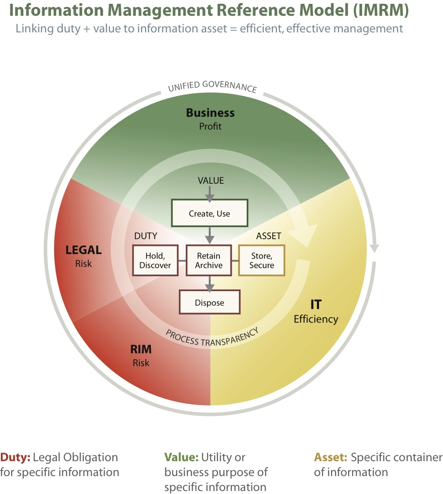

% Samenvatting IFIT
% Mathijs Bernson

# Inleiding Forensische ICT

## Stof

* Boek _Handbook of Digital Forensics and Investigation_ (verplicht)
	* pagina's 1-133	
	* pagina's 139-140
	* pagina's 209-245
	* pagina's 285-292
	* pagina's 301-339
* Slides van IFIT en IPFIT
	* Wat is FIT
	* Keeping the trail
	* E-discovery
* Readers
	* Threading
	* [Cryptologie](#cryptologie)
	* [NTFS](#ntfs)
	* [Steganografie](#steganografie)
	* [Filesystems](#filesystems)
* Werkcolleges
	* Processen en linking
	* [Cryptologie](#cryptologie)
	* [Steganografie](#steganografie)
	* Memory management en kernels
	* [Filesystems](#filesystems)
	* [Operating systems](#operating-systems)
	* Opslagstructuren

**Dit evt nog checken tegen de modulewijzer**

## Inhoud

* Het forensisch werkveld
* Het forensisch proces
* Basis recht
* [Computers en onderdelen](#computerkennis)
* Memory management
* [Bestandssystemen](#filesystems)
* Opslagstructuren
* [Encryptie](#encryptie)
	* [Cryptologie](#cryptologie)
	* [Steganografie](#steganografie)

## Introductie

### Abstractie

Computers, technologie zijn op elkaar gestapelde lagen van abstractie.

### Forensische achtergrond

Je moet altijd op een solide manier onderzoek uitvoeren. Als je  je onderzoek baseert op foute feiten, dan kan een bedrijf of persoon(en) ernstig in de problemen komen. Afhankelijk van jou onderzoek wordt er geoordeeld, en kan iemand in de gevangenis komen.

## Keeping the trail

### Bewijs

Het verzamelen van digitaal bewijs. Bewijs is informatie, gepresenteerd in een getuigenis of in documenten, dat gebruikt wordt om de rechter of jury te verleiden voor de ene of de andere partij te kiezen. Bewijsmateriaal kan zomaar verdwijnen. Kijk daarom goed uit wat je doet. Bewaar altijd alles en origineel.

Informatie draagt betekenis. Data niet. Data is het meervoud van "datum" (Engels). "Datum" betekent daarin _a statement accepted at face value_ (aangenomen tegen nominale waarde).

Digitale informatie kan heel aantrekkelijk zijn als bewijs. Echter brengt het een hoop complexiteit met zich mee.

### Categorieën

Je kunt data onderverdelen in drie hoofdcategorieën:

* Fysiek
	* Geschreven text op papier of andere objecten
* Mentaal
	* Uit het menselijk geheugen
	* Bijvoorbeeld een getuigenverklaring
* Digitaal
	* Bits op een elektronisch apparaat

### Evidence dynamics

_Evidence dynamics_ zijn de invloeden die de inhoud, plaats of verschijning van bewijs veranderen, tussen het moment van het delict en de rechtzaak.

Er zijn allerlei factoren waardoor dit kan gebeuren. Voorbeelden zijn:

* Opzettelijk
	* _De misdadiger_ die zelf zijn sporen probeert te verhullen.
* Per ongeluk
	* _Sysadmins_ die hun werk doen en daarmee per ongeluk bewijs vernietigen.
	* _Forensische examinatoren_ die zelf per ongeluk bewijs verstoren.
	* _Het slachtoffer_ die bijvoorbeeld e-mails weggooit omdat hij zich schaamt.
* Uit noodzaak
	* _Getuigen_ zoals een sysadmin die verdachte accounts verwijderd om een aanvaller buiten te sluiten.
* Van nature
	* Schade door _natuurlijke elementen_ of het weer. Opslagmedia die onbruikbaar raken door blootstelling aan modder, water, vuur of bloed.

### Analyse methoden

### Samengevat

Tijdens het forensisch proces vinden validatie en verificatie voorturend plaats.

## Chain of evidence

Draait om verificatie. Is bewijs wel daadwerkelijk bewijs?

## Chain of custody

Draait om **validatie**. Wordt het bewijs op de juiste manier verzameld en bewaard? Hoe reist een stuk bewijs (zoals data) van het plaats delict naar de rechtbank? Dat moet een **ononderbroken** keten zijn.

### Voorbeeld "kogel"

Er wordt op een plaats delict een afgevuurde kogel gevonden. Eerst wordt er een foto van de kogel gemaakt, met een identificatielabel erbij, verder zoals hij gevonden is. Vervolgens wordt de kogel in een zakje met hetzelfde identificatienummer gestopt. Er wordt nogmaals een foto van de plaats delict gemaakt zonder de kogel.

De kogel gaat naar het forensisch lab waar hij verder onderzocht wordt. Iedere keer dat er iets met de kogel gedaan wordt wordt dit bijgehouden.

Iedere stap op de weg (de _chain_) vanaf het moment dat het opgepakt wordt, is ononderbroken. Als er een foutje in zit, zoals iemand die zomaar iets met het bewijs doet en het niet vastlegt, (en dit dus niet verantwoord kan worden) dan is het bewijs ongeldig.

## Memory forensics

> Werkgeheugen uit elkaar gepulkt met Volatility.

## Collection methods

## Forensisch proces

7 Stappen:

* Preparation
	* Knowing the case
	* Profiling
	* Observer
	* Technical background
	* Jurisdication
	* ^ Juridisch kader vaststellen!
* Acquisition
* Processing -> Analysis
	* Identificeren:
		* wat is het?
		* files herkennen, reconstrueren.
	* Interpretatie:
		* index search and reading, programs.
	* Patronen onderzoeken: time-line, contact-circles, proces analyses.
* Verification
* Presentation
	* Rapporteren
	* Presenteren
	* Rechtbank
	* Testimony
* Archiving

Na elke stap wordt er nog eens **verificatie** uitgevoerd.

### Stap 1: Preparation

* Wat onderzoek je?
* Wat is de hoofdvraag?
* Kun je al een hypothese vormen?

#### Crime lab

In de voorbereidingsstap moet een _crime lab_ opgezet zijn, bestaande uit het volgende:

* Infrastructuur
* Hardware
* Software
* Menselijke protocollen
* 'Paper' trail
* Beveiliging
* Set up log

**Vanaf het begin** moet er gedocumenteerd worden. Dat brengt ons bij:

#### Loggen

Alles moet gedocumenteerd worden vanaf het begin! Voor een forensisch onderzoek houd je meerdere logboeken bij. In een team log worden gezamelijke acties bijgehouden. Inviduele acties komen in een individueel log.

**Hoe?** Loggen kan op papier, digitaal, of in de vorm van opgenomen geluid of video.

**Wat?** Alles wat van belang is moet gelogd worden. Zorg ook dat je hierbij de _7 w's van goed feitenonderzoek_ meeneemt!

1. Wie?
2. Wat?
3. Waar?
4. Waarmee?
5. Op Welke Wijze?
6. Wanneer?
7. Waarom?

#### Pre-investigation

Zorg dat je de zaak kent. Verzamel alle informatie die je nodig hebt.

### Classificeren van digitale data

Je krijgt te maken met allerlei verschillende soorten data.

* Communicatiedata
* Transactie/proces data
* Corporate Governance data
* Business Intelligence data
* Software

### Stap 2: Acquisition

In deze fase maakt je van data informatie. De data kun je op allerlei manieren verzamelen.

### Collectie methoden

* Imaging
* Forensische kopie
* Selectie en extractie
* Fysiek maken met getuigenis

### Stap 3: Processing

### Stap 4: Analysis

### Stap 5: Verification

**Verificatie**: is bewijs echt wel bewijs? -> [Chain of evidence](#chain-of-evidence)

**Validatie**: is het bewijs op de juiste manier verzameld en bijgehouden? -> [Chain of custody](#chain-of-custody)

### Stap 6: Presentation

* Verslag geven
* Presenteren
* Rechtbank
	* Rechtzaak
	* Getuigenis

### Stap 7: Archiving

Bewaren van:

* Data
* Bewijs
* Software
* Hardware (wanneer nodig)

Sommige zaken kunnen jaren duren. Na lange tijd kan ook de hardware verouderd/obsoleet zijn. Soms is het dus handig om dit te bewaren.

## Carving

Alle data die zich op een opslagmedium bevindt moet in het forensisch proces gered kunnen worden en omgezet naar een leesbare vorm.

> **File carving**: The practice of searching [an input for files or other kinds of objects] based on content, rather than on metadata.

Alternatieve definitie:

> **File carving** is the process of reassembling computer files from fragments in the absence of filesystem metadata.

Het zoeken door de verkregen data naar informatie die niet hersteld kan worden via de oorspronkelijke filesystem structuren.

Carving is niet hetzelfde als _file recovery_. Dat is namelijk het terughalen van een beschadigd bestand. Carving gaat alleen maar om bestanden uit rauw data halen. Daarbij wordt er niet naar het bestandssysteem gekeken. Zoals de naam doet vermoeden _carve_ je ("uithakken") een bestand uit rauwe data (een "rotsblok").

Neem bijvoorbeeld het FAT-[filesystem](#filesystems). Als hieruit een bestand verwijderd wordt, wordt er alleen maar een entry uit de tabel veranderd naar "unallocated space". De **inhoud** van het bestand blijft echter gewoon staan op de schijf.

Carving kan echter leiden tot zeer grote hoeveelheden data, omdat elke revisie van het filesystem bewaard moet blijven.

## E-discovery

E-discovery is de uitwisseling van data tussen partijen bij civiele of publieke procesvoering. Het proces wordt voornamelijk door advocaten gestuurd. Zij bepalen welke data er moet komen, op basis van relevantie. Forensisch onderzoekers zijn echter belangrijk vanwege hun tecnisch advies.

### Waarom e-discovery?

* Regulering (toezicht)
* Interne fraude opsporen
* Bedrijfsspionage opsporen
* Andere criminele activiteiten opsporen

### Waar wordt e-discovery gedaan?

* Beursgenodeerde ondernemingen
* Gereguleerde markten (banken, energie)
* Iedere andere partij

Kleine bedrijven kunnen ook tegenwoordig een heel erg goede kans met de masale data inzameling

### Fasen van e-discovery (EDRM)

### Information management

## Basis recht

### Rechtsgebieden

Het Nederlands rechtsstelsel is onderverdeeld in drie gebieden: 

* [Burgerlijk Recht](#burgerlijk-recht)
* [Bestuursrecht](#bestuursrecht)
* [Strafrecht](#strafrecht)

#### Burgerlijk recht

Wordt ook wel **civiel recht** of **privaatrecht** genoemd. Dit betreft alle juridische problemen tussen **burgers en/of organisaties** onderling.

De overheid heeft hier **geen** bemoeienis mee. De partij moet zelf de zaak onder aandacht brengen.

#### Bestuursrecht

Dit regelt de verhoudingen tussen **burgers en overheid** en tussen **overheidsinstanties onderling**. Dit alles is onderdeel van het publiekrecht. Hierin is alles verboden, tenzij de wet het toestaat.

#### Strafrecht

Strafrecht herken je aan de volgende punten:

* Er is een **overtreding of misdrijf** gepleegd.
* Er is een **dader en een slachtoffer**.
* Het slachtoffer treedt nooit op, maar het **OM**.

## Encryptie

(Full) disk-encryptie kan forensisch onderzoek heel moeilijk maken.

## Cryptologie

Valt Omwisselen van letters hieronder?

------------------------------------------

# Practisch gedeelte

## Steganografie

Het verbergen van een boodschap in een andere boodschap.

## Computerkennis

Kennis van de samenstelling/opbouw computers en onderdelen is vereist voor het kunnen onderzoeken en forensisch 'ontleden' ervan. Zowel software als hardware. Elk hebben hun eigen set problemen en uitdagingen.

## Filesystems

* FAT{12,16,32}
	* _Deprecated_
* exFAT
* [NTFS](#ntfs)
	* Microsoft
* Ext{2,3,4}
	* Linux
* HFS(+) -> Apple
* ISO-9660

* XFS, JFS -> Relatief onbekend
* ReiserFS

**inodes**

### NTFS

Standaard FS van MS OS'es.

De MFT (Master File Table) bevat info over directories en bestanden.

Multiple Data Streams, ook wel Alternate Data Streams.

indien het maken van een image niet mogelijk is -> kopiëren naar ander NTFS volume. Beter om een image te maken en die te carven.

### FAT32 en exFAT

Zijn vergelijkbaar, maar de maximale grootte van een volume is anders, 8Tb bij FAT32 vs. 128Pb bij exFAT.

### ISO-9660

Is een FS voor CD's en DVD's, gespecificeerd door ISO.

### Journaling

Wijzigingen bijhouden van bestanden in een aparte journal.

## Opslagstructuren

## Operating systems

### Windows

Registry

### Unix

Specificatie

MACD: Modification, Access Change en Delete

### Linux

Unix-like

`/etc/shadow` en `/etc/passwd`.

## Kernels

De kernel is brug tussen applicaties enerzijds en dataprocessing op [...]

### Monolithische kernel

### Microkernel

### Hybridekernel

## Tools

* Volatility
* Regripper
* John the ripper

### Forensische linuxdistributies

* DEFT
* Die ene die Fox-IT gebruikt

### Volatility

Een framework voor het analyseren van memorydumps.

### Regripper

Om registerbestanden te onderzoeken.

### John the ripper

Om wachtwoorden te kraken.