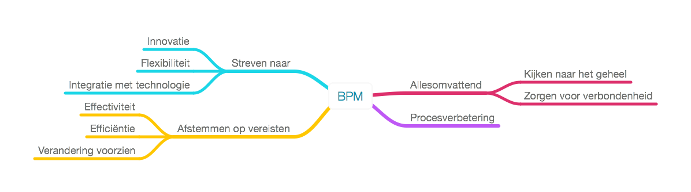
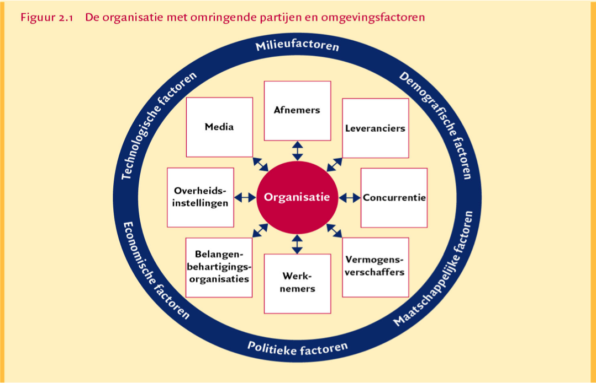
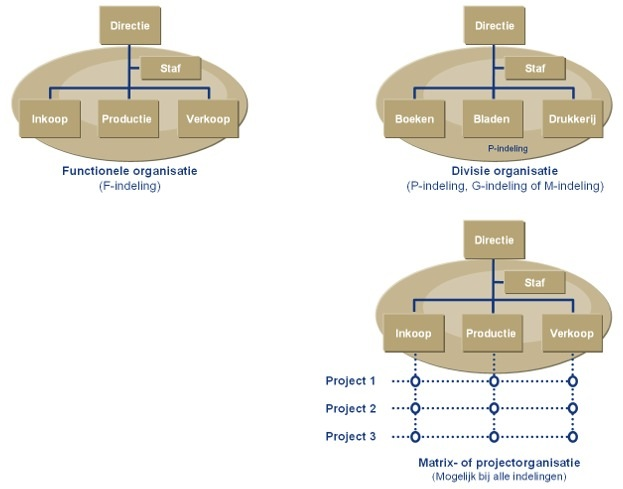
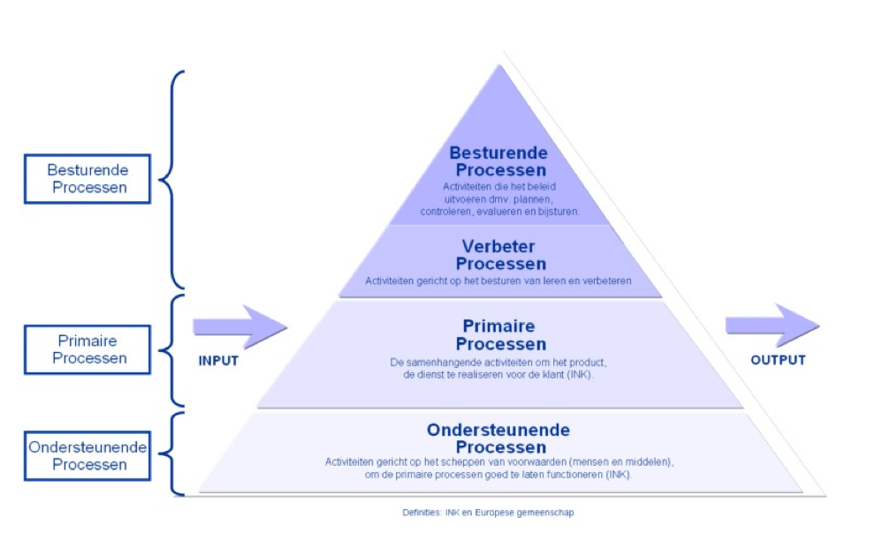
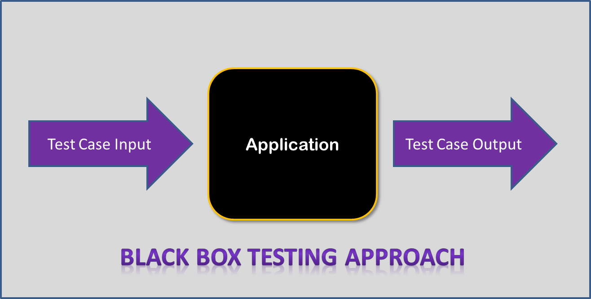
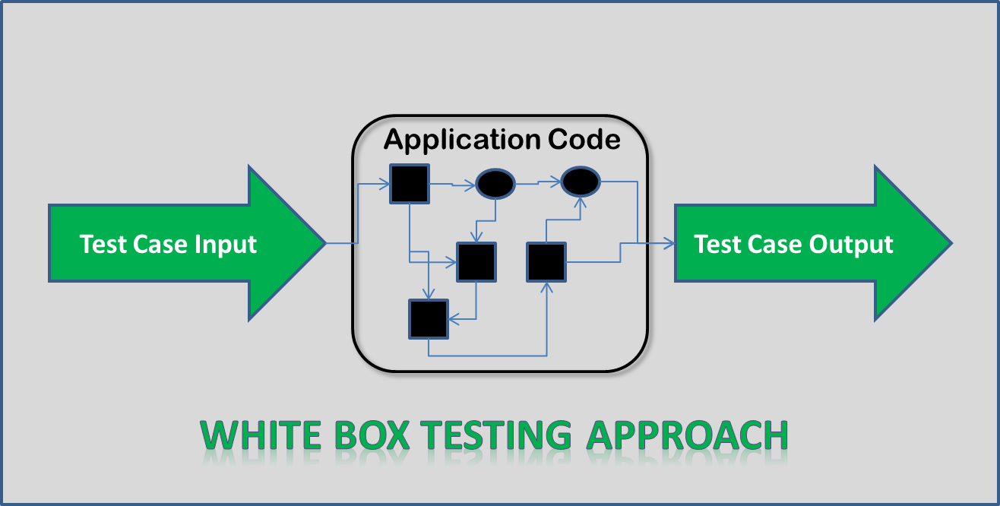
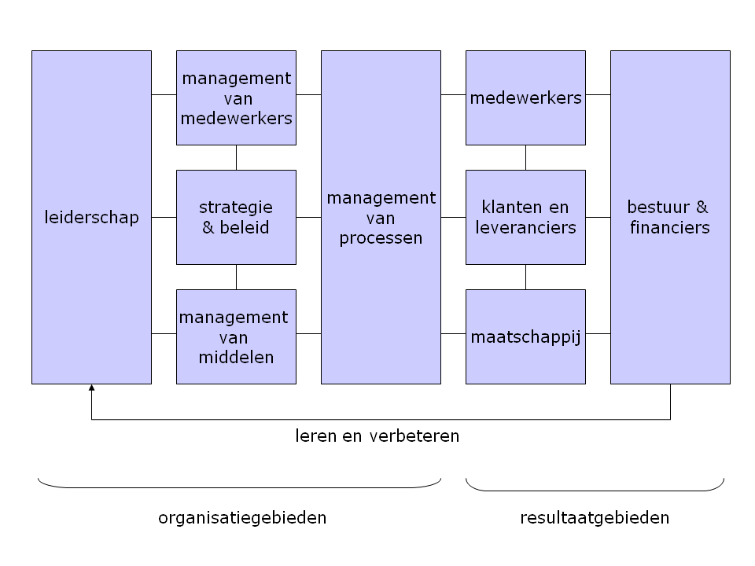
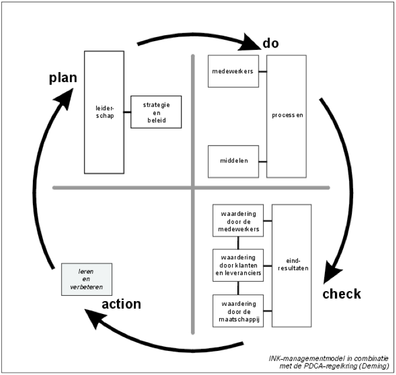
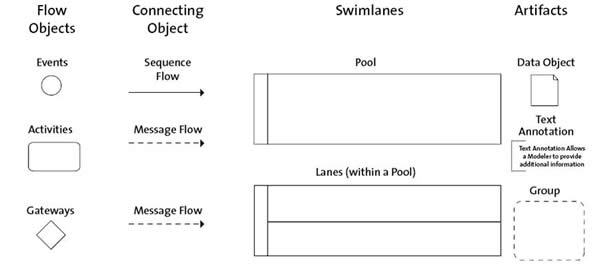

% Samenvatting IIBPM
% Mathijs Bernson

# Samenvatting IIBPM

## Kerninhoud om te leren

* Organisaties & processen
* Procesontwerp (met BPMN)
* INK model
* PI's en KPI's
* CRUD en RACI
* BPMN
* Samenvatting

## Belangrijke leerdoelen

* Een procesmodel op kunnen stellen
* Processen koppelen aan succesfactoren (KPI's)
* Valkuilen van KPI. Sleutelprocessen te bepalen.
* Een _CRUD_ en _RACI_ matrix op kunnen stellen.
* BPMN (modelleringsnotatie) toepassen.

## Boeken

* _Grip op processen in organisaties_
* _Business Process Model and Notation 2.0_

## Start

Business Process Management (BPM) is een management-aanpak, die staat voor het afstemmen van [aspecten van] een organisatie ten opzichte van de behoeften en vereisten van een cliënt.

De aandachtspunten hierbij zijn _effectiviteit_ en _efficiëntie_. Daarnaast wordt er gestreefd naar _innovatie_, _flexibiliteit_ en _integratie met technologie_ met behulp van IT.

De aanpak is "Holistisch" (Alomvattend). Men kijkt dus naar het geheel. Zorgen voor verbondenheid van de delen van een systeem. Een vervlochten geheel van facetten.

BPM beoogt het (continu) verbeteren van processen.

## Kernvragen

* Hoe kunnen we omgaan met continu veranderende eisen aan processen?

## Organisatie

> Menselijke samenwerking voor een gemeenschappelijk doel.

Een organisatie is een vorm van menselijke samenwerking met een gemeenschappelijk doel. Een organisatie in deze zin is een zelfstandig, geordend geheel van mensen en middelen die bepaalde processen uitvoeren.

Een bedrijf is een organisatie die aan andere personen producten levert of diensten verleent. Een organisatie hoeft niet per se een bedrijf te zijn, maar een bedrijf is wel altijd een organisatie.

Organisaties bestaan omdat bepaalde doelstellingen niet door een individu alleen gerealiseerd kunnen worden.

### Invloeden

Organisaties worden beïnvloed door allerlei factoren [uit hun omgeving].

### Complexiteit reductie

_Dit verder uitwerken. Waar slaat het precies op?_

**Span of control**: het aantal mensen dat een manager of andere leidinggevende onder zich heeft.

**Interne differentiatie**: indeling op basis van de fase of aard van de werkzaamheden in het productieproces (gelijksoortigheid), een (F)unctionele indeling.

**Interne specialisatie**: indeling op basis van het eindresultaat, (P)roduct-indeling, M(arkt)-indeling en (G)eografische-indeling.

### Bedrijfskundige criteria

**Effectiviteit (doelgericht)**: De mate waarin gestelde doelen bereikt worden.

**Efficiëntie (doelmatig)**: De mate waarin middelen gebruikt worden om gestelde doelstellingen te bereiken. (Ofwel zo weinig mogelijk productiefactoren (input) gebruiken voor een bepaald doel (output).)

### Organisatiestructuren

* Functionele organisatie
* Divisie-organisatie
* Matrix-organisatie

## Proces

> Processen zijn reeksen gebeurtenissen geordend in de tijd en plaatshebben in of verbonden aan materiële systemen.

Processen worden binnen procesmanagement ook wel in een genest model gezien, het PAM of **Proces Architectuur Model**.

Net als bij een activiteit in `ISMI` heeft een proces een _input_, welke _getransformeerd_ wordt en resulteert in _output_.

### Soorten processen

#### Primaire processen

Primaire processen zijn alle activiteiten die rechtstreeks een bijdrage leveren aan de totstandkoming van producten of diensten. Het is primair omdat het resulteert in het doel van de onderneming.

#### Secundaire processen

Ook wel ondersteunende processen genoemd. Deze worden uitgevoerd om de productiefactoren in stand te houden. De processen vormen geen doel op zich, maar moeten de primaire processen goed en ongestoord laten verlopen.

#### Besturende processen

De besturende processen geven voor een belangrijk deel richting aan de primaire en seduncaire processen. Ze richten de organisatie op de gestelde doelstellingen.

### Project en proces

Een project is:

* Uniek
* Eenmalig
* Tijdsgebonden
* Eindig
* Onzeker
* Heeft veel budget
* Vereist veel denkwerk

Een proces is echter:

* Repeterend
* Massaal uitgevoerd
* Minder tijdsgebonden
* Niet eindig (doorlopen)
* Heeft zekerheid
* Heeft een beperkt budget
* Goed te automatiseren

## Systeem(theorie)

Een systeem is:

> Een binnen de totale werkelijkheid te onderscheiden deelverzameling van elementen.

Deze elementen zijn gerelateerd aan elkaar en hebben daardoor een _samenhang_. Eventueel hebben ze ook andere relaties met elementen uit de totale werkelijkheid.

### Black box

Bij een _black box_ benadering wordt een systeem gezien als een gesloten iets, waarvan je niet ziet wat er binnenin gebeurt. Je gaat er maar vanuit dat het doet wat het moet doen, en anders heeft de leverancier ervan een probleem; niet jijzelf of je organisatie. Met een _black box_ kun je complexiteit dus verbergen.

### White box

Een _white box_ is het tegenovergestelde, waarbij je wel zicht hebt op de inhoud. Liefste wordt hier in detail weergegeven hoe het proces in elkaar steek en hoe de input getransformeerd wordt naar output.

## Visie

Wat is **Visie**?

Visie = Missie + Principes

**Eigen woorden**: Een visie is het ideaalbeeld van de organisatie over hoe de wereld moet zijn.

## Missie

Een **Missie** van een organisatie is:

> Beschrijving van product-marktcombinatie en de manier waarop men hiermee een structureel concurrentievoordeel kan realiseren.

Ofwel: Missie = ProductMarktCombinatie + ConcurrentieVoordeel

**Eigen woorden**: Een missie is een bepaald breder doel wat je met een organisatie wilt bereiken; gekoppeld aan een product/dienst en de markt waarop je je begeeft.

## Principes

Hebben betrekking op de normen en waarden van de organisatie. Bijvoorbeeld:

* Kwaliteit komt eerst
* De klant komt eerst
* Wij zijn betrouwbaar en integer
	* Onze medewerkers zijn betrouwbaar en integer
* Onze medewerkers zijn onze kracht
* Wij dragen bij aan een goede samenleving
* _Enzovoort_

## Producten en diensten

Een product is:

* Tastbaar
* Eventueel op voorraad
* Heeft een vaste prijs
* Heeft garantie
* Hulpmiddelen

Een dienst:

* Afnemer werkt mee
* Bestaat nog niet bij koop
* Persoonlijk
* Geen zekerheid
* Mensenwerk

## Ontwerp & model

Een model is een beschrijving van een bestaande of nieuw te scheppen _werkelijkheid_.

Een model is bedoeld om daarmee een bestaande of nieuwe werkelijkheid _na te bootsen_.

Het maken van een model noemen we _modelleren_. Het bedenken en ontwerpen van een gewenste situatie is _ontwerpen_.

Een model helpt bij het besluiten of de gewenste situatie echt gewenst is - we stellen daarmee een _what if...?_ vraag.

Een model helpt bij het inschatten van de te verwachten kosten en exploitatie.

## Gegevens en informatie

Gevegens (data) zijn de tekens of signalen die op zichzelf niet noodzakelijk een betekenis hebben.

Informatie bestaat echter uit verwerkte, omgevormde gegevens, die in een bepaalde context geplaatst voor de gebruiker een betekenis krijgen [die een waardevermeerdering inhoudt].

## Kwaliteit

> Het geheel aan eigenschappen en kenmerken van een product dat van belang is voor het voldoen aan vastgestelde of vanzelfsprekende behoeften.

## INK model (ook wel bekend als het EFQM-model)

Staat voor Instituut Nederlandse Kwaliteit. De Deming-cirkel komt hierin terug.

Het INK model beschrijft verder ook 5 oplopende "excellentieniveaus" van organisaties.

1. Activiteitengeoriënteerd
2. Procesgeoriënteerd
3. Systeemgeoriënteerd
4. Ketengeoriënteerd
5. Excelleren en transformeren

### Fase 1 - Activiteitengeoriënteerd

Dit is de basisfase. Iedereen in de organisatie streeft ernaar in zijn eigen werksituatie het werk zo goed mogelijk te doen. Vakmanschap wordt gewardeerd en door opleidingen ondersteunt. De organisatie probeert klachten te verhelpen.

M.a.w.: Mensen die verstand hebben van het proces zijn het aan het uitvoeren. Er wordt niet verder gekeken.

### Fase 2 - Procesgeoriënteerd

De organisatie beheert het primare (voortbrengings-) proces. Taken en verantwoordelijkheden liggen vast, en de processtappen zijn geïdentificeerd. Prestatie-indicatoren werken als stuurmiddel. Processen worden verbeterd op basis van geconstateerde afwijkingen.

Mensen die aan het uitvoeren zijn praten wel met elkaar, maar niet met andere lagen van het management.

### Fase 3 - Systeemgeoriënteerd

Er wordt op alle niveaus systematisch gewerkt aan verbeteringen van de organisatie als geheeld. De PDCA-cyclus wordt toegepast in primaire, ondersteunende- en besturingsprocessen.

Voorbeeld: De verkoper en inkoper van verschillende afdelingen praten wel met elkaar om dingen af te stemmen.

### Fase 4 - Ketengeoriënteerd

Samen met partners wordt er gestreefd naar maximale "toegevoegde waarde". Per partner wordt bepaald wie het meest geschikt is om een bepaalde taak uit te voeren. [Besturings]systemen worden met elkaar verbonden, innovatie staat voorop.

De organisatie is ook in gesprek met partijen (keten/leverancier) buiten de organisatie. Het gaat hier om het overstijgen van de eigen organisatie en contact leggen met andere organisaties om dingen efficiënter en effectiever te doen.

### Fase 5 - Excelleren en transformeren

De organisatie behoort tot de top in haar doelgroep/branche. Continue verbetering is verankerd in de organisatiestructuur- en cultuur.

De organisatie is niet bang om te transformeren en kan bijvoorbeeld andere bedrijven overnemen (of afstoten) om daar voordeel van te doen.

### EFQM valkuilen

Veel gemaakte fouten bij het invoeren van processen binnen dienstverlenende organisaties zijn (Dorr):

* Verbetergroepen starten zonder procesborging.
* Processen worden te gedetailleerd beschreven.
* De norm (ISO) als uitgangspunt kiezen.
* Procesmanagement delegeren aan kwaliteitsmanager.

## Succesfactoren, PI's en KPI's

### (Key) Performance Indicators (KPI's)

#### Definitie ####

Een keyperformance indicator is, vaak een getal of, waarde waarmee op een gemeten manier zichtbaar gemaakt kan worden hoe het staat met een proces of resultaat.

Denk hierbij aan:

- Aantal geassembleerde auto's in een fabriek op 1 dag.
- Duur van het bestellen van een kaartje voor een concert in de afgelopen maand.
- Gemiddelde wachttijd bij een helpdesk het afgelopen uur.
- Het gemiddeld aantal wachtende bij het postkantoor de afgelopen 5 dagen, gemeten per 5 minuten.

Belangrijk is, dat er een meetbare waarde weergegeven wordt over een onderdeel van het proces met een daarbij horend tijdsbestek. Per dag, uur, jaar, etc.

### Cricital Success Factors (CSF's)

#### Definitie ####

Critical Success Factors (ook wel **Kritische succes factoren** in het Nederlands) geven aan wat er belangrijk is voor een proces of organisatie om een proces of product tot een succes te brengen. Dit kan ook slaan op de gehele organsatie, om te zorgen dat deze een succes wordt.

## Doelen

Er zijn 3 soorten doelen:

* ER-Doelen zijn na te streven, maar onbereikbare doelen als beter, goedkoper, klantgerichter, ...
* MAGIE-Doelen zijn Meetbaar, Acceptabel, Gecommuniceerd, Inspirerend en Engagerend
* SMART-Doelen zijn Specifiek, Meetbaar, Acceptabel, Realistisch en Tijdgebonden

* Een ER-doel is een algemeen uitgangspunt.
* Een MAGIE-doel zet mensen in beweging.
* Een SMART-doel geeft aan wanneer welke resultaten bereikt moeten zijn.

## Matrices

Binnen IIBPM worden `CRUD` en `RACI` matrices gebruikt.

### CRUD (Create Read Update Delete)

Een CRUD-matrix word gebruikt om bepaalde beheerrechten te matchen met rollen. CRUD staat voor Create, Read, Update en Delete (in de context van data beheer).

### RACI (Responsible, Accountable, Consulted, Informed)

* Responsible: Degene(n) die het werk doet/doen. Verantwoording wordt afgelegd aan de persoon die _accountable_ is.
* Accountable: Degene die voor het (eind)resultaat verantwoordelijk is. Heeft veto recht.
* Consulted: Iemand die vooraf geraadpleegd wordt. 2-richtingscommunicaite.
* Informed: Iemand die achteraf geïnformeerd wordt over de genomen beslissingen. Is 1-richtingscommunicatie. (Mildste vorm in het rijtje)

Een verdere uitwerking uit de slides is als volgt:

* R (Responsible) degene(n) die het werk doet/doen. Verantwoording wordt afgelegd aan de persoon die accountable is.
	* Per op te leveren resultaat/proces is/zijn er één of enkele personen R.
* A (Accountable) degene die voor het (eind)resultaat verantwoordelijk is. Als het erom gaat, moet hij/zij het eindoordeel kunnen vellen, veto- recht uitoefenen.
	* Er is altijd maar **één eindverantwoordelijke A**.
	* Deze persoon moet ook de autoriteit hebben om beslissingen te nemen.
* C (Consulted) iemand die vooraf geraadpleegd wordt. Is twee-richting communicatie. Deze persoon geeft (mede) richting aan het resultaat, hij/zij wordt voorafgaand aan beslissingen of acties geraadpleegd.
* I (Informed) iemand die achteraf geïnformeerd wordt over de genomen beslissingen, over de voortgang, bereikte resultaten enz. Dit is één-richting communicatie.
	* De A- en C-rollen hebben impliciet ook deze rol.

## BPMN

BPMN is een standaard modelleringsnotatie om processen in te ontwerpen en uit te drukken. Een proces in BPMN heeft altijd minstens één begin en minstens één einde.

**BPD**

	Business Process Diagram

**BPMI**

	Business Process Management Initiative

**BPMN**

	Business Process Modeling Notation

### Onderdelen

#### Flow objecten

**Events** beïnvloeden de stroom van een proces en zijn meestal een oorzaak (_trigger_) van iets of een resulataat (_result_) van iets. Er zijn drie soorten events: begin, tussenliggend en eind.

**Activiteiten** zijn 'werk' dat wordt gedaan. Ze zijn breder dan in het PAM en kunnen van alles zijn. Activiteiten moeten altijd met **ronde hoekjes getekend worden**.

**Poorten** zijn vergelijkbaar met if-statements. Afhankelijk van de keuze in de poort stroomt een _sequence_ ergens anders heen. Poorten **moeten** ook gebruikt worden om convergerende stromen te verbinden. Hiervoor moet **geen** activiteit gebruikt worden.

#### Verbindende objecten

**Volgordestromen** (_sequence flow_) worden gebruikt om opeenvolging van activiteiten weer te geven.

**Berichtstromen** (_message flow_) worden gebruikt om de stroom van berichten tussen twee procesdeelnemers te laten zien. Ze kunnen dus **alleen** tussen _pools_ lopen, en niet binnen dezelfde _pool_.

Met een **associatie** (_association_) koppel je tekst, gegevens en andere _artifacts_ aan andere dingen, zoals activiteiten.

#### Swimlanes

**Pools** bevatten activiteiten. Tussen twee _pools_ mogen alleen _messages_ gestuurd worden, er mogen dus alleen berichtstromen van de ene naar een andere pool lopen.

Een **lane** is een manier om _pools_ te groeperen. _Sequence flow_ mag tussen _lanes_ in dezelfde _pool_ lopen, maar _message flow_ mag dit niet.

#### Artifacts

Een **gegevensobject** (_data object_) kun je gebruiken om de input en output van activiteiten weer te geven.

Met een **groep** kunnen activiteiten en andere elementen gegroepeerd worden, om er vervolgens een annotatie aan te verbinden.

Tot slot legt een **annotatie** (_annotation_) extra informatie vast over de daarin opgenomen elementen.