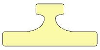
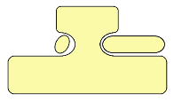

% Samenvatting IITORG
% Mathijs Bernson

# Samenvatting Inleiding Organisatiekunde

## Informatie

* Studiepunten: 3 ECTS
* Studiebelasting: 84 SBU
* Tijdbesteding: 21 lesuren (7 * 3 uur), dus 63 uur zelfstudie
* Modulecode: IITORG
* Toetsvorm: schriftelijk tentamen met open vragen

## Literatuur

* IT Management voor het HBO 2 - Organisatie, ISBN 9789070808273
*	Slides van ELO
	* Bronnen zijn vermeld op de sheets.

* Readers en oefententamens zijn te vinden op ELO (onder 'Cursusdocumenten'). 

## Leerdoelen

De student kan na (gunstige) afloop van deze module: 

* verschillende bedrijfskundige modellen uitleggen, verklaren en toepassen.
* een organisatie typeren met gebruik van de organisatietypologie van Mintzberg en de culturele typologie van Hofstede.
* Het levenscyclusmodel van Greiner uitleggen.
* de 5 P’s van de marketingmix (Product, Prijs, Plaats, Promotie en Personeel) en de daarbij behorende theoretische modellen benoemen, verklaren en toepassen.
* De BCG matrix en de PLC uitleggen en toepassen.
* De Valuechain en het 5-krachtenmodel van Porter uitleggen en toepassen.
* aan de hand van PMC’s nieuwe mogelijkheden voor producten en diensten benoemen.
* verschillende leiderschapsstijlen onderscheiden en benoemen.

## Eindeisen

> De student doorgrondt na (gunstige) afloop de causaliteit van de behandelde modellen
> en hij/zij kan deze in praktijksituaties toepassen op organisaties.
>
> Daarnaast kan de student de achtergrond en opbouw van de bedrijfskundige modellen uitleggen,
> verklaren en toepassen, alsook leiderschapsstijlen en organisatievormen uitleggen en verklaren. 

## Studietaken

* Organisatiemodellen van Mintzberg
* Levenscycli volgens Greiner
* Cirkel van falen en Cirkel van Succes
* Marketingmix (Prijs, Product, Plaats, Promotie, Personeel)
* PMC, PLC, BCG, adoptiecurve, Herzberg en andere modellen
* Waardeketen en 5-krachtenmodel van Porter
* Organisatievormen (KvK) 
* Leiderschapsstijlen Oefententamen 

## Lesinhoud

* week 1: organisatie, omgeving, leiderschap, cultuur
* week 2: value chain, Mintzberg, contingentie, levenscyclus
* week 3: Greiner: ontwikkeling van organisaties
* week 4: rechtsvormen, PMC, BCG, PLC, Leeflang, Copeland
* week 5: promotie, plaats, distributie en kanalen
* week 6: kosten, (prijs)strategieën, prijselasticiteit, winst
* week 7: personeel, Maslow, Herzberg, marketingmix/PLC

## Inhoud

* [Organisaties](#organisaties)
	* [Missie en visie](#missie-en-visie)
	* [Stakeholders](#stakeholders)
		* [Interne stakeholders](#interne-stakeholders)
		* [Externe stakeholders](#externe-stakeholders)
	* [Shareholders](#shareholders)
* [Organisatievormen](#organisatievormen)
	* [Lijnorganisatie](#lijnorganisatie)
	* [Lijn-staf-organisatie](#lijn-staf-organisatie)
		* [Functionele lijn-staf-organisatie](#functionele-lijn-staf-organisatie)
	* [Matrixorganisatie](#matrixorganisatie)
* [Leiderschapsstijlen](#leiderschapsstijlen)
	* [Quinn](#quinn)
		* [Beheersgericht](#beheersgericht)
		* [Mensgericht](#mensgericht)
		* [Innovatie gericht](#innovatie-gericht)
		* [Resultaatgericht](#resultaatgericht)
	* [Hersey](#hersey)
		* [Stijl 1: Leiden](#stijl-1-leiden)
		* [Stijl 2: Begeleiden](#stijl-2-begeleiden)
		* [Stijl 3: Steunen](#stijl-3-steunen)
		* [Stijl 4: Delegeren](#stijl-4-delegeren)
	* [Competenties](#competenties)
* [Situationeel leiderschap](#situationeel-leiderschap)
* [Cultuur](#cultuur)
	* [Organisatiecultuur](#organisatiecultuur)
		* [Normen](#normen)
		* [Waarden](#waarden)
	* [Culturele typologie van Hofstede](#culturele-typologie-van-hofstede)
* [Organisatietypologie van Mintzberg](#organisatietypologie-van-mintzberg)
* [Levenscyclusmodel van Greiner](#levenscyclusmodel-van-greiner)
* [5 P's van marketing](#ps-van-marketing)
* [BCG matrix](#bcg-matrix)
* [PMC, PLC, BCG, adoptiecurve, Herzberg en andere modellen](#pmc-plc-bcg-adoptiecurve-herzberg-en-andere-modellen)
	* [PMC's](#pmcs)
	* [PLC](#plc)
	* [Boston Consulting Group (BCG) matrix](#boston-consulting-group-bcg-matrix)
	* [Adoptiecurve](#adoptiecurve)
	* [Herzberg](#herzberg)
* [Value chain](#value-chain)
	* [Waardeketen van Porter](#waardeketen-van-porter)
* [5-krachtenmodel van Porter](#krachtenmodel-van-porter)
* [Organisatievormen (KvK)](#organisatievormen-KvK)
	* [V.O.F.](#v.o.f.)
	* [B.V.](#b.v.)
	* [N.V.](#n.v.)
	* [Vereniging](#vereniging)
	* [Stichting](#stichting)
	* [Maatschap](#maatschap)
* [Promotie](#promotie)
	* [Distributie](#distributie)
* [Groeistrategie Ansoff](#groeistrategie-ansoff)
	* [Penetratie](#penetratie)
	* [Productvernieuwing](#productvernieuwing)
	* [Marktvernieuwing](#marktvernieuwing)
	* [Diversificatie](#diversificatie)
* [Bronnen](#bronnen)
	* [Zelf](#zelf)
	* [Slides](#slides)

## Belangrijke kopjes

* [Waardeketen van Porter](#waardeketen-van-porter)
* [Organisatiecomponenten van Mintzberg](#)
* [Rechtsvormen organisaties](#)
* [Product vs. dienst](#)
* [Productsamenstelling Leeflang, Copeland](#)
* Modellen
	* [Culturele topologie van Hofstede](#culturele-typologie-van-hofstede)
	* [BCG matrix](#bcg-matrix)
	* [Organisatie crisissen](#)
* Cirkels
	* [Cirkel van falen](#cirkel-van-falen)
	* [Cirkel van success](#cirkel-van-success)
* Leiderschap
	* [Leiderschapsstijlen van Quinn](#quinn)
	* [Situationeel leiderschap Hershey](#hersey)

## Inleiding

Je komt altijd in organisaties terecht later, en er bestaan vele soorten organisaties.
In projecten werk je met mensen uit andere organisatieonderdelen. Je moet hun "taal" kunnen spreken.

## Organisaties

Lees de [sectie 'organisatie'](../IIBPM/samenvatting.html#organisatie) uit de samenvatting IIBPM! 

Alle soorten organisaties hebben te maken met omgevingsinvloeden. Meestal zijn dit er veel.

Het bedrijf van een ZZP-er is ook een organisatie. §9.8.3

### Missie en visie
 
[missie](../IIBPM/samenvatting.html#missie) en [visie](../IIBPM/samenvatting.html#visie), is allemaal herhaling van IIBPM!

* integriteit
* mission statement

### Stakeholders

Een stakeholder heeft bepaalde belangen bij een organisatie. Voorbeelden zijn de belastingdienst, de toeleveranciers en de werknemers van het bedrijf.

#### Interne stakeholders

* Medewerkers
* Leidinggevenden

#### Externe stakeholders

* Leveranciers
* Overheid
* Klanten (niet per sé?)
* Crediteuren

### Shareholders

Een shareholder heeft ook daadwerkelijk een aandeel in het bedrijf.

## Organisatievormen

### Lijnorganisatie

In een lijnorganisatie heeft iedere medewerker (behalve de eindbaas) één baas boven zich.
Het aantal medewerkers dat iedere baas aanstuurt noemen we de *span of control*.

### Lijn-staf-organisatie

Dit is een aanvulling op de lijnorganisatie. Het verschil is dat er één of meer staffuncties aan zijn toegevoegd, zoals bijv. de **administratie**.
Een staffunctie is een functie die geen onderliggende lagen aanstuurt.

#### Functionele lijn-staf-organisatie

Ingedeeld op functie. Directie is de baas over iedereen, ook over de staf. (slide 16 van week 1).

### Matrixorganisatie

Een matrixorganisatie wordt soms **naast** een lijnorganisatie opgezet. In het IT-management speelt de matrixorganisatie een prominente rol.
Er wordt gebruik gemaakt van rollen die vaak anders zijn dan in de lijnorganisatie.

Bijvoorbeeld:

                   Interim manager
                          ↓
                    Interim raad
                          ↓
          /---------------|--------------\
          ↓               ↓              ↓
    Voorlichting    Specificaties     Training

----------------------------------------------------------

## Product vs. dienst

(Herhaling van IIBPM)

Een product is:

* Tastbaar
* Eventueel op voorraad
* Heeft een vaste prijs
* Heeft garantie
* Hulpmiddelen

Een dienst:

* Afnemer werkt mee
* Bestaat nog niet bij koop
* Is persoonlijk
* Geen zekerheid
* Mensenwerk

## Leiderschapsstijlen

Er zijn veel verschillende modellen voor leiderschapsstijlen. We zullen er een aantal zullen behandelen in dit vak.

### Quinn

Quinn vindt dat iedereen een bepaalde hoeveelheid leiderschap in zich moet hebben, niet alleen bazen.

Hij heeft een diagram gemaakt met flexibiliteit (flexibel vs inflexibel) op de Y-as en de oriëntatie (intern vs extern) op de X-as.

#### Oriëntatie

Uit de "oriëntatie" as lees je af of iemand naar binnen of naar buiten geörienteerd is.

Intern wil zeggen dat diegene zich richt op medewerkers of organisatiestructuur.

Bij een externe oriëntatie houdt het individu zich meer bezig met productie en innovatie, de zaken in de buitenwacht zullen opvallen.

#### Flexibiliteit

Een medewerker met lage flexibiliteit is volgens Quinn conservatief, en wil dus liever geen veranderingen zien.
Bij hoge flexibiliteit wil diegene eigen medewerkers binden of zakelijke partners verleiden tot nieuwe vormen van van samenwerking.

#### Beheersgericht

Beheersgerichte organisaties worden ook wel hiërarchisch genoemd. Een beheersgerichte organisatie richt zich op zorg voor goede verhoudingen in combinatie met stabiliteit en beheersbaarheid. Kernbegrippen zijn: interne efficiëncy, uniformiteit, veiligheid, controle, stabiliteit en respect voor autoriteit. De bedrijfsstrategie richt zich veelal op Operational Excellence: prestatie-indicatoren en schaalgrootte.

#### Mensgericht

De mensgerichte cultuur wordt ook wel familiecultuur genoemd. Een mensgerichte organisatie richt zich op goede interne verhoudingen, zorg voor het personeel en klantgevoeligheid. Er wordt veel tijd besteed aan het ontwikkelen van medewerkers, participatie, samenwerking, openheid en moreel. De communicatie in een mensgerichte organisatie is veelal mondeling en informeel. De betrokkenheid van de individuele werknemer bij zijn werk en de organisatie staan centraal.

#### Innovatie gericht

De innovatiegerichte cultuur wordt ook wel adhocratiecultuur of ontwikkelingscultuur genoemd. Een innovatieve organisatie kenmerkt zich door: vernieuwing, flexibiliteit, creativiteit, experimenteren, risico’s nemen en groei. De strategie richt zich veelal op Product Leadership. Er wordt veel geld gestoken in technologie-ontwikkeling en R&D. Medewerkers zijn hoog opgeleid, intrinsiek gedreven en werken vaak in projectgroepen aan verschillende projecten. De communicatie is vooral informeel en medewerkers hebben de vrijheid en ruimte om zichzelf te ontwikkelen.

#### Resultaatgericht

Resultaatgericht - het eindproduct staat centraal

    Zijn er targets?
    Gaat het om kwaliteit of snelheid?
    Wordt er veel overgewerkt?
    Wordt dat apart beloond?

### Hersey

Op de Y-as de ondersteunendheid van het gedrag, op de X-as de hoeveelheid sturing.

Zie ook [Situationeel leiderschap](#situationeel-leiderschap).

#### Stijl 1: Leiden

* Deze stijl wordt ook aangeduid als management by prescription. Veel sturend en weinig ondersteunend leiderschapsgedrag; de leidinggevende schrijft voor wat medewerkers moeten doen, geeft nauwkeurige instructies en controleert de taakuitvoering.
* Een valkuil is dat de leidinggevende autoritair overkomt: als een baas of een leraar. Deze wijze van leidinggeven werkt alleen als de opdrachten goed zijn te structureren.

#### Stijl 2: Begeleiden

   * De leidinggevende ondersteunt de medewerker door verantwoordelijkheden te delen en door veel vragen te stellen: actief luisteren, de ander raadplegen en betrekken, complimenteren en stimuleren. Wel worden de taken nauwkeurig vastgesteld en zonodig gecontroleerd. Deze stijl wordt ook wel aangeduid als resultaatgericht management.
   * Deze stijl wordt ineffectief bij manipuleren: wel vragen naar de inbreng van de ander, maar er niets mee doen. Een valkuil is dat de leidinggevende overkomt als therapeut.

#### Stijl 3: Steunen

* Leidinggevende en medewerkers beslissen samen hoe het werk wordt uitgevoerd. De leidinggevende treedt stimulerend op, is klankbord en helpt de medewerker op verzoek bij de uitvoering. Hij geeft daarbij primair leiding door aandacht te besteden aan de relatie en door het geven van erkenning. Deze stijl wordt ook wel organisch management genoemd.
* Een valkuil is dat de manager de medewerker gaat betuttelen.

#### Stijl 4: Delegeren

* Delegeren is effectief toe te passen wanneer de leidinggevende voor de medewerker de voorwaarden kan scheppen die nodig zijn bij het uitvoeren van de opdracht. De leidinggevende laat beslissingen en de wijze waarop de taak moet worden uitgevoerd over aan de medewerkers, deze zijn zelf verantwoordelijk en krijgen dan ook de nodige bevoegdheden. Deze stijl staat ook bekend als management by exception.
* De leidinggevende loopt hierbij wel de kans te vervallen in een niet-effectieve laissez-faire stijl.

### Competenties

Competenties *leer* je niet, ze komen uit jezelf. Op de Hogeschool doe je kennis op, maar de competenties heb je al. Die moeten alleen nog [op een bepaald moment] ontsloten worden.

## Situationeel leiderschap

De belangrijkste taak van leiders is het beïnvloeden van anderen, om plannen te realiseren. Soms gaat het om hun eigen plannen, soms om de plannen van een groep. Eén van de bekendste modellen voor leidinggeven is het situationeel leiderschap van Hersey en Blanchard.

Het model heeft twee dimensies: taakgericht en relatiegericht gedrag van de manager.

 

* Kenmerkend voor taakgericht of sturend leiderschap is het accent op het einddoel en de uitvoering van de taak. De leidinggevende stelt de doelen en doelstellingen vast, plant en organiseert het werk, geeft prioriteiten aan, bepaalt welke werkmethoden er gevolgd worden, hoe controle en evaluaties plaatsvinden en houdt nauwgezet toezicht op de voortgang. Deze stijl zal door veel medewerkers als éénrichting en autoritair worden ervaren.
* Bij relatiegericht of ondersteunend leiderschap ligt het accent op de onderlinge verhouding. De leidinggevende moedigt aan, bevestigt, prijst, luistert actief, vraagt om suggesties en ideeën, stimuleert zelfstandige probleemoplossing, maakt informatie toegankelijk, moedigt teamwork aan en durft zich kwetsbaar op te stellen. Deze meer participatieve stijl kenmerkt zich door twéérichting communicatie.

 

Hier ontstaan vier combinatiestijlen van leidinggeven:

## Cultuur

> Patroon van waarden, doeleinden, normen, verwachtingen e.d. die voor het functioneren van de (ambtelijke) organisatie van belang zijn.

Bedrijfscultuur is belangrijk. Je moet zelf aansluiting op de bedrijfscultuur, anders wordt het niks.

Cultuur komt van alle medewerkers van de organisatie. Daaronder komt het weer van hun achtergrond en opvoeding.
Cultuur komt ook van de leiding, en van de geografische ligging van het de organisatie.

### Organisatiecultuur

> De organisatiecultuur is de wijze waarop de organisatie zich opstelt, zowel naar de eigen medewerkers als naar de buitenwereld, op grond van de normen en waarden van de organisatie.

De organisatiecultuur heeft veel invloed op de werking van de organisatie en haar medewerkers. Het vormt als het ware de 'persoonlijkheid' van de organisatie.

#### Normen

Normen bepalen de wijze waarop we ons gedragen.

#### Waarden

Liggen in het verlengde van de normen. Er zijn *instrumentele* en *intrinsieke* waarden.

### Culturele typologie van Hofstede

Geert Hofstede.

Vijf dimensies:

* Machtsafstand
* Individualisme vs. collectivisme
	* Ik vs. wij
* Masculiniteit vs. femininiteit
* Onzekerheidsvermijding
* Lange termijn vs. korte termijn oriëntatie (nieuw)

----------------------------------------------------------

## Levenscyclusmodel van Greiner

## 5 P's van marketing

> Marketingmix: *Product, Prijs, Plaats, Promotie en Personeel*

## BCG matrix

Dit model dat ontworpen is door de Boston Consulting Group beschrijft de stadia waar een product doorheen gaat.

Er zijn vier stadia:

1. Vraagteken
	* Het product heeft (nog) een klein aandeel van de markt, maar hoog groeipotentieel. Het kan dus alle kanten op.
2. Ster
	* Hoog marktaandeel en hoog potentieel. Dit is wat iedereen wil hebben.
3. *Cash cow*
	* De groei is afgeremd, maar er komt nog geld binnen. Het marktaandeel is nog hoog.
4. *Dog*
	* Hier wil je vanaf.

## PMC, PLC, BCG, adoptiecurve, Herzberg en andere modellen

### PMC's

*Product Markt Combinaties*

### PLC

1. Development
2. Introduction
3. Growth
4. Maturity
5. Decline

### Boston Consulting Group (BCG) matrix

*Boston Consulting Group* matrix

Door welke stadia loopt een product?

### Adoptiecurve

### Herzberg

## Value chain

### Waardeketen van Porter

De waarde van een product neemt toe naarmate er meer bewerkingsstappen worden uitgevoerd, van grondstof tot eindproduct.

Bij iedere stap waar een product doorheen gaat, wordt er waarde toegevoegd.

Voorbeeld: tuinaarde -> bezakker (stop het in zakken) -> tuincentrum -> klant

#### Onthouden

Ondersteunende activiteiten

* Firm infrastructure
* Human resources
* Tech. development
* Procurement (acquisitie)

Primaire activiteiten

* Inbound logistics
* Operations
* Outbound logistics
* Marketing en sales
* Service

## Mintzberg

Henry Mintzberg heeft een theorie over organisatiestructuur opgezet in de vorm van abstracte kunt.

Hij onderkent vijf organisatie configuraties:

* ondernemersorganisatie (simpele structuur)
* machineorganisatie (machinebureaucratie)
* professionele organisatie
* innovatieve organisatie (adhocratie)
* gediversifieerde organisatie (divisiestructuur)

Met de volgende twee extra erbij:

* zendingsorganisatie
* politieke organisatie

### Vijf onderdelen

In zijn model bestaan organisaties uit de volgende vijf onderdelen:

* Operating core
	* Verzorgt productie.
* Strategic apex
	* Dit is de strategische top, zij bepalen beleid.
	* Zorgt ervoor dat de organisatie haar missie effectief uitvoert.
* Middle line managers / middenkader
	* Is de link tussen de *strategic apex* en de *operating core*.
	* Stuurt de operating core aan.
* Technostructuur
	* Bepaalt standaarden, richtlijnen en processen.
* Support staff
	* Ondersteunt de organisatie
	* Bijv. catering, juridische zaken

### Configuraties

#### Simpele structuur (ondernemersorganisatie)

Kenmerken van een ondernemersorganisatie zijn:

* De meeste macht ligt bij de strategische top
* Weinig regels en procedures
* Weinig middenkader
* Staf en technostructuur ontbreken volledig
* Platte, informele organisatie, flexibel
* Familiecultuur

De communicatie is informeel. Informatie loopt vooral van- en naar de top.

#### Machineorganisatie (machinebureaucratie)

Dit zijn klassieke organisaties, die voortgekomen zijn uit het tijdperk van industrialisatie.
Een machineorganisatie is vaak gericht op productie van dingen

Kenmerken:

* Routinematig
* Sterke hiërarchie en technostructuur
* Veel regels en procedures
* Stabiele omgeving
* Piramidecultuur

Informatie is vastgelegd in regels en procedures. Er ligt een nadruk op beheersing van processen.

#### Professionele organisatie

Draait om de *professionals*.

Kenmerken:

* Hoogopgeleid, specialistisch werk
* Belangrijke rol zelfstandige professionals
* Grote ondersteunende staf
* Technostructuur is beperkt
	* De regels komen van buitenaf (wetgeving, branche organisatie)
* Geoliede machine cultuur

#### Adhocratie (innovatieve organisatie)

#### Divisiestructuur (gediversifieerde organisatie)

### Extra

#### Zendingsorganisatie

#### Politieke organisatie

De politieke organisatie wil (meer) macht verwerven.

### Druk

## 5-krachtenmodel van Porter

## Organisatievormen (KvK) 

### Eenmanszaak

### Vennootschap onder Firma (V.O.F.)

### Besloten Vennootschap (B.V.)

LLC

### Naamloze Vennootschap (N.V.)

### Commanditaire Vennootschap (C.V.)

### Vereniging

Wordt bestuurd door haar leden.

### Stichting

Wordt bestuurd door enkele mensen en heeft contribuanten. Als een stichting teveel om gaat zetten komt de belasting om de hoek kijken.

### Maatschap

Van artsen of advocaten. Maten kunnen matennaaien (wettelijke term).

## Promotie

### Distributie

Kort distributiekanaal vs. lang distributiekanaal.

* Direct -> fabrikant levert aan (eind)klant
* Kort -> slechts één partij die levert aan één winkel, zoals fabrikant aan groothandel
* Lang -> Twee of drie partijen tussen de fabrikant en klant

## Groeistrategie Ansoff

Dit is een model voor groei.

Product (oud of nieuw) vs. markt (oud of nieuw). Product staat op de horizontale as, markt op de verticale.

Kijk of een product nieuw is voor een bedrijf, niet of het nieuw is voor de markt?

Volgens Ansoff kun je op de volgende 4 manieren groeien:

### Penetratie

Hier verandert het minste bij. Bestaande producten groeien op bestaande markten. Er wordt niks nieuws gedaan.

### Productvernieuwing

Nieuw product ontwikkelen. Met R&D en visie. Vereist aanpassingen in de marketing.

### Marktvernieuwing

Naar het buitenland of over de grens gaan. Of nieuwe segmenten aanboren zoals jeugd of 65-plus.

### Diversificatie

Dit zijn de voorgaande twee punten, productvernieuwing en marktvernieuwing in één.

## Prijs

### Wat is prijs

### Prijsstrategieën

Actief vs. passief prijsbeleid

#### Actief prijsbeleid

##### Skimpricing

De prijs beetje bij beetje verlagen om de markt af te romen.
Deze methode kan alleen worden toegepast in een monopoliepositie.

##### Stay-out pricing

Prijzen laag houden zodat het voor nieuwkomers niet interessant is om zich op deze markt te begeven.

##### Put-out pricing

Druk weg. Op de concurrentie gericht, met een tijdelijke sterk verlaagde prijs die concurrenten uit de markt dwingt.

**Voorbeeld**: supermarkten prijzenoorlog

##### Prijsdifferentiatie

Dezelfde leverancier vraagt verschillende prijzen aan **verschillende klanten**.

**Voorbeeld**: Hotel dat een hogere prijs toont aan Apple-gebruikers omdat zij hogere prijzen gewend zijn.

##### Prijsdiscriminatie

Verschillende prijzen vragen op **verschillende markten** [op grond van verschillende afzetscenario's].

Om dit te kunnen doen moeten de markten moeten gescheiden zijn, zodat de goederen niet van de ene markt naar de andere stromen.

##### Penetratie pricing

Heel snel marktaandeel proberen te veroveren door een lagere prijs dan concurrenten te vragen. Of om snel naamsbekendheid te kunnen vestigen.

#### Passief prijsbeleid

##### Kartelvorming

Prijsafspraken tussen organisaties. (Overleg houden over de prijzen)

Is verboden omdat het de concurrentievorming tegen gaat: de consument heeft geen keuze meer.

##### Me-too pricing

### Prijselasticiteit

Formule hier

## Kosten

### Vaste en variabele kosten

Kosten die **niet** reageren op een verandering in de hoeveelheid bedrijfsactiviteiten.

Reageren (binnen productiegrenzen) **niet** op een verandering in de hoeveelheid

## Cirkels

### Cirkel van falen

### Cirkel van succes

## Bronnen

### Zelf

* [Mintzberg Organisatiestructuren / modellen](http://www.expand.nl/hr-weblog/mintzberg-organisatiestructuren---modellen)

### Slides

* [Tekst](#)
