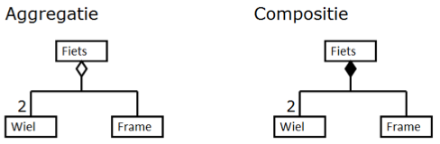

% Samenvatting IMUML
% Mathijs Bernson

# Samenvatting IMUML

## Stof

* Boek "[Pragmatisch modelleren met UML](http://www.bol.com/nl/p/pragmatisch-modelleren-met-uml-2-0/1001004001751193/)"
* Larman H6 – Use-cases
* Slides
* Documenten van ELO

## Leerdoelen

> De leerdoelen zijn het kennis opdoen van UML schematechnieken. Daarnaast het opdoen van vaardigheden in het analyseren van kleinschalige softwaresystemen op zowel functioneel als technisch niveau en vaardigheden in het ontwerpen van kleinschalige softwaresystemen met behulp van een referentiearchitectuur en UML schematechnieken op zowel functioneel als technisch niveau.

## Achtergronden van modelleren en UML

Modelleren is: een model maken van de werkelijkheid; bestaande uit objecten, die met elkaar samenwerken om het beoogde doel te bereiken.


UML is een object-geörienteerde manier om te modelleren. We zien OO-principes zoals classes, instances, overerving (sub- en superclasses) en polymorfisme (overriding, overloading, dynamic binding) erin terugkomen.

UML is een **modelleertaal** voor alle fasen van het ontwikkeltraject. Hier biedt een aantal verschillende soorten diagrammen voor. 
Let ook op dat het een **taal** is en geen methode [voor applicatieontwikkeling]. Zoals veel talen bestaat het uit _syntax_ (grammatica) en _semantiek_ (de betekenis van de symbolen).

De eerste OO-programmeertalen verschenen tegen het einde van de 60's. UML is in de jaren '90 ontstaan, en werd oorspronkelijk ontwikkeld door "The Three Amigos" (James Rumbaugh, Ivar Jacobson en Grady Booch). In 1997 verscheen UML 1.0, de eerste goedgekeurde toepasbare versie. Tegenwoordig wordt UML doorontwikkeld door de [Object Management Group (OMG)](http://www.omg.org/), een (internationale) non-profit.

## Algemene begrippen

### Actor

Actoren in UML hoeven (in tegenstelling tot BPM/ISMI) niet per sé menselijk te zijn.

## Soorten diagrammen

De soorten UML-diagrammen zijn op te delen in twee groepen; de diagrammen die het dynamisch gedrag beschrijven en diagrammen die de structuur van de applicatie beschrijven.


### Dynamisch gedrag

* [Use-case diagram](#use-case-diagram)
	* [Use-case beschrijving](#use-case-beschrijving) (eigenlijk geen diagram)
* [Activity-diagram](#activity-diagram)
* [Sequence-diagram](#sequence-diagram)

### Structuur

* [Klassediagram](#klassediagram), onderverdeeld in drie fasen:
	* [Domeinmodel](#domeinmodel) (klassediagram van de _business_-laag)
	* [Applicatiemodel](#applicatiemodel) (bevat ook forms en tasks)
	* [Implementatiemodel](#implementatiemodel) (volledig klassediagram van de applicatie)

### Use-case diagram

Use-cases beschrijven **wat** een applicatie precies moet kunnen doen. Het is een algemene manier om de belangrijkste functies van een systeem neer te zetten. Iedere deelfunctie is een ballonnetje in het diagram. Use-case diagrammen splitsen het systeem dus in verschillende [samenhangende] categorieën van functionaliteit. 

Bij use-cases is de gebruiker het uitgangspunt. Er worden functionele eisen aan een systeem gesteld, maar het systeem zelf is een _black box_. Vanaf de **buitenkant** gezien specificeert het wat het systeem doet en hoe het haar taken moet bewerkstelligen.

Zodoende biedt het inzicht in het gedrag van het systeem (aldus de slides).

Een use-case wordt beschreven in de vorm van acties uitgevoerd door een actor of het systeem.


#### Use-case beschrijving

Use-case beschrijvingen liggen min of meer in het verlengde van de use-case diagrammen. Ze geven inzicht in de werking van een systeem door stapsgewijs uit te leggen wat er gebeurt.
Voor ieder use-case diagram is er één use-case beschrijving.

Deze stappen worden genummerd en komen allemaal in een tabel te staan. Deze heeft twee kolommen, eentje voor de actor (gebruiker) en één voor het systeem. Telkens **doet** de actor iets, en het systeem **reageert** daarop.

De use-case beschrijving heeft bepaalde pre-condities, dit zijn aannamen voor wanneer de use-case begint. Het eindigt met één of meer post-condities, het resultaat van de use-case. Daarnaast worden de actoren die bij de use-case betrokken zijn genoemd en is er altijd een samenvatting van de use-case.

De normale voortgang van activiteiten wordt de _happy flow_ genoemd. Iedere stap kan echter uitzonderingen hebben, dit noemen we de _alternative flow_. Uitzonderingen vallen onder hun eigen kopje in de tabel. Ze krijgen het nummer van de stap waar de uitzondering optreedt, met een letter erachter. Zo kan stap 3 de uitzonderingen 3a, 3b enzovoort hebben.


#### «include» en «extend»

UML heeft drie soorten relaties tussen use-cases (de ballonnetjes zelf): de associaties «include» en «extend», en de generalisatie. Op deze laatste gaan we bij dit vak niet verder in.

##### Include

Een «include» geeft aan dat de ene use-case gebruik maakt van de andere use-case. Daardoor verandert _expliciet_ het gedrag van de eerste use-case. Aangezien dit weinig aangeeft over het gebruik van «include» kun je de volgende richtlijn stellen. Geef met «include» aan dat een use-case de andere use-case expliciet nodig heeft om te slagen.

Op deze manier kun je use-cases modelleren die een aantal _afhankelijkheden_ hebben om te slagen. Het boek geeft het voorbeeld van **Aanvragen abonnement** met de secundaire use-cases **Invoeren abonnement**, **Valideren abonnement**, **Invoeren creditcard** enzovoort.

Je modelleert «include» met een pijl met stippellijn. Het is een _dependency_ die wijst naar de benodigde use-case.

##### Extend

Met een «extend» breidt je het gedrag van een use-case op één of meer punten uit. Hier komt dus een nieuwe use-case uit voort, die al het gedrag van zijn _parent_ bevat. Zie het maar als een _class-hierarchy_ zoals in Java. Als je hier een versimpelde richtlijn van maakt kun je stellen dat: een «extend» aangeeft dat je een andere use-case gebruikt, maar ook zonder dat deze slaagt. Dit kan heel nuttig zijn, maar leidt wel tot meer use-cases in je project.

Een «extend» modelleer je ook met een stippellijn en pijl, alleen wijst de pijl dit keer **naar de _parent_**.


_Toelichting_: Vereisten voor het aanvragen van een abonnement zijn het invoeren en valideren van de gegevens en creditcard. Een e-mail adres hoeft niet ingevuld te worden. Hier is dus een extend van gemaakt, wat als een nieuwe use-case op zich dient.

### Activity-diagram

Met activiteitendiagrammen worden **bedrijfsprocessen** chronologisch gemodelleerd. Het lijkt in de verte op BPMN (wat ook door de OMG wordt bijgehouden), is natuurlijk een ander beest.

Activiteitendiagrammen helpen om use-cases te testen. Daarbij doorloop je in het activity-diagram niet alleen het gewenste scenario, maar ook alle faal- en herstelscenario's. De tekstuele beschrijving in een use-case dekt misschien niet alle mogelijke situaties, een activity-diagram hoort dit wel te doen. Voor elke use-case wordt een apart activity-diagram gemaakt.

Activity-diagrammen kunnen voor een aantal doeleinden gebruikt worden, waaronder:

* Bedrijfsproces
	* Modelleer een chronologisch bedrijfsproces
	* Vergelijkbaar met de bedrijfsprocessen van BPM
	* Voorbeeld: het aanvragen van een verzekering
* Use-case
	* Geef een overzicht van de stappen van een use-case. Hierin zijn verschillende scenario's duidelijk te onderschenden.
* Methode
	* Boek: Je kan een methode van een klasse met veel conditionals modelleren als activity-diagram.
	* Mathijs: WTF is dit voor anti-pattern. Modelleer de control-flow van een deel van je programma. Niet van één method.

Een activity-diagram bestaat uit een aaneenschakeling van _activity-nodes_. We kennen de volgende soorten nodes:

#### _Activity node_

Is een eenheid van gedrag. Vertegenwoordigt een bepaalde activiteit die uitgevoerd wordt.


#### _Initial node_

Beginpunt van het activity-diagram.


#### _Activity final node_

Eindpunt van het activity-diagram. Afspraak is dat de post-conditie er ook bij genoemd wordt.


#### _Decision node_

Lijkt op de BPMN _decision node_.

Met _guards_ worden de condities aangegeven. Zie de _guards_ als een boolean-expressie. Zo kun je ook bijvoorbeeld de kleiner-dan, groter-dan en gelijk-aan symbolen gebruiken. Voorbeeld: `[aantal ongeldige logins <= 2]`.

Er zijn altijd twee uitgaande transities en één inkomende transitie.


#### _Merge node_

Lijkt op de BPMN _merge node_.

Heeft altijd twee inkomende transities en één uitgaande transitie.


#### _Loop node_

**Is niet vereist voor dit vak.**
Modelleert de herhaling van een aantal _activity nodes_.Je kan ook nog van een _transition node_ spreken, hiermee worden simpelweg de pijltjes tussen _activity nodes_ bedoelt.

### Sequence diagram

> Sequence is IMO het enige lastige deel van UML.
> <br /><br /> _Mathijs_

#### Introductie

Het sequentiediagram biedt een manier om interactie tussen een actor en code te modelleren. Het laat zien hoe ze samenwerken om een doel te bereiken (bijvoorbeeld met een use-case). Sequentiediagrammen zijn **chronologisch**. Verder wordt er uitgegaan van _messages_ die naar objecten worden verstuurd.

De actor en alle klassen die betrokken zijn bij het sequentiediagram worden vertegenwoordigd door _lifelines_. Dit zijn verticale lijnen waartussen _messages_ (pijlen) lopen. Op de _lifelines_ wordt aangegeven wanneer een object actief is.


#### Bouwen

Je kunt een sequentiediagram bouwen als het klassediagram van een use-case bekend is, aangezien de _forms_, _tasks_, _business classes_ en _factories_ erin gebruikt zullen worden. De _lifelines_ staan op volgorde a.d.h.v. de referentiearchitectuur. (?)

Voordat je een sequentiediagram zult maken ga je dus door de volgende stappen heen:

Use-case -> stappenplan -> (activiteitendiagram ->) task -> sequentiediagram


Met een **ref**-lifeline kun je verwijzen naar een andere use-case die dan wordt uitgevoerd. Dit verloopt wederom via het _task pattern_.

Sequentiediagrammen kunnen geïnitieerd worden vanuit een actor-poppetje of vanuit een _found message_ (gevulde zwarte stip).

#### Fragmenten

Beslissingen, conditionals en herhalingen modelleer je in een sequentiediagram met de volgende fragmenten.


Het **opt fragment** modelleert één beslissing in één fragment. Zie het als een enkel **if-statement**. De guard bepaalt of het wel of niet uitgevoerd wordt.

Het **alt fragment** wordt gebruikt voor meerdere beslissingen in meerdere fragments. Zie het als een **if-else-statement**. Ieder fragment heeft een guard die de keuze al dan niet bepaalt.

Tot slot het **loop fragment**. Deze modelleert herhaling in één fragment. Zie het als een **while-loop**. Het fragment wordt [nul, 1 of meer keren] uitgevoerd zolang de conditie in de guard waar is. De guard kan ook aangeven hoe vaak het minimaal/maximaal wordt uitgevoerd.

### Klassediagram

Klassediagrammen in UML komen al aardig dicht bij de werkelijkheid van object-geörienteerd programmeren in de buurt. Het is een schematische weergave van klassen en associaties daartussen.

Een klasse in het klassediagram wordt als volgt ingedeeld:

1. het bovenste deel bevat de naam van de klasse. (Belangrijk; dit bepaalt het object) Onthoud dat de naam uniek en in het enkelvoud geschreven wordt.
2. Het middelste deel bevat de attributen. Deze zijn meestal private en kunnen enkel worden aangeroepen en aangepast door de methoden van de klassen. Je hebt hierbij 3 soorten: +: public; -: private; #: protected;
3. het onderste deel bevat de methoden. Dit zijn functies of handelingen die men kan uitvoeren. Hier kan je ook voorwaarden in plaatsen; zoals WijzigNaam("Nieuwe naam");


Als de klasse die gemodelleerd wordt een **instantie** is, wordt het bovenste vakje (klassenaam en dubbele punt) in zijn geheel ondersteunt.

#### Associaties

Er zijn een aantal verschillende manieren om 
relaties tussen klassen uit te drukken. De standaard associatie in UML is simpelweg een zwarte lijn tussen twee klassen.


Aan beide kanten van de associatie kan de **multipliciteit** genoemd worden. Hiermee wordt aangeduidt van hoeveel naar hoeveel objecten deze associatie loopt. Dit kan bijvoorbeeld een-op-een, een-op-veel of veel-op-veel zijn. Multipliciteit noteer je met een constant getal of een bereik (zoals `1..5` of `1..*`).


##### Aggregatie

Een aggregatie is een relatie tussen klassen die een **geheel** kent (de _aggregate_) maar ook de **onderdelen** (de _parts_). Er gelden grotendeels dezelfde richtlijnen voor als een gewone associatie. De onderdelen zijn dus afzonderlijk maar ook als een geheel te gebruiken.

_Het boek raadt af om aggregaties te gebruiken._

##### Compositie

Een compositie is een sterkere vorm van aggregatie. Bij een compositie kunnen de onderdelen **niet los van elkaar** bestaan (lifetime dependency), bij een aggregatie wel. Compositie geeft dus expliciet aan dat de onderdelen afhankelijk van elkaar zijn om te kunnen werken.

Een onderdeel kan altijd maar deel uitmaken van één compositie.



##### Overerving

Overerving wordt gemodelleerd als een zwarte lijn met een wit pijltje. Dit moet je zien als het _extenden_ van een klasse in een object-geörienteerde programmeertaal.


##### Dependencies

Een _dependency_ is een afhankelijkheid van één klasse op een andere. Deze modelleer je met een stippellijn met een pijl.

### Soorten klassendiagrammen

Binnen dit vak worden er drie verschillende modellen gemaakt op basis van UML-klassediagrammen.

#### Domeinmodel

In het domeinmodel wordt de _business_-laag vastgelegd. Het omschrijft - zoals de naam al zegt - de domeinlogica. Alleen de _business classes_ en _factories_ worden erin gemodelleerd.

##### Domeinanalyse

Met behulp van een domeinanalyse kun je tot een domeinmodel komen. Dit gaat met de volgende stappen:

1. Domeinconcepten definiëren
	* Zet de eisen en wensen van de klant op papier en onderstreep de zelfstandig naamwoorden. Hiermee vang je de **meeste** domeinconcepten. De toepasselijke woorden worden domeinconcepten, en op den duur _business classes_.
2. Domeinconcepten vertalen
	* Definieer per geschikt concept één _business class_. Voorzie deze elk van een korte, duidelijke beschrijving over de rol die het speelt.
3. Domeinmodel opzetten
	* Maak het onderscheid tussen _business classes_ en _factories_. Modelleer vervolgens de associaties voor klassen die relaties hebben. Noteer de associaties met een werkwoord en vergeet de multipliciteiten niet.

#### Applicatiemodel

Het applicatiemodel is een uitbreiding van het domeinmodel. Naast domeinklassen worden er ook applicatiespecifieke klassen in weergegeven zoals _forms_, _tasks_ en _utilities_.

#### Implementatiemodel

Het implementatiemodel hoort (nagenoeg) een-op-een overeen te komen met de uiteindelijke implementatie.

## Referentiearchitectuur

School en het UML-boek behandelen een aantal specifieke _design patterns_. De referentiearchitectuur die school ons leert zou een gestructureerde opzet van applicaties moeten bieden, t.b.v. uitbreidbaarheid en onderhoudbaarheid.


De volgende voordelen van de referentiearchitectuur worden genoemd:

* **Gemeenschappelijke taal** voor "architecten", ontwerpers en programmeurs
* **Productiviteit** door het gebruiken van dezelfde werkwijze
* **Herbruikbaarheid** in meerdere projecten
* **Onderhoudbaarheid** - vergelijkbare opbouw met mogelijk dezelfde componenten
* **Begrijpelijk** - een laag hoeft geen kennis van andere lagen te hebben
* **Vervangbaar** - je kunt een laag vervangen zonder dat andere lagen er last van hebben
* **Minder afhankelijkheden**

In combinatie met _forms_, _business classes_ en _factories_ lijkt dit op het [MVC-pattern](https://en.wikipedia.org/wiki/Model%E2%80%93view%E2%80%93controller). Hierbij zijn _business classes_ de models, _tasks_ de controllers en zijn _forms_ de views.

### Proceslaag (tasks)

Met het _task pattern_ worden use-cases omgezet naar concrete, uitvoerbare classes in een applicatie.

Iedere task komt overeen met één use-case beschrijving. De task valideert de pre-condities, en kan vervolgens het stappenplan van de use-case uitvoeren. Dit kun je in code als volgt zien:

```
class Task {
	abstract boolean validate();
	abstract void execute();

	void run() {
		if(validate())
			execute();
	}
}
```

Een task toont meestal een form, en geeft hier data vanuit de _business_-laag aan door.

### Presentatielaag (forms)

Deze laag bevat de _forms_ van de applicatie. Zie deze als _views_ uit het MVC-pattern of dergelijken. _Forms_ bevatten geen enkele (bedrijfs- of domein-) logica. Ze hoeven alleen maar gegevens te ontvangen van _tasks_, en acties weer terug doorgeven aan _tasks_.

### Business laag

Deze laag bevat alle bedrijfs- en domeinlogica van de applicatie. De _business classes_ bevatten de logica van indivduele instanties. De _factories_ bevatten logica voor verzamelingen van instanties. Daarnaast beheren ze de instanties van _business classes_.

#### Datalaag (database)

Deze laag communiceert met de data-opslag. Het bestaat uit data-klassen met het doel om data op te halen en te _persisten_. Het vertaalt deze data van de opslag naar de applicatie en omgekeerd. Wat voor data-opslag erachter hangt maakt niet uit, of dit nou een SQL-database of een _flat-file_ opslag is. Dit is een implementatiedetail.

### Utility

Dit is eigenlijk geen laag, maar meer een _junk-drawer_ met alle utility-code die nergens anders een thuis heeft. Voorbeelden zijn functies die gulden-euro conversie doen of een bedrag inclusief/exclusief BTW berekenen.

### Business component

Dit is wederom geen laag. Het bevat organisatiegenerieke bedrijfslogica die door meerere applicaties wordt gebruikt. _Libraries_ dus.

## Smart factory pattern

Dit patroon wordt beschreven in de referentiearchitectuur van het UML-boek. Het _pattern_ definieert de samenwerking tussen _factories_ en _business classes_. Dit vertaalt zich naar een aantal **CRUD**-methoden.


Dit lijkt aarig op het [activerecord-pattern](https://en.wikipedia.org/wiki/Active_record_pattern), alleen zijn bij dat pattern de _business class_ en de _factory_ hetzelfde. Als je ooit een framework als [Rails](http://rubyonrails.org) hebt gebruikt is dit vrij makkelijk toe te passen.