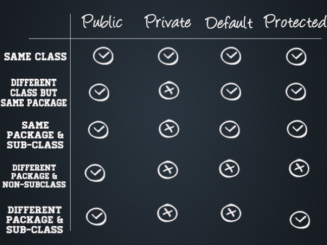

# IOPR2

Object-geörienteerd programmeren.

## Stof

* Liang's Java-bijbel
	* Introduction to Java Programming, Comprehensive Version, 9/E
* Praktijkopdrachten (voorbeeldcode)
* Sheets
* Weblectures
* Videosnippets

## Leerdoelen

#### Kennis

> Student kent basis programmeerprincipes in de programmeertaal Java.

#### Vaardigheden

> Student kan programmeerprincipes toepassen in de programmeertaal Java.

## Inhoud

* [GUI's](#guis)
* [Graphics](#graphics)
* [Threads](#threads)
* File I/O
* Binary I/O
* [Events](#events)
* [Exceptions](#exceptions)
* [ArrayLists](#arraylists)

## Thinking in objects (denken in objecten)

_public_, _private_, _protected_. Een _public_ method/property is altijd toegankelijk, ook voor de buitenwereld. _Protected_ alleen voor de klasse zelf en superclasses. _Private_ alleen voor de klasse zelf.

Het `this`-keyword verwijst naar het object zelf. Het gebruik ervan is alleen verplicht als er ambiguïteit tussen variabelen/methods is.

## Inheritance and polymorphism (overerving en polymorfisme)

Constructors uit superklassen worden niet standaard overerfd in Java. Deze roep je aan via `super()`.

Duck typing

## Abstract classes and interfaces (abstracte klasses en interfaces)

Een abstracte klasse is simpelweg een klasse die je niet mag instantiëren. In plaats daarvan is de bedoeling dat je 'm subclass't.

Een _interface_ is een voorschrift van methods (_method signatures_ om precies te zijn) die een klasse moet implementeren. Als een klasse een _interface_ implementeert maar er niet perfect aan voldoet, geeft de compiler een fout.

## Generics

Worden gebruikt bij [ArrayLists](#arraylists).

## GUI's

Swing en AWT.

Niet alle (Swing-)componenten uit je hoofd leren, maar wel toe kunnen passen. Desnoods opzoeken in het boek, aangezien het een open boek examen is.

## Graphics

De enige vorm van _graphics_ die bij dit vak behandeld worden omvat het tekenen op een `JPanel`. Dit lijkt op andere drawing API's, zoals canvas in JavaScript.

## Exceptions (uitzonderingen)

## Text I/O

## Binary I/O

## Threads

## Events

Event-handling in Java wordt toegepast door een klasse te laten voldoen aan een toepasselijke `EventListener`-interface. Er zijn een hoop verschillende _listeners_ beschikbaar, zoals:

* ActionListener (generiek)
* MouseListener

### equals()

Met `equals()` vergelijk je de inhoud van objecten. Standaard checkt deze met `==`.

## ArrayLists

ArrayList is een 