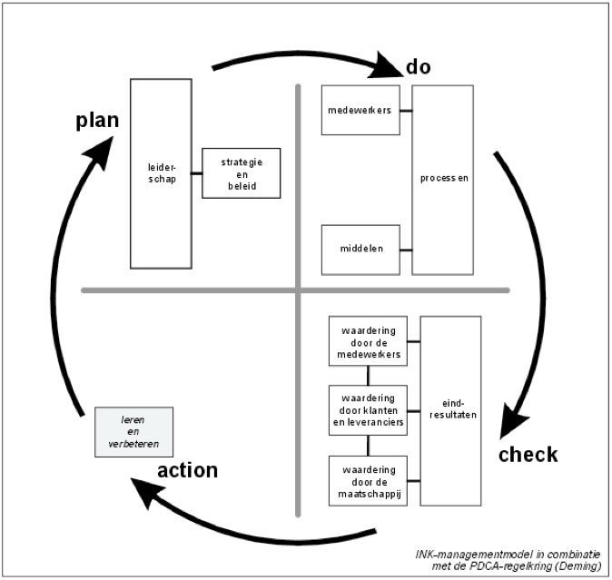

% Samenvatting IQUA
% Mathijs Bernson

# Kwaliteit in de ICT

## Informatie

* Studiepunten: 3 ECTS
* Studiebelasting: 84 SBU
* 7 * 1,5 uur hoor/werkcollege
* Modulecode: IQUA

## Literatuur

* Literatuur en ondersteunend materiaal via ELO
	* Denk hierbij aan white-papers en filmpjes.

Vóór ieder college graag het materiaal bestuderen.

Er zijn geen aanbevolen boeken voor dit vak, **kortom**: je zoekt het maar uit.

## Leerdoelen

Kennis opdoen over:

* Definitie(s) van kwaliteit
* Methoden om kwaliteit te borgen
* Standaarden zoals ISO

Inzicht krijgen in:

* Wijze(n) waarop kwaliteit geborgd kan worden
* Visie(s) op kwaliteiten
* Verantwoordelijkheden m.b.t. kwaliteit
* Hoe projecten in te richten m.b.t. kwaliteit

## Inhoud

* [Wat is kwaliteit?](#wat-is-kwaliteit)
* [Kwaliteitsmodellen en methoden](#kwaliteitsmodellen-en-methoden)
	* [INK model](#ink-model)
	* [Six Sigma](#six-sigma)
	* [ISO](#iso-normen)
	* Etc.
* [Software ontwikkelingsmethodieken](#software-ontwikkelingsmethodieken)
	* [Waterval](#waterval)
		* [SDM](#sdm)
	* [Agile](#agile)
		* [Scrum](#scrum)
		* [RUP](#rup)
	* [Continuous delivery](#continuous-delivery)
* [Verschillen tussen methoden](#verschillen-tussen-methoden)
* [Project management methoden](#project-management-methoden)
	* [Prince2](#prince2)
	* [Six Sigma](#six-sigma)
* [Auditing](#auditing)
	
## Intro

### Wat is kwaliteit?

> Kwaliteit is de mate waarin iets goed of fout is, en voldoet aan de eisen, behoeften en specificaties van de afnemer, klant of gebruiker.

We maken onderscheid in kwaliteit van het product tegenover kwaliteit van het proces. Het verschil hangt af van veel verschillende factoren.

#### Duivelsdriehoek

De **duivelsdriehoek** is een term die het samenspel van de volgende drie aspecten beschrijft:

* Geld (goedkoper)
* Tijd (sneller)
* Kwaliteit (beter)

Mathijs: De clou zit 'm erin dat je nooit alledrie aspecten tegelijkertijd kan hebben.

#### Hoe moet je deze vraag op de toets beantwoorden?

Het belangrijkste als je dit moet opschrijven is **bewustwording** en **kennis** over kwaliteit.

## Projecten

In het boek Projectmanagement (Grit) wordt de levenscyclus van een project onderverdeeld in de volgende fasen:

1. Initiatief
2. Definitie
3. Ontwerp
4. Voorbereiding
5. Realisatie
6. Stagnatie
7. Verval
8. Ondergang

## Kwaliteitsmodellen en methoden

**TODO**

Kwaliteit meetbaar maken met ISO of INK?

### Six Sigma

Six Sigma is een methode om kwaliteit te beheren en te verbeteren.

#### DMAIC

Bij Six Sigma wordt altijd de de DMAIC-methodiek van procesverbetering gebruikt. Dit staat voor *Define*, *Measure*, *Analyze*, *Improve* en *Control*.

1. Define
	* Definieer het probleem.
2. Measure
	* Meet de belangrijkste aspecten van het project en verzamel relevante gegevens.
3. Analyze
	* Analyseer de onderzochte gegevens.
	* Kijk naar oorzaak en gevolg, 
4. Improve
	* Verbeter het huidige proces [m.b.v. technieken en andere creatieve oplossingen].
5. Control(e)
	* Draait vooral om toezicht, controle zorgt daarvoor.

##### Define

##### Measure

##### Analyze

##### Improve

##### Control

### ISO

#### ISO 25010

ISO 25010 is een norm die de kwaliteit[skenmerken] van software beschrijft. Dit doet het door een aantal punten vast te stellen in de categorieën **productkwaliteit** en **kwaliteit tijdens gebruik**.
De software kan dan getoetst worden a.d.h.v. die punten.

In deze samenvatting gaan we alleen in op de hoofdpunten. Alle sub-eigenschappen daarvan [vind je op Wikipedia](https://nl.wikipedia.org/wiki/ISO_25010).

##### Productkwaliteit

Het model voor **productkwaliteit** bestaat uit acht hoofdcategorieën die zijn onderverdeeld in 31 kwaliteitseigenschappen (niet genoemd).

1. Suitability
	* Functionele geschiktheid, of een *systeem* de juiste behoeften aankaart.
2. Performance
	* Hoe efficiënt presteert het *systeem*?
3. Compatibility
	* Kan het *systeem* informatie uitwisselen met andere componenten?
4. Usability 
	* Kunnen de gebruikers van het *systeem* er effectief mee werken?
5. Reliability (betrouwbaarheid)
	* Werkt het *systeem* onder de gewenste condities, binnen bepaalde tijd?
6. Security
	* Juiste toegang en autorisatie.
7. Portability (overdraagbaarheid)
	* Kan het *systeem* efficiënt worden overgezet naar andere hardware/software/omgevingen?
8. Maintainability
	* Kan het *systeem* gewijzigd worden door de beheerders?

##### Kwaliteit tijdens gebruik

Naast het model voor productkwaliteit beschrijft de norm ook een model voor **kwaliteit tijdens gebruik**. Dit model onderscheidt vijf hoofdcategorieën die zijn onderverdeeld in 11 kwaliteitseigenschappen (niet genoemd).

1. Effectiveness
	* Kunnen de gebruikers hun doelen *nauwkeurig* en *volledig* bereiken?
2. Efficiency
	* Welke hulpbronnen zijn er gebruikt in verhouding tot de *nauwkeurigheid* en *volledigheid* waarmee gebruikers hun doelen behalen?
	* **Wie verzint dit soort dingen?**
3. Satisfaction
	* Worden de gebruikersbehoeften vervuld door het *systeem*?
4. Freedom from risk
	* Beperkt het *systeem* de potentiële risico's, in de breedste zin van het woord?
5. Context coverage
	* Hoe breed is het *systeem* inzetbaar?

#### ISO 9000 en 9001

### Capability Maturity Model (CMM)

**TODO**

### CoBIT

**TODO**

### INK model (ook wel bekend als het EFQM-model) en PDCA

*N.b.: dit stuk tekst is linea recta ge-copy-paste uit mijn [samenvatting IIBPM](http://duckson.nl/samenvattingen/IIBPM/samenvatting.html#ink-model-ook-wel-bekend-als-het-efqm-model)*

INK staat voor Instituut Nederlandse Kwaliteit. De Deming-cirkel komt hierin terug.

Het INK model beschrijft verder ook 5 oplopende "excellentieniveaus" van organisaties.

1. Activiteitengeoriënteerd
2. Procesgeoriënteerd
3. Systeemgeoriënteerd
4. Ketengeoriënteerd
5. Excelleren en transformeren

#### Fase 1 - Activiteitengeoriënteerd

Dit is de basisfase. Iedereen in de organisatie streeft ernaar in zijn eigen werksituatie het werk zo goed mogelijk te doen. Vakmanschap wordt gewardeerd en door opleidingen ondersteunt. De organisatie probeert klachten te verhelpen.

M.a.w.: Mensen die verstand hebben van het proces zijn het aan het uitvoeren. Er wordt niet verder gekeken.

#### Fase 2 - Procesgeoriënteerd

De organisatie beheert het primare (voortbrengings-) proces. Taken en verantwoordelijkheden liggen vast, en de processtappen zijn geïdentificeerd. Prestatie-indicatoren werken als stuurmiddel. Processen worden verbeterd op basis van geconstateerde afwijkingen.

Mensen die aan het uitvoeren zijn praten wel met elkaar, maar niet met andere lagen van het management.

#### Fase 3 - Systeemgeoriënteerd

Er wordt op alle niveaus systematisch gewerkt aan verbeteringen van de organisatie als geheeld. De PDCA-cyclus wordt toegepast in primaire, ondersteunende- en besturingsprocessen.

Voorbeeld: De verkoper en inkoper van verschillende afdelingen praten wel met elkaar om dingen af te stemmen.

#### Fase 4 - Ketengeoriënteerd

Samen met partners wordt er gestreefd naar maximale "toegevoegde waarde". Per partner wordt bepaald wie het meest geschikt is om een bepaalde taak uit te voeren. [Besturings]systemen worden met elkaar verbonden, innovatie staat voorop.

De organisatie is ook in gesprek met partijen (keten/leverancier) buiten de organisatie. Het gaat hier om het overstijgen van de eigen organisatie en contact leggen met andere organisaties om dingen efficiënter en effectiever te doen.

#### Fase 5 - Excelleren en transformeren

De organisatie behoort tot de top in haar doelgroep/branche. Continue verbetering is verankerd in de organisatiestructuur- en cultuur.

De organisatie is niet bang om te transformeren en kan bijvoorbeeld andere bedrijven overnemen (of afstoten) om daar voordeel van te doen.

#### EFQM valkuilen

Veel gemaakte fouten bij het invoeren van processen binnen dienstverlenende organisaties zijn (Dorr):

* Verbetergroepen starten zonder procesborging.
* Processen worden te gedetailleerd beschreven.
* De norm (ISO) als uitgangspunt kiezen.
* Procesmanagement delegeren aan kwaliteitsmanager.

### Lean manufacturing (TPS)

**TODO**

## Software ontwikkelingsmethodieken

Softwareontwikkelmethodes worden gebruikt bij het ontwikkelen van software, tijdens de hele levenscyclus hiervan.

Er bestaan veel verschillende methoden voor software ontwikkeling:

* Waterval
	* SDM
* Iteratieve methoden (IAD)
* Agile
	* Scrum
	* Agile Unified Process
	* Extreme Programming (XP)
	* Test-driven Development (TDD)
* Rational Unified Process (RUP)
* CDJ

### Verschillen tussen methoden

Bij een project in de echte wereld komt meer dan alleen software-ontwikkeling om de hoek. Neem als voorbeeld een systeem voor cijferadministratie op een school.
Dit project bestaat weer uit verschillende subprojecten, waaronder software, infrastructuur en procesbeheer.

Voor de software van het invoersysteem wordt Scrum toegepast. Daarnaast moet er ook technische infrastructuur gerealiseerd worden, waarbij ASL, BiSL of ITIL gebruikt kunnen worden.
Voor procesmanagement, (zoals het toetsingsproces **(???)**) kan Prince2 of IPMA toegepast worden.

Zo zie je dat de methodieken gecombineerd kunnen worden, en naast elkaar werken. Dan maak je een pakket op maat voor het project.

### Waterval

In de watervalmethode werk je telkens (in volgorde) de fasen af. Daarbij kun je niet teruggaan naar de vorige fase.
Veel mensen zien de watervalmethode als achterhaald.

Het watervelmodel bestaat uit de volgende fasen:

#### Voordelen

Het wordt als makkelijker ervaren om *eerst* alle ontwerpdocumenten op te stellen (*big design up front*), en daarna in een iteratie te bouwen.

#### Nadelen

Als er na de eerste fase fouten worden gemaakt, kun je niet meer teruggaan om het ontwerp te veranderen.

#### SDM

SDM (**system development methodology**) valt onder de watervalmethode. Het wordt vooral gebruikt bij projecten waar een informatiesysteem wordt ontwikkeld.

SDM bestaat uit de volgende fasen:

1. Definitiestudie
	* Onderzoek of het project uitvoerbaar/haalbaar is.
2. Basisontwerp
	* Initieel ontwerp van het systeem.
3. Detail ontwerp
	* Er wordt voortgeborduurd op het basisontwerp.
4. Realisatie
	* Het systeem wordt gebouwd volgens het ontwerp.
5. Invoering
	* Het opgeleverde systeem wordt geïnstalleerd.
6. Gebruik en beheer
	* De organisatie gaat het systeem overnemen, maar er zijn richtlijnen voor het beheer en onderhoud.

### Agile

De *agile* software methoden hechten aan andere waarden dan traditioneel gesteld werden.
In het [Agile manifest](http://agilemanifesto.org/iso/nl/) worden deze beschreven:

* **Mensen en hun onderlinge interactie** boven processen en hulpmiddelen
* **Werkende software** boven allesomvattende documentatie
* **Samenwerking met de klant** boven contractonderhandelingen
* **Inspelen op verandering** boven het volgen van een plan

Er zijn een aantal methoden die we als *agile* kwalificeren. De meeste daarvan zijn gericht op teamwerk, ontwikkeling, samenwerking en flexibiliteit van het proces.

#### Scrum

Bij Scrum bestaat het proces uit korte cycli, *sprints* genaamd.  De duur van een sprint kan per team verschillen, maar ligt meestal tussen de 7 en 30 dagen. Na iedere sprint moet er een tastbaar resultaat zijn, zoals nieuwe features in het product.

Scrum teams hebben een dagelijkse *standup*, waarbij iedereen vertelt wat hij/zij gisteren gedaan heeft, en wat ze vandaag willen doen. Deze standups worden begeleid door de *scrum master*.

Een groot onderdeel van Scrum is een prikbord met taken (dit hoeft geen fysiek bord te zijn). Hierop staan alle taken die nog gedaan moeten worden, waar aan gewerkt wordt, en taken die af zijn.

#### RUP

Rational Unified Process (RUP) is een andere iteratieve software-ontwikkelmethode.

* Inception
* Elaboration
* Construction
* Transition

RUP op maat is een boek geschreven door Ordina, waarin een spinoff van RUP beschreven wordt.

### Continuous delivery

Bij *continuous delivery* wordt het proces van software levering aan de klant of gebruiker(s) zo veel mogelijk geautomatiseerd. Nadat de developers een nieuwe feature hebben ontwikkeld wordt deze automatisch getest (in meerdere testfasen). Daarna gaat de nieuwe release gelijk naar productie.

Er wordt met gemengde teams gewerkt, waarin geen onderscheid wordt gemaakt tussen ontwikkelaars en beheerders. Samenwerking tussen deze groepen wordt verwacht.

*Continuous delivery* volgt de agile en iteratieve stijl van werken.

#### Voordelen

* Snel en iteratief proces, waarbij de lijntjes met de klant ook kort zijn.
* Er wordt alleen ontwikkeld wat nodig is (wat er gevraagd wordt).
* Er worden telkens kleine veranderingen uitgerold, waardoor er minder mis kan gaan. De veranderingen zijn immers goed te overzien.
* Het automatiseren van de uitrol bespaart tijd, omdat dit niet meer door mensen wordt gedaan.

#### Nadelen

* Onvoorzichtige- of onervaren developers kunnen gebroken code leveren aan de klant.
* Je moet er van uit kunnen gaan dat je automatisering te vertrouwen is [en doet wat het moet doen].
* CD vraagt om herinrichting van de IT-afdeling.

## Project management methoden

Project method(iek)en zijn niet specifiek gericht op software ontwikkeling. 
Voorbeelden hiervan zijn o.a.:

* [Prince2](#prince2)
* PRBOK
* IPRA
* Meer...

_Deze hoeven we niet in detail te kennen._

Het uiteindelijke doel van al deze methoden is om de kwaliteit te borgen.

### Prince2

Prince2 is een algemene ontwikkelmethode. Soms zien we "Prince In Name Only" (PINO), of laat men delen van Prince2 vallen. Hier is niet iedereen het mee eens.

Prince2 staat bekend om de grote flexibiliteit.

#### 7 principes

* Voortdurende zakelijke rechtvaardiging
* Leren van ervaring
* Gedefinieerde rollen en verantwoordelijkheden
* Managen per fase
* Managen 'by' exception
* Productgerichte aanpak
* Op maat maken voor de projectomgeving

#### 7 thema's

* Businesscase → waarom?
* Organisatie → wie?
* Kwaliteit → wat?

## Requirements

**TODO**

### Requirements en agile

## Auditing

**TODO**