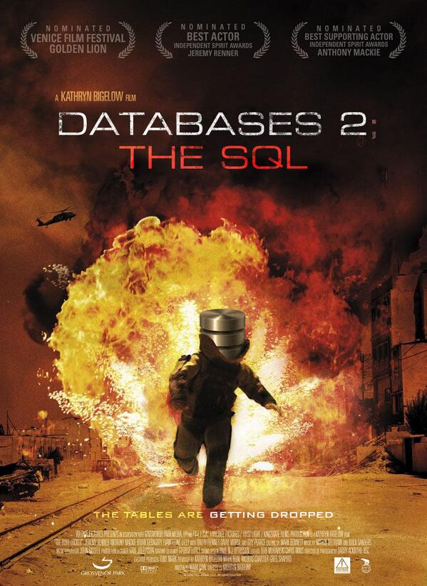
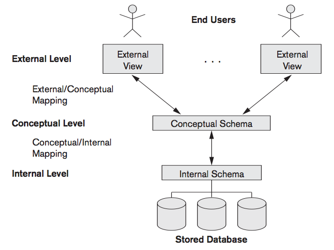
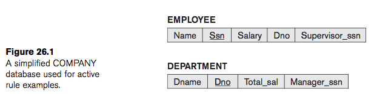
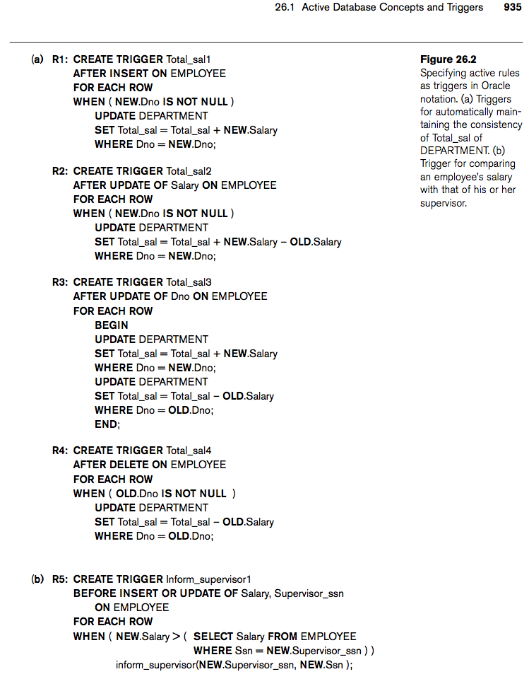
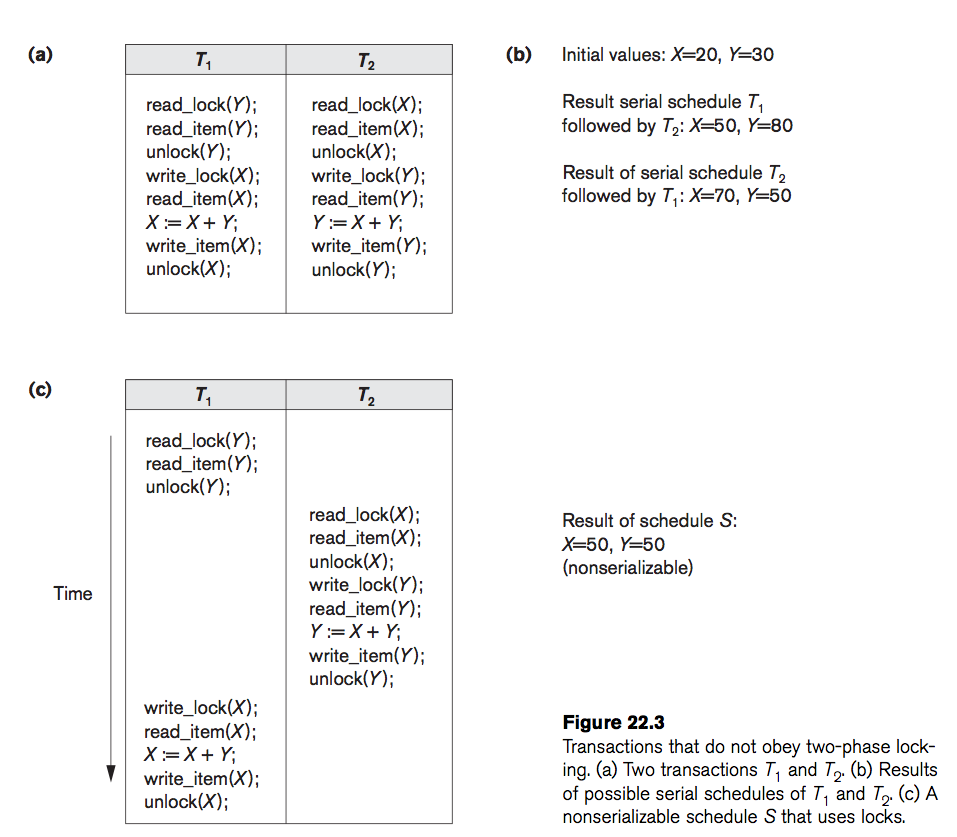
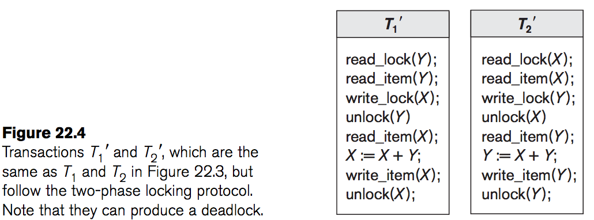
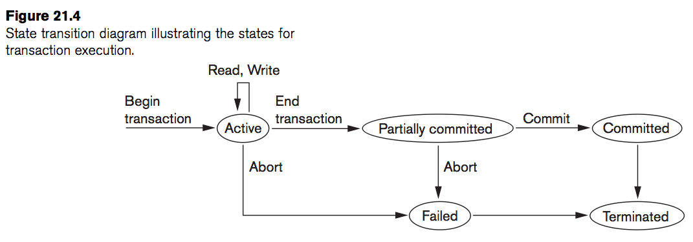
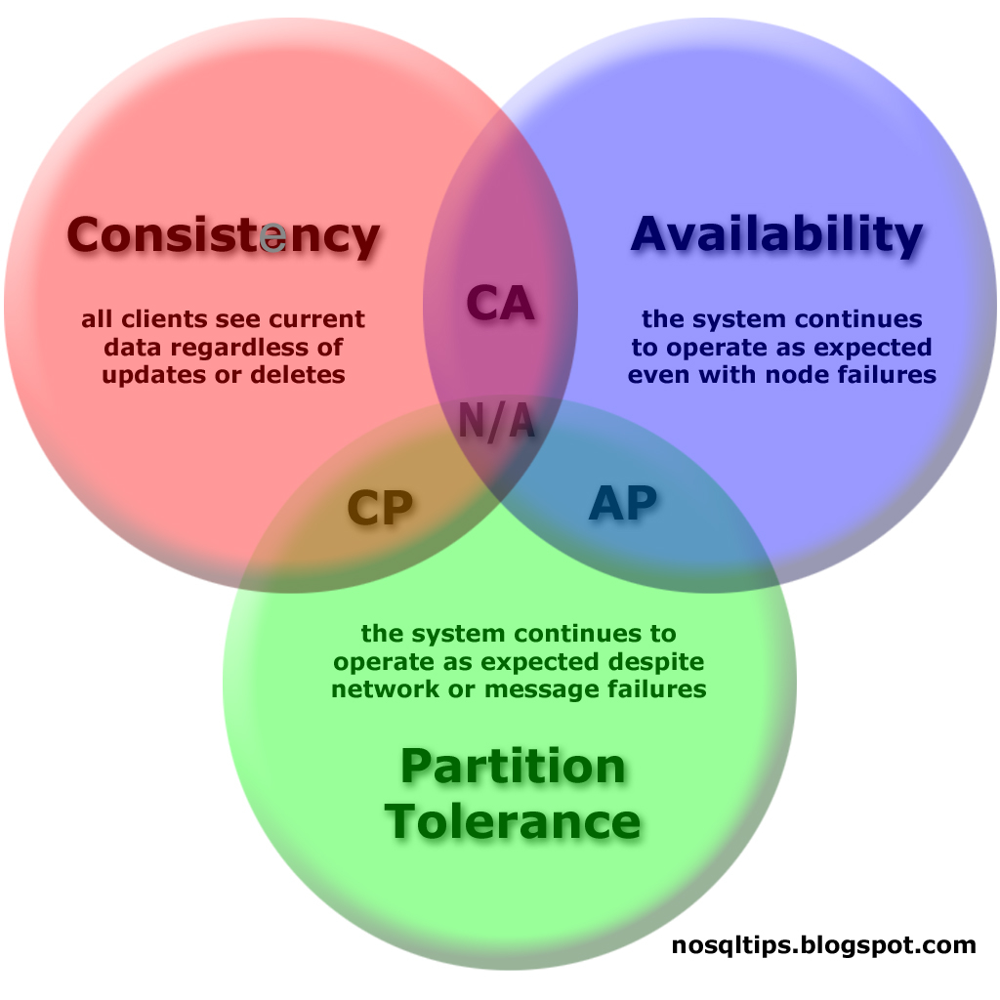

% Samenvatting IRDBMS
% Mathijs Bernson

# Inleiding Relational database management systems

<a href="the-sequel.jpg"></a>

## Intro en literatuur

* Studiepunten: 3 ECTS
* Studiebelasting: 84 SBU
* Modulecode: irdbms
* Boek: 
	* Elmasri Navathe
	* [Fundamentals of Database Systems](http://www.bol.com/nl/p/fundamentals-of-database-systems/1001004007511876/)
	* Addison-Wesley 
	* ISBN: 9780136086208
* Examenstof: boek, readers op ELO, colleges, practicumopdrachten. 
* Schriftelijke toets over de examenstof.

## Doelen

* Leren kennen van verschillende DBMS-oplossingen en de verschillen daartussen.
* Een DBMS inrichten en beheren: architectuur, performance,
beveiliging, concurrency.
* Complexe SQL opdrachten schrijven, optimaliseren en uitvoeren.

## Inhoud

* Week 1 - Inleiding
	* [Fundamentele concepten](#fundamentele-concepten)
	* [Logisch en fysiek databaseconcept](#niveaus-van-dbmsen)
	* [Verschillende DBMS oplossingen](#)
	* [DML en DDL statements](#)
* Week 2 - Relationele db's, SQL
	* [Constraints](#constraints)
	* [Views](#views)
	* [Triggers](#triggers)
* Week 3 - Query optimalisatie
	* [Query optimalisatie](#query-optimalisatie)
	* [Performance tuning](#performance-tuning)
* Week 4 - Transacties, recovery en concurrency control
	* [Transacties](#transacties)
	* [Logging](#logging)
	* [Recovery](#recovery)
	* [Concurrency control](#concurrency-control)
	* [Locking](#locking)
	* [ACID](#acid)
* Week 5 - Beveiliging
	* [Access control](#access-control)
	* [SQL injection](#sql-injection)
	* [Encryptie](#encryptie)
* Week 6 - Distributed databases
	* [Distributed databases](#distributed-databases)
	* [NoSQL](#nosql)
* Week 7
	* _Herhaling_

## Fundamentele concepten

### 3 niveau's van DBMS'en

* **Internal** (fysieke laag)
	* Dit is de "fysieke" opslagstructuur.
	* Is onzichtbaar voor de buitenwereld.
* **Conceptual** (logische laag)
	* Beschrijft de structuur van de database voor de gebruikers.
	* Tabellen
	* Vorig jaar met IRDB behandeld.
* **External** (view laag)
	* De API van de database.
	* Dit is wat de buitenwereld gebruikt.
	* Views

Dit wordt de _three-schema architecture_ genoemd.



Het "DBMS" conept is ontstaan uit software die het wegschrijven naar een file handelt. Hier is een relationeel systeem omheen gebouwd.

### Data independence

Een DBMS wil _Data independence_ waarborgen. In theorie wordt deze scheiding met het drie-schema model behaald.

We kennen twee niveau's van data independence:

#### Logical data independence

Dit wil zeggen dat het **conceptuele schema** kan veranderen, maar de **externe interface** hetzelfde blijft (m.b.v. views). Hierdoor blijven applicaties gewoon werken met de database.

#### Physical data independence

Het schema niet afhankelijk is van de manier waarop het wordt opgeslagen op het opslagmedium (hardeschijf).

#### Tedd Codd

Bedacht een relationeel model in de jaren '60. Is in de jaren '70 geïmplementeerd door Oracle.

* Relation -> Tabel
* Tuple -> Row
* Attribute -> Column

### DML, DDL en DCL

Met deze drie termen delen we SQL op in drie subgedeelten, op basis van functionaliteit.

* DDL
	* Data Definition Language (statements)
	* Creëren van structuren
	* `CREATE TABLE` etc.
* DML
	* Data Manipulation Statements
	* Dit zijn alle statements om data te manipuleren.
	* `SELECT, UPDATE, INSERT` en `DELETE`
* DCL
	* Data Control Language
	* Security en access control tot de database.
	* O.a. `GRANT` en `REVOKE`

Daarnaast kennen we:

* SDL
	* Storage definition language
	* Specificeert het interne schema.
* VDL
	* View Definition Language
	* Specificeert views/mappings naar het conceptuele schema.

## Nieuwe SQL

### Views

Views werken als een virtuele tabel. Ze kunnen gegevens opvragen, en kunnen deze eventueel ook op een andere manier weergeven.

```sql
CREATE [OR REPLACE] VIEW some_view_name
AS SELECT a, b, c
	FROM t1, t2, t3
	WHERE a = b AND c = d
	GROUP BY b
[WITH CHECK OPTION]; -- INSERT and UPDATE commands on the view will be checked
                     -- to ensure new rows satisfy the view-defining condition.
```

Een view bevat geen data, maar is gelinkt aan één of meer _base tables_. De gebruiker ziet het verschil niet bij bijv. een SELECT statement. Views kunnen bijv. handig zijn om een query met JOINs die je vaak gebruikt te vervangen.

Het uitvoeren van UPDATEs op een view kan ingewikkeld zijn.

Een **update view** kan het volgende **niet** hebben:

* Meer dan één base table
* Distinct in de `FROM`-clause
* `GROUP BY` of `HAVING`

En een **update view** moet het volgende **wel** hebben:

* `WITH CHECK OPTION` achter de definitie.

#### Inline views

Het is ook mogelijk om een view in de `FROM` clause van een SQL-query te hebben. In dit geval bestaat de view alleen in de query zelf.

### Detour: Active database rules

Triggers en stored procedures vallen onder de _active database rules_. D.w.z. dat de database niet alleen maar een passieve kaartenbak is, maar ook acties uit kan voeren.

### Triggers

Anders dan een stored procedure kan een trigger kan niet expliciet worden aangeroepen. Een trigger wordt geactiveerd wanneer er een bepaalde gebeurtenis plaatsvindt.

Triggers vallen onder het **Event-Condition-Action** model:

1. Het **event** is de gebeurtenis die de trigger activeert.
2. De **condition** is de voorwaarde waaraan voldaan moet worden voordat de trigger wordt uitgevoerd.
3. De **action** is de handeling die aan de trigger verbonden is. Dit kan SQL-code of code in een andere programmeertaal zijn.

* Een time trigger.
* Een UPDATE, INSERT of DELETE in een tabel.

#### Opbouw

Je maakt een trigger met `CREATE TRIGGER`. Bevat het volgende:

* Events
	* `BEFORE, AFTER, INSTEAD OF`
	* `FOR EACH ROW` of `FOR EACH STATEMENT`
* Conditie
* Body

Vraag: blocking of non-blocking? Hangt ervan af.
Bij een transactie moet je wachten tot de trigger is uitgevoerd.

#### Voorbeeld





_Zie ook: Navathe pagina 935._

### Stored procedures

Behoort ook tot de categorie _actieve data_. Is een stuk SQL-code die aangeroepen kan worden en iets doet. Heeft in- en uitvoerparameters.

Een trigger kan een stored procedure aanroepen.

* Naam
* Parameters
* Body

```sql
CREATE PROCEDURE procedure_naam (a, b, c)
BEGIN
END;

CREATE PROCEDURE procedure_naam (a, b, c)
RETURNS return_type
BEGIN
END;
```

```sql
CREATE PROCEDURE schrap_werknemers (variabele_x IN CHAR(4), jobcode_var IN CHAR(6) AS
BEGIN
	DELETE FROM werknemer
	WHERE dnr = variabele_x AND jobcode = jobcode_var
END;

CALL PROCEDURE schrap_werknemers ('D112', 'JOB124');
```

## Constraints

_Constraints_ zijn een manier om data-integriteit in ons schema te garanderen. Het stelt eisen aan de data die opgeslagen wordt.

We maken onderscheid tussen drie soorten constraints.

1. _Inherent model-based constraints_ of _implicit constraints_
	* Dit zijn de beperkingen die het model van de gebruikte database(-systeem) ons oplegt.
	* Bijvoorbeeld: dezelfde rij in een tabel kan nooit twee keer bestaan. Dit wordt voorgeschreven door het database-model.
2. _Schema-based constraints_ of _explicit constraints_
	* Zijn direct uit te drukken in het schema van het datamodel.
	* Bijvoorbeeld: films hebben maar één regisseur. Dit is een _belongs to_ relatie met een _foreign key_.
3. _Application-based constraints_ of _business rules_
	* Dit zijn regels die niet in SQL uitgedrukt kunnen worden.
	* Bijvoorbeeld: Validatie van e-mail adressen e.d.

In SQL kennen we een aantal verschillende _constraints_:

* PRIMARY KEY
	* Is een kolom of combinatie van kolommen die uniek identificerend is voor alle rijen.
* UNIQUE KEY
	* Is een kolom of combinatie van kolommen.
* FOREIGN KEY
	* Verwijzing naar een rij in een andere tabel. Hiermee wordt het bestaan van de tegenhangende rij afgedwongen.
* NOT NULL
	* De waarde in een veld mag niet gelijk zijn aan NULL.
* Assertion
	* Is een stukje DDL om een zelf gedefinieerde check mee uit te voeren. Dit geeft altijd een boolean terug; klopt dit of niet?
* Stored procedure
	* M.b.v. een stored procedure is de check van de constraint niet beperkt tot de mogelijkheden van de databasetaal.
* Andere conditie (zoals "integer waarde tussen 1 en 10")
	* Hier is specifieke SQL voor.

### Data integriteit

Twee soorten, **entiteits**- en **referentiële** integriteit.

## Relationele algebra

Relationele algebra, ook bedacht door meneer Codd, is een manier waarmee we queries op een abstracte manier kunnen modelleren.

### Operaties

R en S zijn willekeurige tabellen.

* Union (R &cup; S)
	* Alle records uit R en S.
* Intersection (R &cap; S)
	* De records die zowel in R als in S zitten.
* Difference (R &mdash; S)
	* De records die in R maar niet in S zitten.

### Set operators

#### Projection (&#960;)

Een projectie is een kolom die gebruikt gaat worden door een operatie.

#### Selection (&sigma;)

Selectie is een restrictie die wordt opgelegd aan hetgene wat **eronder** in de _query tree_ opgevraagd wordt.

#### Rename (&rho;)

// Aliast de naam van een kolom naar iets anders?

### Joins en join-like operators

#### Natural join (&#x22C8;)

De _natural join_ pakt van twee tabellen R en S het resultaat van de overlappende kolomnamen.

## Cartesisch product

Het Cartesisch product is een wiskundige operatie waarmee we het **product** van meerdere sets krijgen. Het symbool hiervoor is een kruis ( X ).

Speelkaarten zijn een goed voorbeeld: we hebben de 13 rangen {A, K, Q, J, 10, 9, 8, 7, 6, 5, 4, 3, 2} en de 4 soorten {Schoppen, Harten, Ruiten, Klaver}. Het cartesisch product hiervan zijn 52 _geordende paren_, namelijk de 52 mogelijke speelkaarten:

## Query optimalisatie

Om zo snel mogelijk met een antwoord op je query te komen (ook bij grote datasets) maken DBMS'en gebruik van _query optimalisatie technieken_.

Query optimalisatie gebeurt in een aantal fasen:

1. Scanning, parsing and validating
	* Returns _immediate form of query_
2. Query optimizer
	* Returns _execution plan_
3. Query code generator
	* Returns _code to execute the query_
4. Runtime database processor
	* Returns _result of the query_

De naam "query optimizer" is niet altijd even toepasselijk, aangezien het gekozen _execution plan_ niet altijd optimaal is. Een beter omschrijving zou zijn: "_het plannen van een goede execution strategy_".

### Query tree

De _optimizer_ vertaalt je query in feite naar [relationele algebra](#relationele-algebra). De datastructuur die hiermee overeen komt noemen we de _query tree_.

Elk _blad_ in deze boom is een relatie, elke _interne knoop_ is een operatie die we uitvoeren. Vanzelfsprekend is dat dit in de query tree op volgorde staat.

SQL is vrij gemakkelijk om te vormen naar relationele algebra, omdat de volgorde van bewerkingen in SQL niet wordt vastgelegd. Je vertelt het DBMS alleen _wat_ je wilt hebben (en waar het vandaan moet komen), en niet _hoe_ het dat precies moet doen.

### Optimalisatietechnieken

Het vinden van de beste optimalisatie-strategie is moeilijk en duur.

// Er zijn een aantal manieren om tot die geoptimaliseerde query te komen: het netwerk model, hiërarchisch model en objectmodel.

#### Heuristics

Het woord "heuristics" definiëren we als:

> Proceeding to a solution by trial and error or by rules that are only loosely defined.

Wat het voor databases betekent is dat het DBMS een aantal van deze optimalisatieregels kent, en achter elkaar toepast op de gegeven query.

Bij heuristics worden de bladen en knopen van de query tree gerangschikt om tot een efficiëntere query te komen.

##### Voorbeeld

Een query wordt vertaald naar [relationele algebra](#relationele-algebra) in de vorm van een _query tree_. Op die tree past het DBMS de volgende bewerkingen toe:

* Complexe selecties worden opgesplitst in meerdere eenvoudige selecties.
* Select operaties worden naar beneden verplaatst in de tree.
* Select operaties worden gerangschikt van meest restrictief naar minst restrictief. De meest restrictieve selecties worden links gerangschikt. Deze geven kleinere relaties.
* Waar mogelijk worden cartesische producten vermeden.
* Vervolgens wordt het `CARTESIAN PRODUCT` en `SELECT` waar mogelijk met `JOIN` operaties vervangen.
* Projection operaties worden naar beneden verplaatst in de query tree, telkens onder de operatie(s) waarin deze bepaald wordt.
	* Gooi onnodige attributen direct weg.
* Identificeer deelbomen die door één algoritme kunnen worden uitgevoerd (zonder tijdelijke tabel).

##### Pipelined en materialised evaluatie

Bij _materialised evaluation_ hebben we het over het tijdelijk opslaan van de (tussen)resultaten van de query. In sommige gevallen kan dit tot veel overhead leiden.

Bij _pipelined evaluation_ worden de operaties achter elkaar geketend zonder dat er een tijdelijk bestand nodig is.

##### Kostenschatting

De kosten van een query schatten we aan de hand van een aantal factoren:

* Toegang tot hulpgeheugen (hoeveel blokken kun je lezen/schrijven in de tijdelijke storage?)
* Opslag van tijdelijke bestanden
* Berekeningen
* Gebruik van het RAM
* Communicatiekosten tussen server en client

De toegang tot het hulpgeheugen weegt hier meestal in door.

## Performance tuning

### Queries analyzeren

Je kunt SQL-queries analyseren met `EXPLAIN`. Dit toont:

* De geschatte kosten in de vorm van de execution time.
* Hoe tabellen benaderd worden (sequentieel/index etc).
* De gebruikte join algoritmes.

Als DBA kun je `EXPLAIN` gebruiken om langzame queries te onderzoeken, en te achterhalen wat ze precies langzaam maakt.

### Indices

Indices zijn tabellen met verwijzingen naar andere gegevens, zodat deze gegevens sneller opgevraagd kunnen worden.
In de praktijk komt dit neer op de _caching_ van de meest gebruikte, minst veranderende gegevens, wat queries soms (veel) sneller kan maken.

Indices zijn echter geen wondermiddel. Als het herberekenen van de indices meer tijd kost dan het gebruik van de index oplevert is het proces inefficient.

### Hoe maak je een index?

```SQL
CREATE [UNIQUE] INDEX index_naam
ON tabel_naam (`kolom_naam`, ...)
[CLUSTER];
```

Met `UNIQUE` wordt de uniciteit van één of meer kolommen afgedwongen. Wanneer de unieke index over meerdere kolommen spant, moet de combinatie van deze kolommen uniek zijn.

Met `CLUSTER` worden de _data file records_ ook nog eens gesorteerd.

### Soorten indices

Indices worden altijd aangemaakt op een _ordered file_. Als je tabel maar één kolom heeft met bijv. text, is het geen _ordered file_.

#### Impliciet en expliciet

Een expliciete index is een index die je zelf aanmaakt. Impliciete indexes worden door het DBMS gegenereerd. _Primary keys_ zijn hier een voorbeeld van.

#### Primary, clustered en secondary indices

De primary index wordt gespecificeerd op het _ordering key field_ van de _ordered file_. Met dit key field worden de records fysiek op de disk gesorteerd.

Wanneer de _ordering field_ geen key field is, d.w.z. als meerdere records in het bestand dezelfde waarde kunnen hebben voor het _ordering field_, kan een ander type index gebruikt 
worden genaamd de _clustering index_.

##### Secondary index

Er is altijd **of** een primary index, **of** een clustering index. Soms wil je gegevens verder ordenen. Hiervoor gebruikt men _secondary indices_, die gespecificeerd kunnen worden op een willekeurig _non-ordering field_ van een bestand. Een data-bestand kan meerdere _secondary indices_ hebben naast de primaire toegangsmethode.

#### Heap

#### Unique

## Transacties, locking en concurrency control

### Concurrency control

Bij concurrency control hebben we het over het beheersen van operaties die gelijktijdig kunnen lopen. Dit brengt onder andere de volgende problemen met zich mee:

* Lost update problem
	* Wanneer meerdere updates tegelijk plaatsvinden kunnen deze invloed uitoefenen op hetzelfde item, wat kan leiden tot onwenselijke resultaten.
* Temporary update (dirty read) problem
	* Een item wordt gemanipuleerd door een transactie die voortijdig afgebroken wordt, maar ondertussen leest een andere transactie de incorrecte waarde van het item uit, voordat de oorspronkelijke waarde hersteld wordt.
* Incorrect summary problem
	* Als één transactie een opsomming maakt van meerdere database items, terwijl andere transacties deze items manipuleren, leidt dit tot een incorrecte opsomming.

### Transacties

Een transactie is een logische unit van _database processing_ die één of meer _access operations_ (insert, update of delete) bevat. Het combineert deze statements in een _alles-of-niets_ operatie. De tussenstappen zijn onzichtbaar voor de rest van de database totdat de transactie voltooid is.

Transacties hebben boundaries (begin en end statements). De acties in een transactie kun je verdelen in twee categorieën: lezen en schrijven.

Dankzij transacties kunnen we queries **groeperen**, waardoor er niks tussenin kan komen. Dit geeft _concurrency control_.

#### Voorbeeld

```sql
BEGIN; -- Start de transactie

UPDATE accounts SET balance = balance - 100.00
    WHERE name = 'Alice';
UPDATE departments SET total_salary = total_salary + 100.00
    WHERE department_name = "foo";

-- Nog meer queries...

COMMIT; -- Voer de commando's uit
[of]
ROLLBACK; -- Annuleer alles uit de transactie
```

### Serializability

Een transactie is _serializable_ wanneer het resultaat van de operaties in sequentie (achtereenvolgend) hetzelfde is als bij _concurrent_ (met overlap) uitvoering. Serializability is een belangrijk criterium om transacties _concurrently_ uit te kunnen voeren.

### Locking

Concurrency kan bereikt worden door middel van locking:

* Locking pakt ofwel _permission to read_ of _permission to write_ op een _data item_ (zoals een rij).
* Unlocking verwijdert deze permissies weer.
* Lock en unlock zijn atomic operaties. Ze kunnen nooit onderbroken worden en worden altijd achtereenvolgens uitgevoerd.

Een _lock_ is een variabele die de status van een item aangeeft. Zo is het duidelijk of je op een bepaald moment toegang tot iets kan krijgen of niet. Er is één lock voor elk item in de database. Over het algemeen hebben we het over **binary locks**. Dit zijn locks die over twee _states_ beschikken, **locked** of **unlocked**.

#### Shared/exclusive locks

Binary locking is echter te beperkt voor de meeste DBMS'en. Een andere manier van locken is met **shared/exclusive** (of **read/write** locks).

Hierbij definieren we 3 staten: **read-locked**, **write-locked** en **unlocked**. Als een item **read-locked** is mag hij door alles gelezen worden, maar niet aangepast. Daarom noemen we dit **share-locked**. Bij **write-locked** eist één transactie het item op, en mag niemand anders het lezen of schrijven. Dit heet **exclusive-locked**.

#### Two-phase locking

Een transactie dwingt het _two-phase locking_ protocol af als het alle locks aanvraagt **voordat** het de eerste unlock heeft gedaan. Zoals de naam al zegt worden de locks in twee fasen verkregen en weer losgelaten:

1. Expanding phase: locks worden verkregen en niks wordt losgelaten
2. Shrinking phase: locks worden losgelaten en niks wordt verkregen





Op de toets kan bijvoorbeeld gevraagd worden: volgen de getoonde transacties het two-phase locking protocol? Waarom zijn deze locks wel of niet serializable?

#### Varianten

Er bestaan een aantal varianten van two-phase locking:

* Basic 2PL
	* Dit is al uitgelegd
* Conservative
	* Eist van een transactie dat alles van tevoren gelockt wordt, voordat de transactie uitgevoerd wordt.
	* Het doet dit door de _read-set_ en de _write-set_ op voorhand te definiëren.
	* Met conservative locking zijn deadlocks uitgesloten.
* Strict 2PL
	* Een transactie T laat geen **exclusive** locks los tot nadat T commit of abort.
	* Daardoor kan geen enkele transactie schrijven of lezen in een item waar T een lock op heeft, totdat T heeft gecommit.
	* Dit leidt tot een _strict schedule_ voor recoverability.
	* Met strict locking kunnen deadlocks **niet** worden uitgesloten.
* Rigorous 2PL
	* Is hetzelfde als strick 2PL, maar laat ook geen **shared locks** los.

Let op het verschil tussen _conservative_ en _rigorous_ locking. Conservative locks alles voordat de transactie begint. Zodra de transactie begint zit hij in de _shrinking phase_.
_Rigorous_ locking unlockt pas nadat de transactie termineert, waardoor de transactie in de _expanding phase_ is tot hij eindigt.

### Deadlocks

Als twee of meer transacties wachten op een item dat gelockt is door een andere transactie, noemen we dat een _deadlock_. Deze situatie is onoplosbaar. Het is daarom een belangrijk probleem bij _concurrent_ systemen.

Een deadlock kan in een RDBMS voorkomen als bijv. twee tabellen van elkaar bepaalde _resources_ willen _locken_. In de praktijk komt het echter niet vaak voor.

### Deadlock preventie met timestamps

Er zijn twee methodes van deadlock-preventie, die allebei gebaseerd zijn op timestamps:

#### Wait-die

Als de timestamp van transactie I kleiner (dus ouder) is dan die van transactie J, dan mag I wachten. Anders (als I jonger is dan J) abort transactie I (hij sterft, _dies_), en herstart I later met **dezelfde** timestamp.

#### Wound-wait

Als transactie I kleiner (dus ouder) is dan J, dan wordt J ge-abort (I "verwondt" J) en later herstart met dezelfde timestamp. Anders, als I groter (dus jonger) is dan J, dan mag I wachten.

### Deadlock preventie zonder timestamps

Er zijn twee methodes van deadlock-preventie, die allebei niet gebaseerd zijn op timestamps:

#### No waiting

Als een transactie geen lock kan krijgen, wordt hij onmiddelijk ge-abort en na een tijdsvertraging weer herstart. Dit gebeurt zonder te checken of er daadwerkelijk een deadlock plaatsvindt. Hierdoor wachten transacties nooit, en kan er dus geen deadlock ontstaan.

#### Cautious waiting

_Cautious waiting_ is bedoeld om het aantal nodeloze aborts en restarts te verminderen. Stel: transactie I probeert een item probeert te waarop transactie J al een lock heeft, dan gelden de volgende regels: als J niet geblokkeerd (aan het wachten) is, dan wordt I geblokkeerd en toegestaan om te wachten. Anders wordt I afgebroken (ge-abort).

Cautious waiting is deadlock-vrij.

### Deadlock detectie

Bij deadlock detectie controleren we of er sprake is van een deadlock. Dit is aantrekkelijk als we weten dat de transacties niet (vaak) dezelfde items zullen benaderen. Als je weet dat het gaat om lange transacties die elk veel items gebruiken, of als de transaction load zwaar is, kan het voordelig zijn om deadlock **preventie** toe te passen i.p.v. deadlock **detectie**.

Deadlock detectie kan op een aantal manieren:

#### Wait-for graph

Hierin bouwen we een graaf (intern model) van de transacties en de afhankelijkheden op elkaar. Dit kan echter veel overhead veroorzaken.

#### Victim selection

Als het systeem in een staat van deadlock is, moet het systeem kiezen welke deadlock-veroorzakende transacties het beëindigt. Het kiezen van deze transacties noemen we _victim selection_.

#### Timeouts

Dit is een eenvoudige manier om deadlocks af te handelen. Als een transactie langer dan een gespecificeerde tijd duurt, wordt het gekilld door het systeem. Dit kan er echter voor zorgen dat processen ongewenst vroegtijdig worden afgebroken. Er wordt niet gecheckt of er wel sprake van een deadlock is.

#### Starvation

Starvation houdt in dat een transactie voor een onbepaalde tijd niet voltooit terwijl andere transacties in het systeem normaal doorgaan. Dit kan gebeuren wanneer het wachtschema voor locked items oneerlijk is en prioriteit toekent aan bepaalde transacties.

**Voorbeeld**: een transactie komt nooit aan de beurt in de queue omdat er steeds transacties met een hogere prioriteit ingevoerd worden.

**Voorbeeld 2**: een transactie wordt telkens gemarkeerd als deadlock, en voltooid daardoor niet.

Een mogelijke oplossing voor starvation is om een eerlijk wachtschema te hebben, zoals een FIFO-queue.

### Timestamp ordering

Een **timestamp** zien we als een unieke identifier die gegeven wordt naar de volgorde waarin transacties worden ingevoerd in het systeem. We hebben het dus over de starttijd van de transactie.

Timestamps kunnen op een aantal manieren gegenereerd worden.
Dit kan door middel van een counter, die zijn waarde ophoogt bij iedere transactie. De maximumwaarde van de counter is eindig, dus zal hij om de zoveel tijd gereset moeten worden.

Een andere manier is gebruik maken van de systeemklok. Echter moet er gegarandeerd worden dat er geen twee timestampwaarden gegenereerd worden tijdens dezelfde _tick_ van de klok.

### Multiversion concurrency control

Een andere techniek voor concurrency is om de oude waardes van een _data item_ te bewaren. Dit heet **multiversion concurrency control**, aangezien er meerdere versies van een item worden bewaard. Als een transactie toegang tot een item nodig heeft, wordt de juiste versie van dat item gekozen om _serializability_ te behouden. Zo zijn sommige read-operaties alsnog mogelijk omdat er een oude versie van het item gelezen kan worden. Wanneer er naar een item wordt geschreven, wordt er gewoon een nieuw item bewaard.

## ACID

_ACID_ is een belangrijke set eigenschappen die garanderen dat [database transacties](#transacties) op een betrouwbare manier verwerkt worden. Het is een afkorting voor **Atomicity**, **Consistency preservation**, **Isolation** en **Durability**.

### Atomicity
	
Atomiciteit wil zeggen dat een operatie compleet wordt afgemaakt of helemaal niet. Er is geen tussenstaat.

_Voorbeeld_: Als er in een banksysteem geld van mij naar iemand anders wordt overgemaakt, dan is er _geen moment_ waarop we geen van beiden het geld hebben, of juist allebei het geld hebben.

### Consistency preservation

De database moet in een consistente staat blijven (zijn integriteit behouden). In de praktijk wil dat zeggen dat de door ons gestelde _constraints_ altijd geldig blijven.

### Isolation

Transacties mogen elkaar niet beïnvloeden. Updates/inserts/deletes van een transactie zijn onzichtbaar voor de buitenwereld totdat er een COMMIT heeft plaatsgevonden.

Dit is belangrijk bij bijv. rapporteren. Stel dat het genereren van een rapport een uur duurt, dan mogen er tijdens dit uur geen wijzigingen zichtbaar worden.

### Durability or permanence
	
Als een transactie eenmaal gecommit is, mogen de changes nooit verloren gaan door een latere fout. Problemen veroorzaakt door het OS vallen echter buiten beschouwing van het DBMS.

## Recovery en logging

### Recovery

Bij een transactie kunnen er dingen mis gaan. Mogelijke oorzaken van het falen van een transactie kunnen zijn:

* Systeemcrash (hardware of software falen)
* Transactie of systeem error (een conditie in je code klopt niet en je wilt terugrollen)

Recovery kent een _undo_ en een _redo_ operatie.

**Undo** lijkt op rollback, maar het werkt op een enkele operatie ipv op een hele transactie.

**Redo** specificeert dat _bepaalde_ (transactie) operaties opnieuw uitgevoerd moeten worden, zodat alle operaties van een committed transactie succesvol zijn uitgevoerd op de database.



### Logging

Een _recovery manager_ schrijft alle operaties binnen het DBMS weg in een logbestand. De volgende operaties worden bijgehouden:

* Begin en einde van een transactie
* Alle reads en writes
* Commit van een transactie
* Rollback/abort van een transactie

Aan de hand van de log (of journal) moet het mogelijk zijn om te herstellen van transactiefouten. Aangezien de log op de schijf bewaard wordt, kan alleen een "catastrofale fout" zoals een hardeschijfcrash het onbruikbaar maken. Er wordt in sommige situaties ook een backup van de log gemaakt.

## Beveiliging

### Algemene database beveiligings issues

Database security heeft met allerlei onderwerpen te maken. Voorbeelden zijn:

* Legale en ethische kwesties over het recht van toegang tot bepaalde informatie.
* Beleidskwesties op overheids- institutioneel- of bedrijfsniveau van wat voor informatie publiekelijk beschikbaar moet zijn.
	* Denk aan medische gegevens en kredietgegevens.
* Systeem-gerelateerde kwesties zoals welke security-functies toegepast moeten worden en op welk niveau.
* De behoefte [in sommige organisaties] om meerdere security levels te identificeren, en zowel de gebruikers als de data te categoriseren op basis van deze opgestelde classificaties.

De DBA is de eindverantwoordelijke over de beveiliging van de database.

### Risico's

Er zijn drie belangrijke risico's voor ieder DBMS.

* Loss of integrity
	* Informatie moet altijd beschermd zijn tegen ongeoorloofde wijzigingen en/of verlies.
	* Dit kan zowel opzettelijk als per ongeluk gebeuren.
* Loss of availability
	* Data moet beschikbaar zijn voor de geoorloofde gebruikers wanneer zij daar de rechten toe hebben.
* Loss of confidentiality
	* Data mag niet bekend worden aan ongeoorloofde partijen.

### Control measures

We onderscheiden vier belangrijke maatregelen om beveiliging te ondersteunen in databases:

1. Access control
2. Inference control
3. Flow control
4. Data encryption

### Access control

We onderscheiden drie vormen van access control:

### Inference control

### Flow control

#### Mandatory


#### Discretionary


#### Role-based

Users en privileges.

### SQL injectie

Lijkt me voor de hand liggend. Bijna niks over verteld. Zie iweb.

### Encryptie

Hashing?

## Distributed databases

Cassandra?

## NoSQL

NoSQL is een ander model dan relationeel. Waar relationele databases sterk zijn in data-integriteit, laat NoSQL dat vallen. Het neemt het niet zo nauw met ACID properties, en dan met name de _Consistency_.



Het is daarom niet zinnig om bijv. aandelenkoersen en boekhoudgegevens (die relationeel van aard zijn) in een NoSQL database op te slaan. NoSQL leent zich goed voor **semi-gestructureerde** data. Denk aan profielgegevens, zoektermen enzovoort.

Op dit moment zijn relationele databases de gevestigde orde, en staat NoSQL nog in de kinderschoenen.

### Kenmerken van NoSQL

* Gedistribueerd, grote schaal
* Horizontaal/lineair schaalbaar
* Open source
* Schemaless
* Consistent (lol)
* Ondersteunt replicatie
* API ondersteuning

### Waarom NoSQL?

NoSQL-databases zijn soms een aantrekkelijke keuze omdat ze een aantal zaken beter beloven te doen:

* Schalen, o.a. door distribution
* Semi-gestructureerde data opslaan

### NoSQL oplossingen

We onderscheiden grofweg 4 vormen van NoSQL:

1. Column-oriented databases
2. Document-oriented databases
3. Key/value stores
4. Graph databases

### Voorbeelden van NoSQL DBMS'en

* Cassandra
* Mongo
* HBase