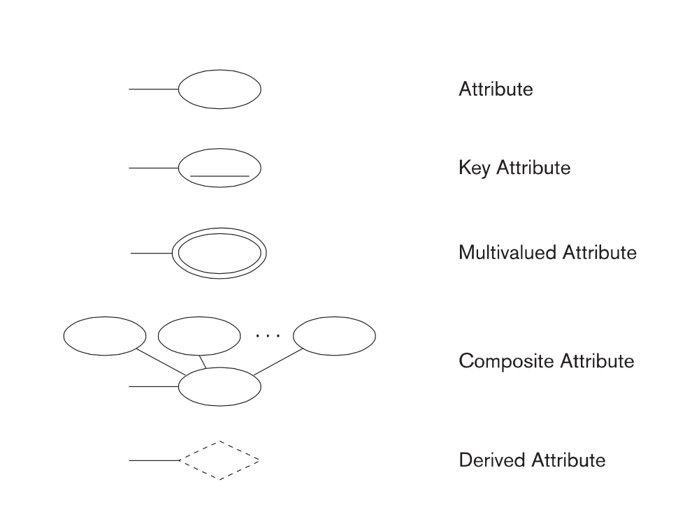
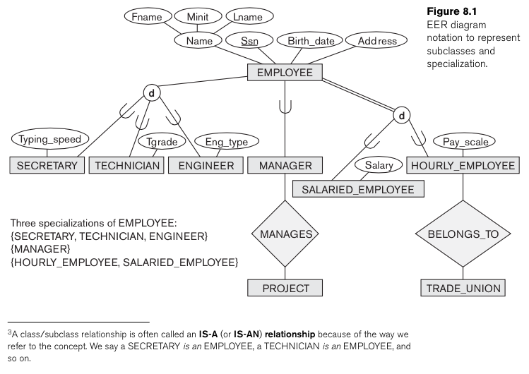

% Samenvatting IRDM
% Mathijs Bernson

# Inleiding Relationele databases modelleren

* Docent: Thomas Boose
* Studiepunten: 3 ects
* Studiebelasting: 84 sbu
* Modulecode: IRM

## Literatuur

* [Fundamentals of Database Systems](http://www.bol.com/nl/p/fundamentals-of-database-systems/1001004007511876/)
	* Elmasri, Navathe
	* Addison-Wesley 
	* ISBN: 9780136086208

### Examenstof

Hoofdstukken 7, 8, 9, 10, 15 uit het boek.
Colleges (slides) en oefeningen.

## Toetsvorm

* Werkstuk 50%
* Schriftelijke toets (mc) 50%

## Programma

* Week 1 & 2: Hoofdstuk 7
* Week 3: Hoofstduk 8
* Week 4: hoofdstuk 9
* Week 5: Hoofdstuk 15 → case inleveren
* Week 6: Hands on workshop college
* Week 7: Hoofdstuk 10
* Week 8: Maandag werkstuk inleveren
* Week 9: Toets

## Inhoud

* [Functionele requirements](#functionele-requirements)
* [Data requirements](#data-requirements)
* [Entiteiten](#entiteiten)
	* [Zwakke en sterke entiteiten](#zwakke-en-sterke-entiteiten)
* [Attributen](#attributen)
	* [Composite en atomic](#composite-en-atomic)
	* [Single-valued en multivalued](#single-valued-en-multivalued)
	* [Stored en derived](#stored-en-derived)
	* [Null-waarden](#null-waarden)
* [Relaties](#relaties)
* [Functionele afhankelijkheden](#functionele-afhankelijkheden)
* [Normaalvormen](#normaalvormen)
	* [Normaalvorm 0 (0NF)](#normaalvorm-0-0nf)
	* [Eerste normaalvorm (1NF)](#eerste-normaalvorm-1nf)
	* [Tweede normaalvorm (2NF)](#tweede-normaalvorm-2nf)
	* [Derde normaalvorm (3NF)](#derde-normaalvorm-3nf)
* [Entity en entity sets](#entity-en-entity-sets)
* [Keys](#keys)
* [Value sets](#value-sets)
* [Relaties](#relaties-1)
	* [Relatietypes- en sets](#relatietypes--en-sets)
	* [Total participation](#total-participation)

* [Soorten diagrammen](#soorten-diagrammen)
    * [Entity Relationship Diagrams](#entity-relationship-diagrams)
    * [UML Diagrams](#uml-diagrams)
	
## Modelleren

Modelleren is een belangrijke fase in het bouwen van database-applicaties. Je gaat altijd in een aantal stappen van idee/concept naar de implementatie van je database-systeem.
Modelleren is daarbij zeer belangrijk.

We stellen twee soorten requirements aan de database(-applicatie): **functionele requirements** en **data requirements**.

### Functionele requirements

**Functionele requirements** zijn de door gebruikers opgegeven operaties die op de database worden uitgevoerd. Dit zijn zowel SELECT's als UPDATE's.
Je modelleert de functionele requirements doorgaans met flow-diagrammen, (UML-)sequence of scenario's.

### Data requirements

**TODO**

### Entiteiten

Het basisobject waar een ER-diagram uit bestaat is een *entiteit*. Een entiteit is (normaalgesproken) een ding in de echte wereld, met een eigen, onafhankelijk bestaan.

#### Zwakke en sterke entiteiten

Een entiteit zonder zijn eigen *key attributes* noemen we een zwakke entiteit. Voorbeelden hiervan zijn koppeltabellen, die alleen maar *foreign keys kennen*.

Daar tegenovergesteld staan *regular entity types*, die wel hun eigen *key attributes* hebben. Deze mogen ook *strong entity types* genoemd worden.

### Attributen

Een entiteit heeft **attributen**. Attributen zijn eigenschappen die de entiteit beschrijven.

#### Composite en atomic

*Composite* attributes bestaan uit meerdere (basis) attributen. Een voorbeeld hiervan is een *adres*. Dit bestaat uit een straat, postcode, plaats etcetera.

Composite attributen kunnen genest zijn; zo kan de straat uit het adres weer bestaan uit een straatnaam, huisnummer, en ga zo maar door.

Alle "ondeelbare" attributen noemen we *atomic* attributes.

#### Single-valued en multivalued

*Single-valued* attributen hebben een enkele waarde voor een entiteit. Leeftijd is hier een voorbeeld van.

*Multivalued* attributen bestaan uit meerdere waarden voor één entiteit. Denk bijvoorbeeld aan een attribuut "diploma's" bij een persoon of "kleuren" bij een meubel of auto.
Hier kunnen beperkingen opgelegd worden, bijvoorbeeld dat een entiteit minimaal één en maximaal drie kleuren heeft.

#### Stored en derived

Sommige attributen kun je afleiden uit andere attributen. Voorbeeld hiervan is de leeftijd van een persoon, die je kunt achterhalen als je de geboortedatum hebt.
Geboortedatum is hier een *stored attribute*, en leeftijd een *derived attribute*.

#### Null-waarden

Als een bepaalde waarde leeg is, vullen we er `NULL` voor in.
De betekenis van `NULL` is 'onbekend' of 'niet van toepassing.

### Relaties

Wanneer een *attribuut* van één entiteitstype refereert naar een ander entiteitstype spreken we van een relatie.
Deze referenties beschouwen we bij het modelleren niet als attributen, maar als relaties.

### Functionele afhankelijkheden

*Niet te verwarren met [functionele requirements](#functionele-requirements)*

*Deels uit het boek*:

Database design is opgezet om naar set van relaties te komen, uiteindelijk. Daarbij hebben we doelen geformuleerd die in twee categorieën vallen:

1. Minimize redundancy 
	* atomaire gegevens moeten op één plek, geen gegevens twee keer opslaan
		* single point of truth
		* Dit is ook voor je views van belang
	* geen meerdere (synchrone) updates hoeven doen
	* consistentie behouden
2. Preserve information
	* de concepten uit een database moeten reproduceerbaar zijn naar het origineel.

### Normaalvormen

#### Normaalvorm 0 (0NF)

Data is niet genormaliseerd.

    ------------------------------------------------------------
    | Naam | Geboortedatum | Taal1 | Niveau1 | Taal2 | Niveau2 |
    ------------------------------------------------------------
    | Test | 21-10-1992    | Java  | Gemidd. | C++   | Basis   |
    | Abcd | 11-10-1992    | NULL  | NULL    | C++   | Geavanc |
    ------------------------------------------------------------

#### Eerste normaalvorm (1NF)

Er mogen geen dubbele kolommen voorkomen (zoals *taal1* en *taal2*).

    ------------------------------------------
    | Naam | Geboortedatum | Taal1 | Niveau1 |
    ------------------------------------------
    | Test | 21-10-1992    | Java  | Gemidd. |
    | Test | 21-10-1992    | C++   | Basis   |
    | Abcd | 11-10-1992    | C++   | Geavanc |
    ------------------------------------------

#### Tweede normaalvorm (2NF)

Een tabel in de tweede normaalvorm moet aan 1NF voldoen.

Daarnaast moeten alle attributen die niet in de *primary key* zijn opgenomen, afhankelijk zijn van de gehele sleutel, en niet slechts van een gedeelte van de sleutel.

#### Derde normaalvorm (3NF)

Tabel moet op zijn beurt voldoen aan 2NF.
Alle niet-sleutel attributen zijn alleen afhankelijk van de sleutel, niet-sleutel attributen hebben geen relatie met andere niet-sleutel attributen.

> "And nothing but the key"

De Bocye Codd normaalvorm (BCNF) hangt op 2NF.

### Entity en entity sets

Een *entity type* definieert een collectie (of set) van entiteiten die dezelfde attributen hebben.
De verzameling entiteiten die aan een bepaald entity type toebehoren noemen we een *entity set*.

De *entity type* en *entity set* hebben doorgaans dezelfde naam.
In ER-diagrammen beschrijven we alleen entity types.

### Keys

Een attribuut dat distinct is voor iedere individuele entiteit in een set noemen we een *key attribute*.

Een entiteit kan meerdere *key attributes* hebben. In dit geval moet de combinatie van deze attributen uniek zijn.

Key attributen worden onderlijnd in ER-diagrammen.

Unique keys

### Value sets

Ieder *simple attribute* van een entiteitstype beschikt over een **value set** (ook wel **domein** genoemd), van alle waarden die het attribuut kan aannemen.

Een *simple attribute* is een attribuut dat *single-valued*, *atomic* en geen *primary key* is. [citation needed]

*Value sets* worden meestal niet getoond in ER-diagrammen. Ook worden de standaard datatypen uit programmeertalen er doorgaans  voor gebruikt (int, float, string, date enzovoort).

### Relaties

**TODO**

#### Relatietypes- en sets

**TODO**

#### Total participation

*Total participation* wil zeggen dat alle entiteiten van een bepaald type een bepaalde relatie hebben. Deze mag dus niet `null` zijn.

### Soorten diagrammen

Er zijn allerlei verschillende diagram-normen om databases in te modelleren. De belangrijkste zijn *Entity Relationship* (ER) en *Unified Modeling Language* (UML).

* Entity Relationship
	* Chen
	* EER
* UML
	* Class diagram

### Entity Relationship Diagrams

**TODO**

#### Chen ER diagrammen

**TODO**

#### Enhanced ER diagrammen

**TODO**

##### Subtypes en supertypes

### UML Diagrams

#### Class diagram

**TODO**