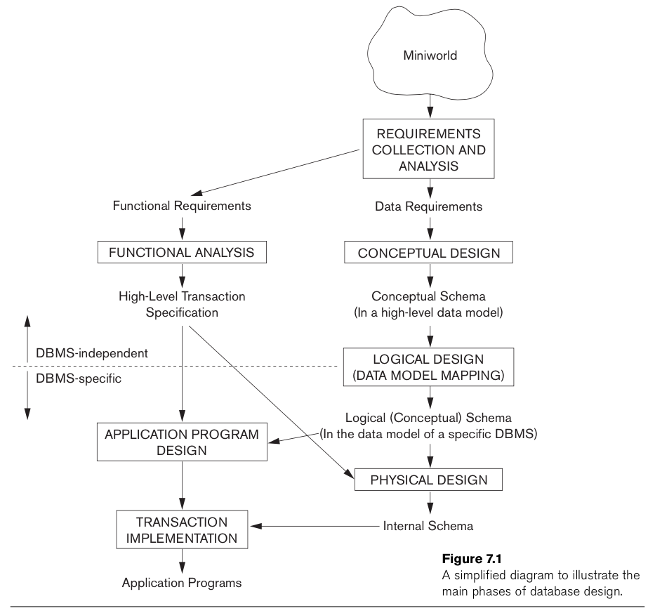

% Samenvatting IRDM
% Mathijs Bernson

# Inleiding Relationale databases modelleren

* Docent: Thomas bosose
* Studiepunten: 3 ects
* Studiebelasting: 84 sbu
* Modulecode: IRM

## Literatuur

* [Fundamentals of Database Systems](http://www.bol.com/nl/p/fundamentals-of-database-systems/1001004007511876/)
	* Elmasri Navathe
	* Addison-Wesley 
	* ISBN: 9780136086208

Examenstof: boek, colleges en oefeningen.

### Verdere stof

* Slides
* [Video](https://www.youtube.com/watch?v=O4PXqpv8TAw)

## Toetsvorm

* Werkstuk 50%
* Schriftelijke toets (mc) 50%

## Programma

* Week 1 & 2: Hoofdstuk 7
* Week 3: Hoofstduk 8
* Week 4: hoofdstuk 9 → cases inleveren?
* Week 5: Hoofdstuk 15 → cases inleveren!
* Week 6: Hands on workshop college
* Week 7: Hoofdstuk 10
* Week 8: Maandag werkstuk inleveren
* Week 9: Toets

In week 8 **werkstuk inleveren**!

## Inhoud

* [Tekst](#)

## Modelleren

Modelleren is een belangrijke fase in het bouwen van database-applicaties.

stappen van concept naar implementatie

We stellen twee soorten requirements aan de database(-applicatie): **functionele requirements** en **data requirements**.

### Entiteiten

Het basisobject waar een ER-diagram uit bestaat is een *entiteit*. Een entiteit is normaalgesproken een ding in de echte wereld, met een eigen (onafhankelijk) bestaan.

### Attributen

Een entiteit heeft *attributen*. Attributen zijn eigenschappen die de entiteit beschrijven.

#### Composite en atomic

**Composite** attributes bestaan uit meerdere (basis) attributen. Een voorbeeld hiervan is een *adres*. Dit bestaat uit een straat, postcode, plaats etcetera.

Composite attributen kunnen genest zijn; zo kan de straat uit het adres weer bestaan uit een straatnaam, huisnummer, en ga zo maar door.

Alle "ondeelbare" attributen noemen we **atomic** attributes.

#### Single-valued en multivalued

Hobbies

#### Stored en derived

Leeftijd

### Soorten diagrammen

Er zijn allerlei verschillende diagrammings-normen om databases mee te modelleren.

* Entity Relationship
	* EER
	* Chen
* UML
	* Class diagram

### Entity Relationship Diagrams

#### Chen ER diagrammen

#### Enhanced ER diagrammen

## Data modelleren

Tekst