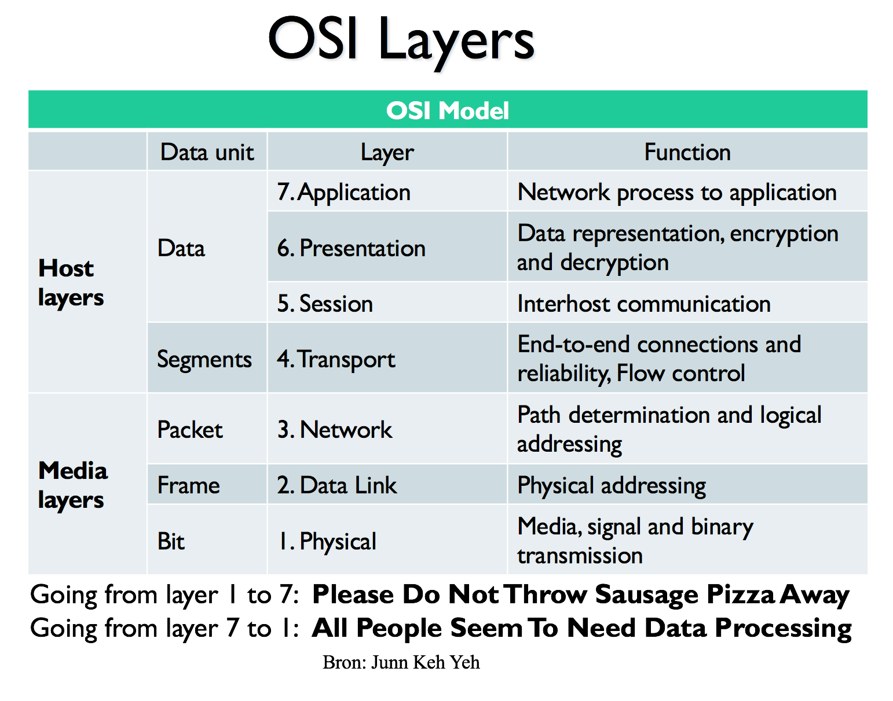
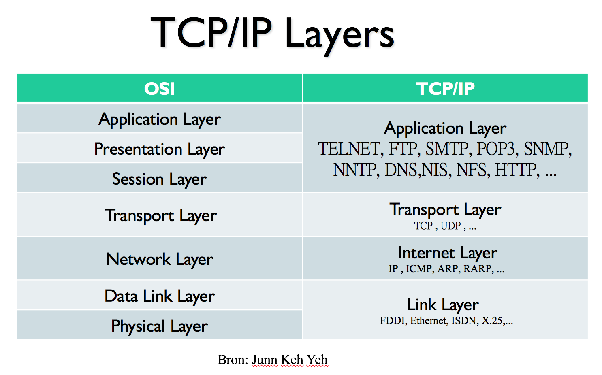
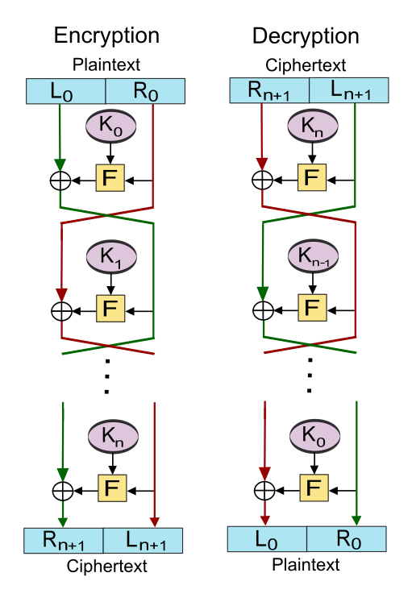

% Samenvatting ISEC
% Mathijs Bernson

# Samenvatting ISEC

## Informatie

* Studiepunten: 3 ECTS
* Studiebelasting: 84 SBU
* Modulecode: ISEC

## Literatuur

* William Stallings, 2010. Network security essentials, fourth edition. Uitgever: Pearson, ISBN 978-0-13-706792-3.
	* Hoofdstukken 1, 2.1, 2.2, 2.4, 3.1, 3.4, 3.6, 4.2, 8, 9, 10 en 11.
* Computernetwerken, een top-down benadering (Kurose en Ross) *niet verplicht*
* Slides

## Onderwerpen

### Kennen

De begrippen die je moet kennen voor dit vak zijn onder andere:

* Network Security, CIA (confidentiality,integrity, availability)
* Authentication, Accountability,Non Repudiation
* Threats, Attacks,Security Services,Security Mechanisms,
* Security Policies
* Network Aspects, OSI-TCPIP Security, Bandwidth, Channel Capacity
* Error Detection and Correction Coding, Hash Coding
* Shannons Theorems on Capacity, Source Coding, Huffmann Coding
* Parity Checking, Checksums, Cyclic Redundancy Coding
* History Cryptography, Caesar codes (intro modular arithmetic)
* One Time Pad Cryptography.
* Cryptoanalysis, Relative Frequency Attack, Vigniere coding.
* Modern Symmetric Key Cryptography The DES standard
* Modern Asymmetric Key Cryptography RSA , Gebruik Priem Getallen
* Demilitarized zones, Firewalls, Virtual Private Networks, Intrusion Detection
* Authentication protocols (Kerberos). Digital Signatures ,Password Strength, Pretty Good Privacy PGP

### Technieken

* De verschillen tussen symmetrische en asymmetrische encryptie beschrijven
* De stappen bij Kerberos authenticatie beschrijven en aangeven welke beveiligingsdoeleinden door de verschillende stappen worden geleverd
* De stappen bij Public Key Encryptie beschrijven
* De stappen bij Private Key Encryptie beschrijven
* De verschillende typen en de werking van firewalls beschrijven
* De functie en werking van een Demilitarized Zone (DMZ) beschrijven
* De functie en werking van een Virtual Private Network (VPN) 

Behandeld worden de onderwerpen beveiligingsbeleid, beveiligingsrisico's, internetdiensten, firewalls, DMZ, VPN, error detection en correction, symmetrische / asymmetrische / public key encryptie, crypto-analyse, intrusion detection, logische en fysieke beveiliging, authenticatie, Kerberos, packet filtering.

### Kunnen

* Barcode checksums
* **Huffman coding**!
* **Cyclic redundancy check**!
* Parity bits uitzoeken
* Zelf public key encryptie kunnen doen

## Toets tips

Voor dit vak moet je zowel dingen **kennen** als dingen **kunnen**. Als je teveel colleges mist, zal dit laatste waarschijnlijk mislukken. Zaken als Huffman coding, CRC checks, parity checks en barcode checksums moet je met de hand kunnen doen.

Neem een (wetenschappelijke) rekenmachine mee! Deze zul je nodig hebben voor de berekeningen.
**Let op**: een *grafische rekenmachine* is niet toegestaan.

Zorg dat je aanwezig bent bij alle colleges, je zult het nodig hebben.

## Inhoud

* [Security concepts](#security-concepts)
	* [CIA triad](#cia-triad)
	* [Threats](#threats)
	* [Attack](#attack)
	* [Soorten attacks](#soorten-attacks)
		* [Passive attack](#passive-attack)
			* [Interception](#interception)
			* [Traffic analysis](#traffic-analysis)
		* [Active attack](#active-attack)
			* [Replay](#replay)
			* [Modification](#modification)
			* [Denial of service](#denial-of-service)
	* [X.800 security services](#x.800-security-services)
	* [Level of impact](#level-of-impact)
* [OSI TCP/IP](#osi-tcpip)
	* [Information theory](#information-theory)
		* [Channel capacity, bandwith](#channel-capacity-bandwith)
		* [Source coding, compression](#source-coding-compression)
		* [Channel coding](#channel-coding)
* [Encryptie](#encryptie)
	* [Terminologie](#terminologie)
	* [Symmetrisch vs. asymmetrisch](#symmetrisch-vs.-asymmetrisch)
		* [Symmetrisch](#symmetrisch)
		* [Asymmetrisch](#asymmetrisch)
	* [Algoritmen](#algoritmen)
		* [DES](#des)
		* [3DES](#des-1)
		* [AES](#aes)
		* [Stream cipher vs. block cipher](#stream-cipher-vs.-block-cipher)
	* [Feistel cipher structuur](#feistel-cipher-structuur)
	* [Public key encryptie](#public-key-encryptie)
		* [Diffie Helman key exchange](#diffie-helman-key-exchange)

## Security concepts

Technologie op zichzelf is onvoldoende om goede beveiliging te kunnen bereiken.
Security is een combinatie van technologie, proces en gedrag.

> Information security = network security + computer security

```
         Information security
                    ^
                    |
        /---------------------\
       |                      |
Computer security       Network security
```

Een pragmatische aanpak van security is nodig, want dat is wat in de praktijk werkt. Besef dat een systeem nooit 100% veilig/waterdicht kan zijn.

Het doel is altijd om security tot een **acceptabel niveau** te houden, omdat je nooit alles kunt voorkomen.
Wat de precieze definitie van "acceptabel" is, verschilt per situatie of doelgroep.

> Network and information security is a **combined** set of actions in *technology*, *process* and *behavior*
> in order to main **C, I, and A** at an **acceptable level**.

Issues binnen security zijn onder meer:

* Transmissies beveiligen
* Continuïteit van systemen bewaken
	* DDOS-preventie en afwee
* Gegevensbeveiliging

### CIA triad

* **Confidentiality** dekt twee concepten:
	* Data confidentiality: privé/geheime informatie is niet beschikbaar voor ongeautoriseerde personen.
	* Privacy: personen hebben controle/invloed over welke informatie over hen wordt verzameld en opgeslagen.
* **Integrity** dekt twee concepten:
	* Data integrity: informatie en programma's worden alleen op een geautoriseerde manier gewijzigd.
	* System integrity: een systeem werkt op de juiste manier zonder ongeautoriseerde manipulaties daaraan (opzettelijk of niet).
* **Availability**
	* Systeem werkt en reageert op tijd, service is beschikbaar voor geautoriseerde gebruikers.

Tegenstellen met:

* Confidentiality -> disclosure
* Integrity -> destruction (of wijziging)
* Availability -> denial

### Extended CIA-triad

De CIA triad is uitgebreid met:

* Authentication
	* Identiteitsverificatie
	* *Proof of identity*
* Accountability
	* Aansprakelijkheid
	* Realiseren met bijv. logging
* Non-repudiation
	* Bewijzen dat een bericht echt van de afzender is
	* It implies that one party of a transaction cannot deny having received a transaction nor can the other party deny having sent a transaction.

### Threats

Een *threat* is het gebruik maken van een *vulnerability* (zwakte), om security te doorbreken en schade te veroorzaken.

> A possible danger that might exploit a vulnerability given a Circumstance, Capability, action, or event to breach security and cause harm.

### Attack

Een aanval die resulteert van een threat.

> An assault on system security that derives from a threat.

### Soorten attacks

We onderscheiden **passieve** en **actieve** aanvallen.
Een passieve aanval verandert niks aan systeem *resources*.
Een actieve aanval doet dit wel.

Passieve aanvallen zijn moeilijk om te detecteren, maar er zijn manieren om hun success te **voorkomen**.
Het is moeilijk om actieve aanvallen te voorkomen, omdat er teveel mogelijke fysieke, software en netwerk kwetsbaarheden zijn. Bij actieve aanvallen ligt de nadruk op het **detecteren**.

#### Passive attack

Passieve aanvallen omvatten het aftappen/afluisteren van communicatie zonder deze te veranderen. Het doel is om informatie te verkrijgen.

##### Interception

TODO

##### Traffic analysis

TODO

#### Active attack

Een actieve aanval omvat het aanpassen van de data stroom of het namaken van een legitieme datastroom.

##### Replay attack

Data wordt met op een passieve manier afgevangen, en later opnieuw verzonden om een ongeautoriseerd effect te behalen.

##### Modification

Deel van een legitiem bericht wordt veranderd om een ongeautoriseerd effect te behalen.

##### Denial of service

Het normale gebruik van een communicatiemiddel blokkeren, bijvoorbeeld door het te overladen met berichten.

### X.800 security services

* Authenticatie
	* De garantie dat een communicerende eniteit is wie het zegt dat het is
* Toegangscontrole (access control)

TODO

### Level of impact

## OSI TCP/IP

1. Physical
2. Data link
3. Network
4. Transport
5. Session
6. Presentation
7. Application





### Information theory

#### Shannon's theorem(s)

```
information ≅ 1/P, where P is probability
```

Het symbool '≅' betekent 'ongeveer gelijk aan'.

#### Logaritmen

`²log x` kan je niet invoeren in de TI83. Maar het kan wel anders. Op je rekenmachine zitten twee logaritmische functies `log` en `ln`.

Met behulp van die functies gaat het wel:

`f(x) = ²log x`

kan je schrijven als

`f(x) = log(x)/log(2)`

Voorbeeld: `²log(64) = 6`

Met je TI83 wordt dat `log(64)/log(2) = 6`
Dit kan natuurlijk ook met `ln`.

#### Channel capacity, bandwith

Shannon's channel capacity theorem luidt:

```
C = B • log^2(1 + S/N)

where:
C is channel capacity in bits/sec
B is bandwith in Hertz
S/N is the signal to noise ratio
```

#### Source coding, compression

#### Channel coding

## Encryptie

Er worden twee soorten encryptie behandeld: [**symmetrische encryptie**](#symmetrische-encryptie) en [**public-key encryptie**](#public-key-encryptie).

### Symmetrischche encryptie

* Symmetrische encryptie bestaat uit 5 delen:
	* **Plaintext** - Het oorspronkelijke bericht
	* **Encryptie algoritme** - Die de plaintext transofrmeert
	* **Geheime sleutel** (secret key) - Dient als invoer voor het algoritme
	* **Ciphertext** - *Scrambled* uitvoer van het algoritme
	* **Decryptie algoritme** - Transformeert de ciphertext

De veiligheid van symmetrische encryptie valt of staat met de **geheimhouding** van de **geheime sleutel**.

Voor het veilig gebruiken van symmetrische encryptie zijn er twee voorwaarden:

1. Er wordt een sterk algoritme gebruikt.
2. De secret key blijft geheim, en wordt op een veilige manier uitgewisseld.

### Public-key encryptie

* Asymmetrisch
* Niet inherent veiliger
* Geen vervanger van symmetrische encryptie vanwege overhead
* Key distributie is (wederom) de bottleneck

### Algoritmen

* [DES](#des)
	* [3DES (triple-DES)](#3des)
* [AES](#aes)

#### DES

**DES (Data Encryption Standard)** is een methode van symmetrische encryptie. Het is vrij oud, en inmiddels niet zo veilig meer.
Doordat de sleutellengte van DES kort is (64 bits), wordt het algoritme als praktisch kraakbaar beschouwd.


#### 3DES

Doet een encrypt-decrypt-encrypt sequentie met DES, zoals bijvoorbeeld:

```
E = Encryptie functie
D = Decryptie functie

K = key
P = plaintext
C = ciphertext

C = E(K3, D(K2, E(K1, P)))
```

**Voordeel**: Triple-DES kan data decrypten die door single-DES is encrypted.
Het is backwards-compatible.

**Nadeel**: Het biedt geen cryptografisch voordeel boven DES.

#### AES

**Advanced Encryption Standard (AES)** is de opvolger van DES.
Uit een wedstrijd voor een opvolger van DES werkt de Rijndael cipher geselecteerd, dat is toen AES geworden.
AES is een *block cipher*.

#### Stream cipher vs. block cipher

Een *block cipher* verwerkt de input als een blok, in één keer.

Een *stream cipher* doet dit als een continue stroom van data. 

Het kan een plain text encrypten terwijl de data binnenkomt, byte voor byte.

Een voorbeeld hiervan is RC4.

### Feistel cipher structuur



#### Diffie Helman key exchange

TODO

## Parity check

TODO

## Huffman coding

Stel: je hebt de brontekst "duke blue devils".

Maak een frequentietabel van elk karakter:
`e:3, d:2, u:2, l:2, space:2, k:1, b:1, v:1, i:1, s:1`.

Pak telkens de nodes met de laagste frequentie en combineer deze onder een nieuwe node.
De twee nodes worden dan verwijderd uit de set, en vervangen door de nieuwe parent node.

Dit wordt herhaald totdat er maar één (root) node over is.

## Hamming distance

* De *hamming distance* van twee bit strings is gelijk aan het aantal bit posities waarijn zij verschillen.
* Wanneer de geldige woorden van een code een minimum Hamming distance van D hebben, dan kunnen er D-1 bit errors gedetecteerd worden.
* Wanneer de geldige woorden van een code een minimum Hamming distance van D hebben, dan kunnen [(D-1)/2] errors gecorrigeerd worden.


## Hamming inequality

Hamming inequality kunnen toepassen **op toets**!!!

## Two-dimensional parity

Tweede dimensie toevoegen aan 1-dimensionale parity, met een *parity byte* die de eerdere *parity bits* checkt.

TODO: **Zie slide**

## Error correcting codes

Belangrijk:

* Hamming code
* Reed-Solomon code (wordt niet behandeld in dit vak, hoef je niet te leren)

## Cyclic Redundancy check (CRC)

TODO!

## Message authenticaiton en message digest

Een *message digest* maakt geen gebruik van een sleutel.

Een *message authentication code* maakt **wel** gebruik van een sleutel. Het is een vorm van symmetrische encryptie. Zender en ontvanger moeten eerst de sleutels hebben.

## Bronnen

* http://www.wisfaq.nl/show3archive.asp?id=179&j=2001