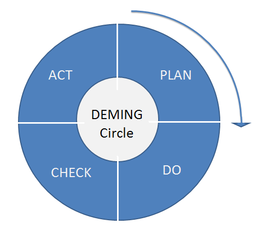
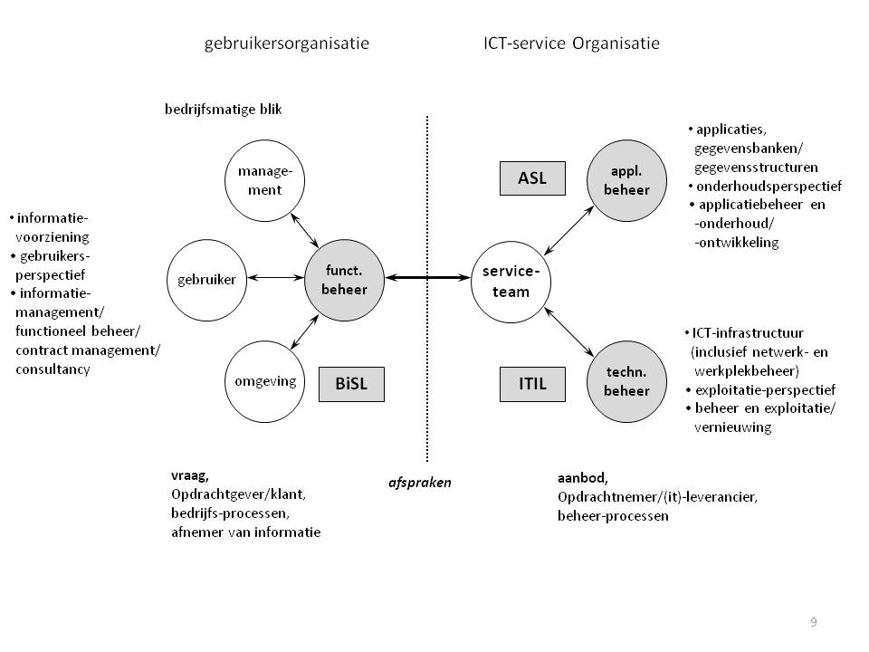
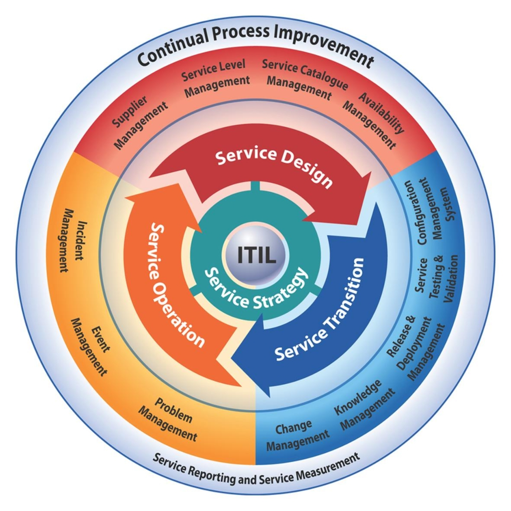
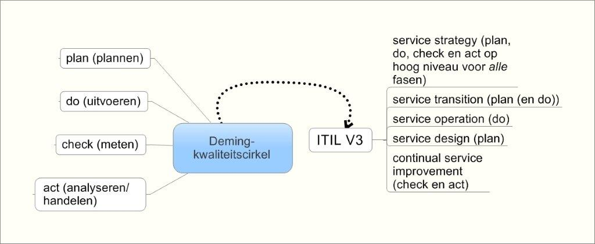
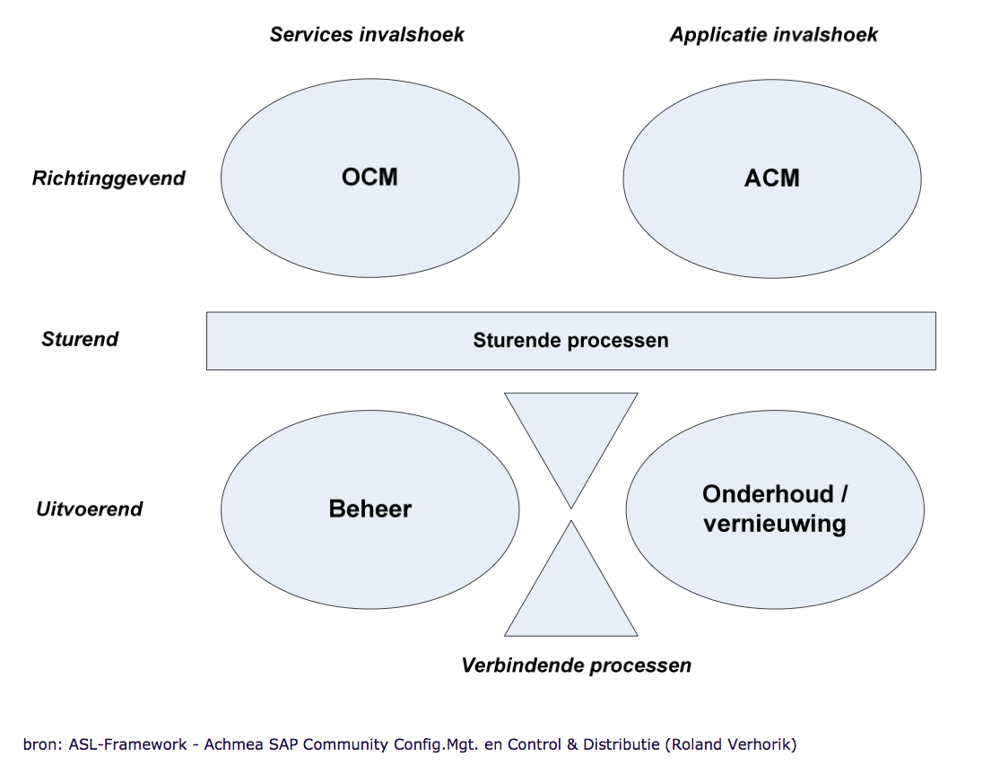
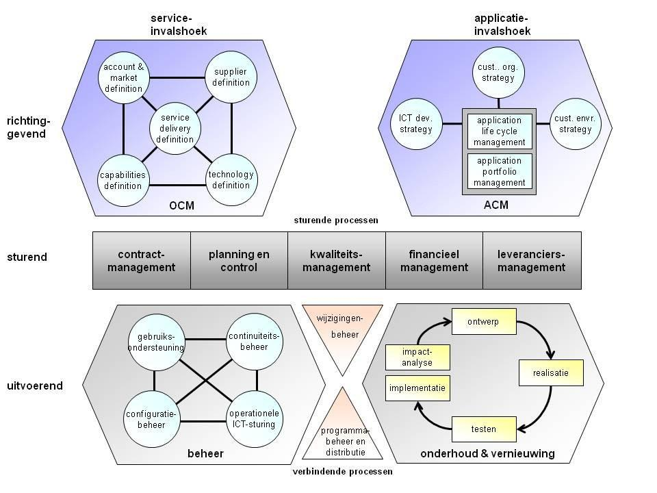
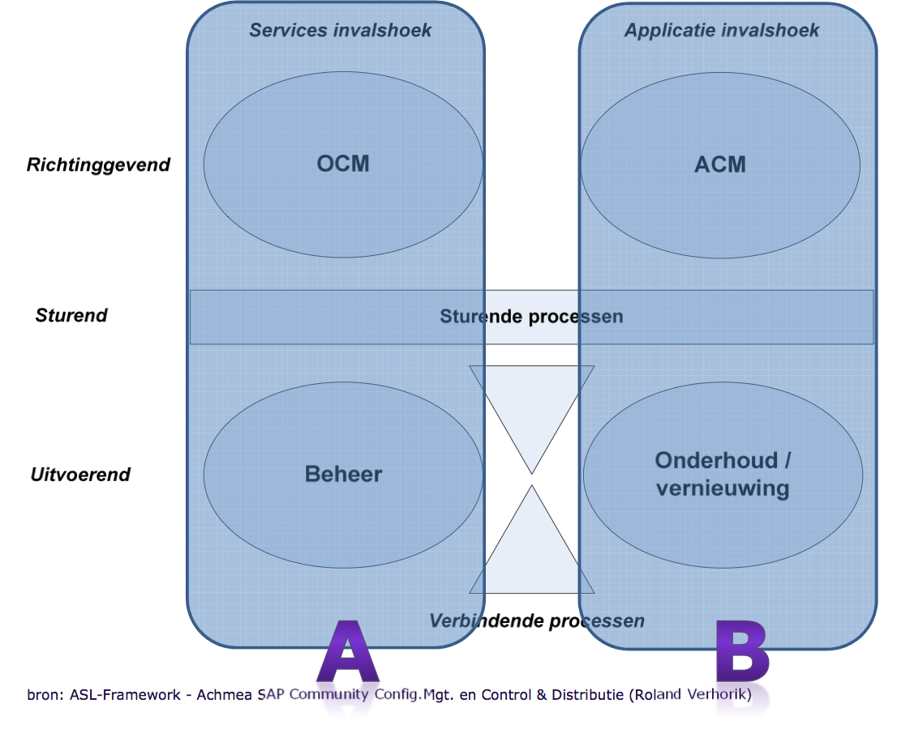
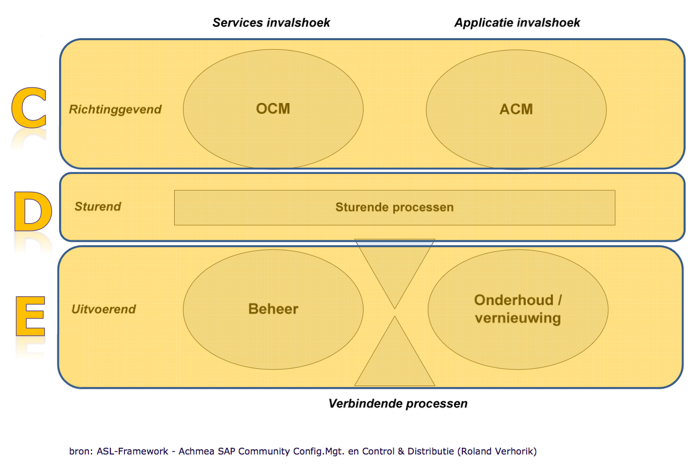
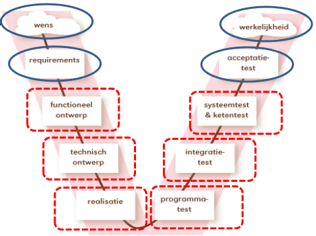
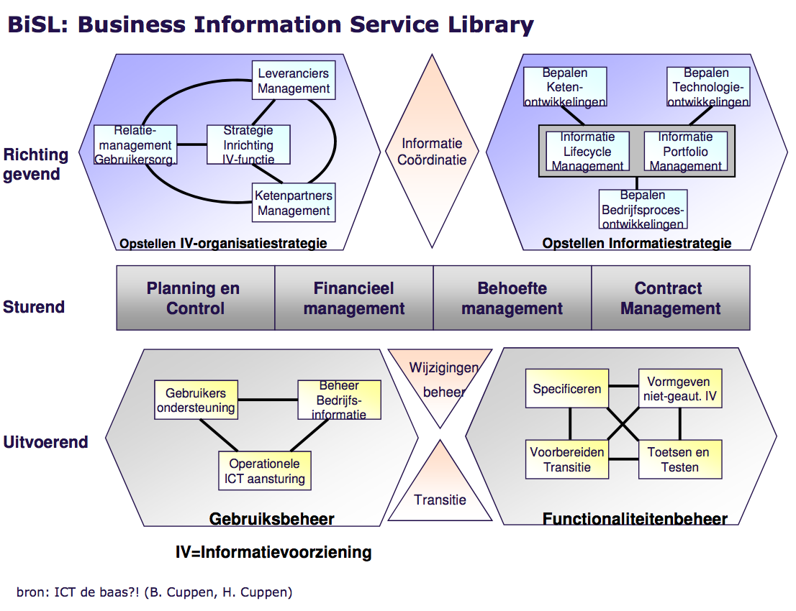

# Samenvatting ISMI

## Stof

* Boek ICT de baas
* Slides hoorcolleges
* Documenten ELO

## Inhoud om te leren

* [Basisbegrippen](#basisbegrippen)
	* beheer, proces, product, dienst, informatiesysteem, kwaliteit, PDCA-cyclus, best practices
* [ITIL v3](#itilv3)
	* Hoofdlijnen en basisbegrippen
	* Implementatie
	* Service-productie (SP)
	* Overige fasen (SS, SO, ST, CSV)
* Service measurement
* [ASL v2](#aslv2)
	* Hoofdlijnen
	* ASL vs ITIL
	* Implementatie
	* Beheerprocessen
	* Onderhoud en vernieuwing
	* Overige procesclusters (VP, SP, ACM, OCM)
* [BiSL](#bisl)
	* Hoofdlijnen
	* vs ASL vs ITIL
	* Gebruiksbeheer
	* Functionaliteitenbeheer
	* Verbindende processen
	* Overige procesclusters (SP, OIS, OIVS, IC)
* [ICT-governance](#ict-governance)

## Het vak

Het vak ISMI (ICT Service Management Introductie) richt zich op het beheer van ICT-dienstverlening binnen organisaties. Hierbij komen de frameworks (geen methodologieën) `ITILv3`, `ASLv2` en `BiSL` kijken.

## Basisbegrippen

### Organisatie

> Elke een vorm van menselijke samenwerking met een gemeenschappelijk doel.

Een organisatie is een zelfstandig, georganiseerd geheel van mensen en middelen. (Zie `IIBPM`) Organisaties kunnen zich op een aantal manieren manifesteren. Het kunnen commerciële bedrijven zijn, maar bijv. ook overheden, non-profits of verenigingen.

### Proces

> Een proces is een [gestructureerd] geheel van samenhangende (of elkaar beïnvloedende) activiteiten, dat input omzet in output.

Het heeft in het verlengde hiervan als doel strategie te concretiseren of te realiseren.

Een proces kan van alles zijn, van iets concreets als reparatie van een auto tot iets ongrijpbaars als de veiligheid van een school. De activiteiten die het proces vormen kunnen op verschillende afdelingen plaatsvinden; het proces kan door de hele organisatie lopen.

ICT wordt gebruik om bedrijfsprocessen te ondersteunen en zododende bedrijfsdoeleinden te bereiken.

### Informatiesysteem

Een set aan elkaar gerelateerde componenten waarmee informatie wordt verzameld, gezocht, verwerkt, opgeslagen en verspreid.

Bij informatiesystemen komen de volgende componenten kijken:

* Hardware
* Software
* Data
* Procedures
* Mensen

## PDCA-cyclus

Ook wel bekend als Deming-cyclus (bedacht door Edwards Deming). Deze cyclus zet verbetering binnen een organisatie in gang en houdt dit zo. Bestaat uit de volgende stappen:

1. Plan		(Afspreken/plannen welke doelstellingen je wilt bereiken en hoe je dat wilt doen)
2. Do			(Doen/uitvoeren en de resultaten meten)
3. Check		(Evalueren. Vergelijk de realiteit met de norm die je stelde)
4. {Pro,Re}Act	(Reflecteren, of bijsturen om de geplande doelen te bereiken)

De PDCA-cyclus wordt binnen `ITILv3` in de gehele levenscyclus toegepast. De cyclus is hierbinnen belangrijk omdat ze gericht is op kwaliteitsgarantie- en verbetering binnen een organisatie.

_Zie pagina's 10 en 11 uit het boek_

## Negenvlaksmodel

Ook wel bekend als het Amsterdams informatiemanagementmodel (AIM). Het negenvlaksmodel is een raamwerk waarmee de relatie tussen een organisatie en haar informatievoorziening bestudeerd kan worden.

## Beheermodel van Looijen

Looijen introduceerde de gebieden:

* Applicatiebeheer
* Functioneel beheer
* Technisch beheer

Het model (figuur) laat de samenhang tussen deze drie zien:

### Functioneel beheer

Functioneel beheer houdt in dat alle functies van een informatiesysteem goed werken, en zonodig vernieuwd/verbeterd/toegevoegd worden.

Het is [namens de gebruikersorganisatie?] verantwoordelijk voor het in stand houden en vernieuwen van [de functionaliteit van] een informatiesysteem. Hiermee zorgt het ervoor dat een informatiesysteem goed blijft aansluiten op bedrijfsprocessen. 

De instandhouding van de informatievoorziening moet ook tegen aanvaardbare kosten en kwaliteit gebeuren, tijdens de gehele levenscyclus. Functioneel beheer werkt dus eigenlijk als eigenaar en opdrachtgever voor het informatiesysteem.

### Applicatiebeheer/applicatiemanagement

Is het [tegen overeengekomen kosten en kwaliteit] onderhouden van applicaties, programma's en databases, tijdens de levenscyclus van informatiesystemen. Binnen ASL heet dit _applicatiemanagement_.

### Technisch beheer/infrastructuurmanagement

Moet de technische infrastructuur (die noodzakelijk is voor de bedrijsapplicaties/diensten/informatiesystemen) in stand houden, tegen aanvaardbare kosten en kwaliteit. Binnen ASL heet dit _infrastructuurmanagement_.

## Inrichting van ICT-beheer

.jpg)

Primair processen: Leveren rechtstreeks een bijdrage aan (totstandkoming van) het product/dienst. (`IIBPM`)

### Als een restaurant

Volgens deze metafoor kun je ICT-beheer vergelijken met een restaurant. Er is een menu (servicecatalogus) waarvan je dingen (services) kunt bestellen; vervolgens wordt dat voor je samengesteld (componenten) en geleverd. De menukeuze baseer je o.a. op prijs/budget, het soort dienst en hoeveel tijd je hebt om het te 'consumeren'.

## Keuzecriteria bij I(C)T-Diensten

Het boek is voorstander van de volgende vier criteria [bij het selecteren van ICT-diensten].

### Functionele eisen

Een ICT-dienst moet over bepaalde functionaliteit beschikken. De doelgroep bepaalt meestal de functionaliteit.

### Kwaliteitseisen

Even belangrijk als de functionele eisen zijn de kwaliteitseisen (ook wel prestatie-eisen), dit zijn voorwaarden waaronder een ICT-dienst moet functioneren. Dit is een ISO-norm geworden:

.jpg)

### Technische eisen

Deze eisen gaan over alle technische componenten, datastromen en technische interfaces. Business-IT'ers willen hier niks van weten, daarom zijn er maar twee zinnen over geschreven. Het gaat bijv. om eigenschappen van de:

* Hardware
* Software
* Netwerk
* Datacommunicatie
* Enzovoort

### Leverancierseisen

Dit kan over interne of externe leveranciers gaan. Het zijn eisen die aan de leveranciers gesteld worden, zoals hun reputatie, kennis, kunde, ervaring, service en support.

## Inrichting van ICT-servicemanagement

_Voor nu overgeslagen aangezien het geen formele methodologie is. (pagina 18 boek)_

## Business case

Binnen ITIL is dit een "besluitvormings- ondersteunings- en planningsinstrument". Het wordt gebruikt om de aannemelijke consequenties van een business actie inzichtelijk te maken. Ook kan het een aanzienlijke uitgave rechtvaardigen. De _business case_ bevat informatie over de kosten, baten, opties, issues, risico's en mogelijke problemen.

Binnen ASL wordt er onderscheid gemaakt tussen de volgende twee _business cases_:

Een _business case_ van de klant verbindt kosten aan de door de klant afgenomen dienstverlening.

Een _business case_ van de leverancier/applicatiemanagement beschrijft de wijze waarop een ICT-organisatie de kosten doorbelast naar diensten en producten die worden afgenomen.

## SLA

Een SLA (Service Level Agreement) is een schriftelijke overeenkomst tussen een IT-serviceprovider en een klant over de services die geleverd/ontvangen worden. Het beschrijft op een hoog niveau welk dienstenniveau er geleverd dient te worden.

Denk hierbij aan een beschrijving van de services, de servicelevel-doelstellingen en de verantwoordelijkheden van de IT-serviceprovider en de klant. Een SLA kan betrekking hebben op meerdere IT-serviceproviders en/of klanten.

Er zijn drie typen SLA's:

* Service based SLA's
	* Gaan om een service voor alle klanten, bijvoorbeeld bij ELO.
* Customer based SLA's
	* Betreft alle door een specifieke klant gewenste diensten.
* Multilevel SLA's
	* Zijn een mix van het bovenstaande.

Monitoring van systemen staat niet in detail in de SLA, hier is de [...] voor.

## OLA

Een OLA (Operational level agreement) beschrijft de te leveren goederen of _services_, en de verantwoordelijkheden van beide partijen (IT-serviceprovider en klant) om de levering te ondersteunen.

Voorbeeld: er wordt een OLA afgesloten tussen een IT-serviceprovider en inkoopafdeling om hardware te verkrijgen binnen overeengekomen tijden of tussen een servicedesk en een ondersteuningsgroep om een incident op te lossen binnen overeengekomen tijden.

## UC

Een UC (_Underpinning Contract_) is een contract tussen een IT-serviceprovider en een derde partij. De derde levert goederen of services ter ondersteuning van de levering van IT-service aan een klant.

Het UC omschrijft de doelstellingen en verantwoordelijkheden vereist voor het voldoen aan de in een SLA overeengekomen servicelevel-doelstellingen.

## ITILv3

ITIL (Information Technology Infrastructure Library) is een _library_, een generieke beschrijving van beheerprocessen [gericht op ICT-infrastructuur]. Het is op zichzelf **geen** implementatiemethode.

Het is een groep van modellen, processen en concepten die een kader bieden voor het inrichten en verbeteren van ICT-processen [binnen een organisatie].

Kenmerken van ITIL zijn:

* wordt wereldwijd gebruikt (!)
	* binnen verschillende industrieën.
* Het is onafhankelijk van platformen en leveranciers.
* Is geschikt voor zowel kleine als grote organisaties.
* Maakt gebruik van bestaande standaarden.

ITIL heeft de volgende mogelijke voordelen als het geïmplementeerd wordt:

* Betere ROI (Return On Investment)
* Continue serviceverbetering (zie fase 5 van ITIL)
* Verbeterde diensten en klanttevredenheid
	* Levering van kwalitatieve diensten
* Verhoogde beschikbaarheid van IT-diensten

### Hoofdlijnen en basisbegrippen

De Deming-cyclus is het uitgangspunt van de structuur waarin processen zijn uitgewerkt. De vijf levensfasen van ITIL zijn:

1. Service strategy (Servicestrategie)
	* Strategische planning van servicemanagement.
	* Afstemmen van IT-services op businessstrategie.
2. Service design (Service-ontwerp)
	* Ontwerp en ontwikkeling van IT-services.
3. Service transition (Servicetransitie)
	* Planning en uitvoering van de transitie (het in productie nemen) van IT-services.
4. Service operation (Serviceproductie)
	* Beschrijving van dagelijkse IT-beheeractiviteiten.
5. Continuous Service improvement (Continue serviceverbetering)
	* Best practice-benadering voor het meten, evalueren en verbeteren van IT-services.

#### Servicestrategie

Keuzes maken die een langdurig effect hebben op het bedrijf en hoe het daarmee zal gaan. IT moet op één lijn gebracht worden met bedrijfsbehoeftes. Servicestrategie brengt de volgende vragen op:

* Erkennen wij concurrenten en zijn we concurrerend?
* Welke diensten moeten aan wie geleverd worden?
* Hoe creëren we **waarde voor onze klanten** en stakeholders?
* Hoe kan financieel management helderheid en controle verschaffen over waardecreatie?
* Hoe geven de de **klant** de indruk dat hij **waarde** krijgt voor zijn geld.
* Hoe verantwoorden we strategische inversteringskeuzes?
* Hoe definiëren we servicekwaliteit [zo concreet mogelijk]?

De nadruk ligt op **waarde** creëren/toevoegen. Middelen (assets) worden omgezet naar _services_, waarde voor de klant.

Onder servicestrategie vatten we de volgende _subprocessen_:

1. Demand management
	* Aanbod **afstemmen** op de vraag
	* **Voorspellen** van vraag
	* Bedrijfsprocessen zijn **bepalend** bij de vraag naar IT-diensten
2. Financial management
	* Het **kostenplaatje specificeren**
	* Waarde van de middelen geven
	* Demandmodelling en -management mogelijk maken
	* **Meer info over vragen!**	
3. Risk management en strategy generation
4. Service portfolio management

##### Wat is strategie?

Strategie wordt gedefinieerd met de **5 P's van Henry Mintzberg (1987)**:

1. Plan
	* Een strategie geeft richting aan en benoemt toekomstige acties. Dit is de beoogde strategie.
2. Patroon
	* Kijkt terug en beschrijft de in het verleden uitgevoerde acties als consistent gedrag in de loop van tijd. Dit is de uitgevoerde strategie.
3. Positie
	* Koppelen van producten aan markten. De strategie positioneert de organisatie [in de omgeving].
4. Perspectief
	* Intern gericht. Dit is de manier waarop [de leiding van] de organisatie de wereld beschouwd.
5. Ploy (truc, listigheid)
	* Het spel van zet en tegenzet tussen concurrerende organisaties.

#### Service-ontwerp

Service-ontwerp is de leidraad om de huidige en toekomstige vereisten van de klant te integreren in de IT-dienstverlening. Het ontwerp en de ontwikkeling van IT-services en de 'servicemanagementprocessen' worden erin besproken.

Het komt vooral overeen met de 'plan'-stap uit de Deming-cyclus.

#### Servicetransitie

Servicetransitie gaat (zoals de naam al zegt) over manieren om de overgang naar een nieuwe of gewijzigde IT-dienst te maken. Denk hierbij aan planning en uitvoering van handelingen. Binnen ITIL omvat servicetransitie een aantal 'best practices'.

Het komt vooral overeen met de 'plan'-stap, maar ook wel met de 'do'-stap uit de Deming-cyclus.

#### Serviceproductie (SP) of service operatie

Zijn de dagelijkse activiteiten die komen kijken bij het draaien van een IT-diensten omgeving. Het omvat incident-, infrastructuur- en applicatiebeheer. De focus ligt op het op efficiënte en effectieve manier ondersteunen van IT-services.

Serviceproductie gaat voornamelijk over de 'do'-stap uit de Deming-cyclus.

##### Access management

Binnen ITIL bestaat er _access management_ om gebruikers het recht te geven gebruik te maken van IT-diensten. M.a.w. om toegang tot de sytemen te regelen. De afdeling _access management_ beslist zelf niet wie toegang heeft tot welke diensten.

Er wordt gebruik gemaakt van gebruikersgroepen om meerdere gebruikers tegelijkertijd toegang te verlenen (eventueel tot een hele bundel IT-diensten).

###### Definities

* _Access_ - toegang
	* Het niveau en omvang van de functionaliteit [van een IT-dienst] die een gebruker mag gebruiken.
* _Directory service_
	* Applicatie voor het beheer van info over de IT-infrastructuur en de bijbehorende toegangsrechten van gebruikers.
* Identiteit
	* Unieke naam om een persoon, gebruiker of rol aan te duiden.
* Identiteitsbeheer
	* Zie toegangsbeheer
* Rechten
	* Bevoegdheden, toestemming toegekend aan een gebruiker of rol.
* Toegangsbeheer - _access management_
	* Het proces waarmee gebruikers toegang kunnen krijgen tot een systeem.

##### Event management

Bij _event management_ worden _events_ opgespoord en geanalyseerd. Vervolgens wordt daarop gereageerd met de juiste (management)actie. Er zijn een aantal event-typen, het boek noemt deze drie:

* Informatief event
	* Geeft een normale operatie/handeling aan.
	* Voorbeeld: Gebruiker verstuurt een mail.
* Alert (waarschuwing)
	* Een gebeurtenis die een ongebruikelijke operatie aangeeft, waarbij een drempelwaarde wordt bereikt.
	* Voorbeeld: Minder schijfruimte.
* Exception (uitzondering)
	* Iets was misgaat en niet hoort te gebeuren.
	* Komt vaak uit bij _incident management_

_Event management_ houdt dit in de gaten (bijv. in de _event log_ van een informatiesysteem) en rapporteert erover.

##### Incident management

Het doel van _incident management_ is om de dienstverlening zo snel mogelijk naar het normale, afgesproken niveau te herstellen in het geval van een incident. Incidenten kunnen via verschillende kanalen binnen komen, zoals e-mail, telefonisch of via een web-interface. Ook kan het direct van het ITIL-proces _event management_ komen.

Aan een incident wordt een hoop metadata gehangen, zoals prioriteit, urgentie, UUID, categorie, melddatum/tijd, impact, omschrijving enzovoort. (Denk aan issuetrackers)

###### Impact, urgentie en prioriteit

_Impact_ is de mate van invloed van een incident, probleem of change op de bedrijfsprocessen. Het wordt vaak gebaseerd op de serviceniveau's vastgelegd in de SLA.

_Urgentie_ is de mate waarin de oplossing van een incident/probleem uitstel kan verdragen.

Tot slot geeft de _prioriteit_ het relatieve belang van het incident/probleem/change aan.

De prioriteit wordt dus gemeten door de combinatie van **impact en urgentie**.

##### Request fulfillment

_Request fulfillment_ verwerkt de verzoeken (_service requests_) van directe gebruikers [van IT-diensten]. Doelen van _request fulfillment zijn_:

* Gebruikers een (communicatie)kanaal bieden voor het aanvragen/ontvangen van diensten.
* Communiceren naar klanten en gebruikers
	* beschikbaarheidsinformatie
	* evenals procedures hoe ze deze info verkrijgen
* Het leveren van componenten van standaard IT-diensten
	* Denk aan werkplek, applicatie...
* Helpen bij afhandeling van algememe vragen, klachten en opmerkingen.

Het proces is bedoeld om de efficiëntie in het afhandelen van standaardvragen (_service requests_ en _standard changes_) te vergroten.

Voorbeelden van serviceverzoeken zijn:

* Kunnen jullie mijn wachtwoord even resetten?
* Kan Henk toegang tot het intranet krijgen?
* Hoe kan ik dit document op de kleurenprinten dubbelzijdig en liggend afdrukken?

###### Definities

_Zie boek voor definities indien niet vermeld_

* Alarm
	* Waarschuwing dat een drempelwaarde is overschreden.
* Ernstig incident
	* Een incident met de hoogste impactcategorie.
* Escalatie
* Fucntionele escalatie
	* **Het overdragen van een incident/wijziging naar een technisch team met meer expertise.**
* Hiërarchische escalatie
	* **Het informeren of betrekken van hoger management.**
* Gebeurtenis
	* Een statusverandering die van belang is.
* Impact
* Incident
* Incidentmodel
* Prioriteit
* Serviceverzoek
* Workaround

##### Monitoring and control

##### Problem management

_Problem management_ is verantwoordelijk voor de levenscyclus van alle problemen en heeft drie doelen. Ten eerste moet het problemen/incidenten voorkómen. Het moet verder het negatieve effect van verstoringen op het bedrijfproces minimaliseren. Tot slot probeert het incidenten te voorkómen voordat ze voor het eerst optreden, door zwakke plekken [in de infrastructuur] te identifieren.

_Problem management_ bestaat uit een **reactief** en een **proactief** proces.

###### Definities

* _Known error_
	* Een probleem waarbij de onderliggende oorzaak en _workaround_ zijn vastgelegd.
* _Known Error Database_ (KEDB)
	* De _Known Error Database_ is simpelweg een database met registraties van bekende fouten.
* Problem
	* Binnen ITIL: De onbekende oorzaak van één of meer incidenten.
	* Binnen ASL: Een ongewenste situatie, die vraagt om structurele analyse en oplossing.

#### Continue serviceverbetering

Dit is een continu proces om (met best-practices) IT-dienstverlening te meten, evalueren en verbeteren. Het houdt verbetering draaiend in een organisatie.

Dit gaat over de 'check'- en 'act'-stappen uit de Deming-cyclus.

### Overige fasen

_Nog geen tekst hier_

### Begrippen van ITILv3

_Sommige van deze begrippen zijn al eerder gedefiniëerd buiten ITIL. Het kan zijn dat ITIL hier net iets andere definities voor heeft._

#### Activiteit

Een verzameling van handelingen (acties) om een bepaald resultaat te bereiken. Worden meestal als onderdeel van processen gedefinieerd.

#### Functies

De term "functie" kan drie betekenissen hebben:

1. Een functie is een team of groep mensen en de instrumenten die ze gebruiken om processen of activiteiten uit te voeren. (Zoals de servicedesk)
2. De bedoelde toepassing van een persoon, team, configuratie-item, proces of IT-service.
3. Het correct functioneren van iets.

#### Proces

Een proces is een gestructureerde verzameling activiteiten [om een bepaald doel te bereiken]. Het verandert bepaalde invoer in bepaalde uitvoer. Om dit te doen kan het rollen, verantwoordelijkheden, instrumenten en managementsturing bevatten.

#### Rol

In het geval van een rol voeren personen één of meerdere activiteiten/bevoegdheden/verantwoordelijkheden uit, en kunnen eventueel dus andere rollen aannemen.
Voorbeeld: dokter (chirurg)

#### Proces

Een gestructureerde verzameling activiteiten gericht op het behalen van een bepaalde doelstelling. Het heeft net als activiteiten bepaalde input die omgezet wordt in bepaalde output.

#### Service/IT-dienst

Services verbeteren de prestaties van een taak, of voeren zelf een taak uit. Services voegen waarde toe, en klanten zijn niet verantwoordelijk voor de specifieke kosten of risico's. Als een service gemaakt gaat worden komen de 'terms and conditions', alsmede de garanties daarvoor in de SLA te staan.

#### Service-asset

Elke vaardigheid of middel ven een serviceprovider. Leveren bijdrage aan het leveren van services. Worden ingedeeld in: management, organisatie, processen, kennis, mensen, informatie, applicaties, infrastructuur en financieel kapitaal.

#### Servicemanagement

Het vermogen om iets te doen **om iets te leveren** aan klanten, met als doel om dat 'iets' waarde toe te laten voegen voor de klant.

#### Servicemanagement-levenscyclus

Dit is het eerder besproken vijffasenmodel (van ITIL) dat alle activiteiten, processen en functies op het gebied van servicemanagement met elkaar verbindt. ITIL gaat om servicemanagement!

#### Serviceprovider

Een organisatie die diensten (services) verleent aan klanten (een of meer, intern of extern).

#### Systeem

Een verzameling van samenhangende elementen die een bepaalde doelstelling vervullen. (Computersysteem, databasesysteem)

#### Waarde/value

De kern van het begrip 'service'. (Zie ook servicestrategy) Voor de klant is dit:

* Bruikbaarheid
* Functionaliteit
* Zekerheid

## ASLv2

ASL (Application Services Library) is net als ITIL een _library_, gericht op het zo goed mogelijk ondersteunen van bedrijfsprocessen. Het is een _framework_ van _best practices_ voor applicatiebeheer. Verder heeft het ook aandacht voor de operationele en tactische processen, en strategische overwegingen.

Een verschil tussen ASL en ITIL is dat ITIL spreekt over _fasen_, maar ASL het over _procesclusters_ heeft. Hier volgt straks meer over.

### Wat is applicatiebeheer?

Applicatiebeheer richt zich op het **ondersteunen van de bedrijfsprocessen door informatiesystemen** voor de levensduur van deze bedrijfsprocessen. Dat betekent:

* Het in de lucht houden van de systemen
* Zorgen dat de systemen de dagelijkse werkzaamheden [van de organisatie] ondersteunen.

Hoofdpunten voor ICT'ers binnen ASL's applicatiebeheer zijn:

* Continue dienstverlening [op basis van goede afpraken over service levels].
* Het _voorkomen_ van storingen.
* Zo spoedig mogelijk herstel (terug naar afgesproken service levels) bij storingen.
* Het mogelijk maken van nieuwe diensten door op tijd op nieuwe dingen in te spelen.

ASL doet dit alles binnen "de levensduur van bedrijfsprocessen". Hiermee wordt het volgende bedoeld:

* Organisaties veranderen, omdat de omgeving en de markt veranderen.
* Om goed te kunnen blijven functioneren, moeten de ondersteunende applicaties meegroeien.
* Gevolg: aanpassingen van applicaties aan huidige en toekomstige technische en functionele wensen.

### Procesniveaus

Binnen ASL zijn er drie belangrijke procesniveaus:

**Dit verder uitzoeken (zie blz 116)**

* Richtinggevend niveau
	* Organization Cycle management (OCM)
		* De OCM vertaalt de _visie_ van de organisatie naar _beleid_ om zodoende de ICT-serviceorganisatie te ontwikkelen.
		* De doelen van de OCM zijn het inrichten van de applicatie beheer organisatie en het vormgeven van de toekomst van de aangeboden services.
		* De OCM _is_ een kritieke succesfactor.
		* De definitie van OCM is: De cluster van processen die zich richt op de ontwikkeling van een toekomstvisie van de ICT-serviceorganisatie en de vertaling van die visie naar beleid voor innovatie van de dienstverlening (services) van de ICT-serviceorganisatie
	* Applications Cycle management (ACM)
		* De ACM-processen richten zich op een langetermijnstrategie voor applicatiestructuur.
* Sturend niveau
* Uitvoerend niveau
	* Beheer van applicaties
	* Onderhoud en vernieuwing van applicaties
	* Verbindende processen

### Bedrijfsprocessen

ASL heeft twee aspecten:

* Het ondersteunen van bedrijfsprocessen door informatiesystemen.
	* Dit betekent dat systemen in de lucht moeten blijven.
	* En dat ze de dagelijkse werkzaamheden [van de org.] ondersteunen.
	* Er moeten goede afspraken zijn over de _service levels_.
	* Continue dienstverlening is belangrijk.

* De levensduur van bedrijfprocessen.

### Clusteringscriteria

ASL maakt onderscheid tussen:

(A) Invalshoek dienstverlening (services) en
(B) Invalshoek applicaties

Daarnaast is er ook het onderscheid tussen:

(C) Richtinggevende processen,
(D) Sturende processen en
(E) Uitvoerende processen 

### Procesclusters

ASL kent zes procesclusters:

* Beheerprocessen
	* Configuratiebeheer
	* Continuïteitsbeheer
	* Gebruikersondersteuning
	* Operationele ict-sturing
* Onderhoud en vernieuwing
	* Applicaties aanpassen bij verstoringen en op basis van nieuwe eisen/wensen.
* Verbindende processen
	* Processen die de uitwisseling tussen dagelijks beheer en onderhoud regelen.
* Sturende processen
	* Aansturing van de andere ASL-processen dmv plannen, bewaken en evalueren.
* Applications Cycle management (ACM)
	* Zorgen dat de strategie van de ICT-services en applicaties overeen komt met die van de organisatie.
* Organization Cycle management (OCM)
	* Zorgen dat er een toekomstvisie van de IT-serviceorganisatie gevormd wordt vanuit een service-invalshoek.

#### Beheerprocessen

##### Configuratiebeheer

ASL kent een CMDB en SDDB (zie onder voor afkortingen). Hierin worden service-items geregistreerd.

###### Configuratiemanagementdatabase (CMDB)

Database waarin configuratieregistraties worden opgeslagen [gedurende hun levenscyclus]. Het configuratie-management-systeem onderhoudt één of meer CMBD's, en elke CMDB bevat de kenmerken van CI’s en hun relaties met andere CI’s.

###### Service delivery database (SDDB)

Database waarin de in {services,dienstverleningsitems,service-items} uitgewerkte dienstverlening staat. De administratie van in een SLA afgesproken dienstverlening. (En nadere uitwerking hiervan in service-items)

##### Continuïteitsbeheer

Continuïteitsbeheer treft maatregelen om te voorzien in bedrijfs-proces-continuïteit. Dit doet het bijv. door:

* Kwetsbaarheden te inventariseren
* Het beveiligingsniveau te bepalen
* Backup-maatregelen te stellen
* Uitwijkmaatregelen te stellen

##### Gebruikersondersteuning

_Geen tekst._

##### Operationele ICT-sturing

Het doel hiervan is het verzorgen, bewaken en waarborgen dat applicaties het juiste gedrag vertonen. Ook zorgt het ervoor dat de dienstverlening hieromtrent conform afspraken is.

ICT-sturing beheert bedrijfszekerheid, beheersbaarheid en doelmatigheid. 

#### Onderhoud en vernieuwing

##### V-model

Het v-model is een afgeleide van de [watervalmethode](https://nl.wikipedia.org/wiki/Watervalmethode). Deze ontwikkelmethode loopt door alle fasen van wens tot werkelijkheid.

##### Impactanalyse

**Toont de gevolgen** van mogelijke wijzigingen zodat het beste veranderingsalternatief gekozen kan worden.

##### Ontwerp

Legt de (gebruikers)specificaties van de/het {informatiesysteem,applicatie,wijzingen} vast zodat de realisatie en tests op eenduidige wijze kunnen plaatsvinden.

Het belangrijkste procesresultaat is een **functioneel** (logisch) **ontwerp** waarin de de gewenste functionaliteit en kwaliteit niet-technisch wordt beschreven.

##### Realisatie

Wijzigingen die van andere afdelingen komen omzetten in concrete wijzigingen. (?)

##### Testen

Borgen dat wijzigingen conform specificaties zijn gerealiseerd en de software het juiste gedrag vertoont. Omvat ook de documentatie!

##### Implementatie

Invullen van de nodige randvoorwaarden voor de ingebruikname van de nieuwe appl. versie.

### Samenhang van het framework

**Figuur op blz 120 bekijken**

### Definities

Applicatie en applicatiebeheer zijn hetzelfde als bij ITIL.

Applicatieobject: een onderdeel van een applicatie zoals sources of scripts.

Richtinggevende processen: procesclusters waarin de toekomst voor de applicaties (ACM) en applicatiebeheerorganisatie (OCM) wordt bepaald.

### Onderhoud

ASL heeft het een en ander te zeggen over het onderhoud van informatiesystemen. Zo kan onderhoud in de volgende categorieën vallen:

* Adaptief - Het aanpassen van een informatiesysteem aan de omgeving
* Additief - De functionaliteit uitbreiden of wijzigen
* Correctief - Afwijkingen in componenten herstellen
* Perfectief - Het aanpassen van een component aan veranderende kwaliteitseisen van gebruikers
* Preventief - Het corrigeren van comonenten zonder aanleiding van een probleemrapport, met als doel het voorkomen van toekomstige problemen of het verhogen van onderhoudbaarheid.

### ASL2 vs ITILv3

### Implementatie

Net als bij ITIL wordt de implementatie van ASLv2 niet beschreven. Het implementeren van ASLv2 pak je projectmatig aan.

## BiSL

BiSL (Business Information Service Library) is een framework met _best practices_ (net als ITIL en ASL), gericht op het functioneel beheer van IT-diensten. Het slaat een brug tussen ICT en bedrijfsproces, en tussen functioneel beheerders en informatiemanagers.

### Hoofdlijnen

### Procesclusters

BiSL kent de volgende 7 procesclusters:

1. Gebruiksbeheer
	* Processen die ervoor zorgen dat de informatievoorziening doet wat het moet doen.
2. Functionaliteitenbeheer (onderhoud en vernieuwing)
	* Onderhouds- en vernieuwingsprocessen waar de informatievoorziening wordt aangepast aan nieuwe eisen en wensen.
3. Verbindende processen op uitvoerend niveau
	* Regelen uitwisseling tussen gebruiksbeheer en functionaliteitenbeheer.
4. Sturende processen
	* Planning en control, financieel management behoeftemanagement en dienstverleningafpsraken met de ICT-leverancier.
5. Opstellen IV-organisatiestrategie
	* Bepalen hoe de sturing op de informatievoorziening moet worden georganiseerd.
6. Opstellen informatiestrategie
	* Bepalen van de strategie t.a.v. de informatievoorziening [op lange termijn].
7. Informatiecoördinatie
	* Verbindend proces op richtinggevend niveau; de afstemming van organisatie en vormgeving van de richtinggeving aan de informatievoorziening.

### BiSL vs ASL vs ITIL

_Nog geen tekst_

### Gebruiksbeheer

Dit proces houdt de informatievoorziening operationeel.

Belangrijke rol: functioneel beheerder

### Functionaliteitenbeheer

Zorg dragen voor de uitwerking en verandering van de gewenste wijzigingen aan de informatievoorziening. Primair verantwoordelijk voor de afstemming van de informatievoorziening op het bedrijfsproces.

#### Informatievoorziening (IV)

Een Informatievoorziening (IV) kan betrekking hebben op tweetal onderwerpen:

- geautomatiseerde IV
- niet-geautomatiseerde IV (maakt deel uit van totale IV en is de afstemming op de geautomatiseerde IV is van groot belang)

#### Processen

Processen binnen functionaliteitenbeheer hebben betrekking op twee aandachtsgebieden.

- vormgeven; vormgeven gewenste verandering functionaliteit
- overdragen; initiëren en voorbereiden van de gewenste transitie

Vier processen binnen functionaliteitenbeheer:

- Specificeren; vormgeven van de gewenste wijziging in functionaliteit
- Vormgeven niet-geautomatiseerde IV; beschrijven van de werkzaamheden binnen het proces van IV
- Toetsen en testen; onderzoeken of wijziging voldoet aan gestelde eisen
- Voorbereiden transitie; implementeren en verankeren

		Bron: http://www.examenvragen.info/bisl-foundation/bisl-samenvatting/functionaliteitenbeheer.html

### Verbindende processen

### Overige procesclusters (SP, OIS, OIVS, IC)

## ICT-governance

ICT veranderd steeds meer van _vraaggestuurd_ naar _aanbodsgestuurd_ (zie plaatje in het boek).

# Minitoetsen #

## College 1 ##

1 Wat is volgens het boek een informatiesysteem?

*Een informatiesysteem is een set aan elkaar gerelateerde componenten die informatie
verzamelen (zoeken), verwerken, opslaan en verspreiden.*

2 Hoe wordt een techniek, werkmethode, proces of activiteit die zich als effectiever heeft
bewezen dan enige andere techniek, methode etc. ook wel genoemd?

*Een best practice*

3 Op het Malieveld in Den Haag staan docenten met spandoeken en een megafoon te
protesteren tegen bezuinigingen in het onderwijs. Welke bewering is correct?

*Er is hier sprake van een organisatie.*

4 Welke uitspraak over een proces is correct?

*Een proces heeft altijd een (betalende) klant.*

5 Welke uitspraak over ELO is correct?

*ELO is een informatiesysteem omdat het uit applicatieprogrammatuur, hardware, een
netwerk, procedures en mensen bestaat die ELO beheeren en gebruiken.*

6 Welke uitspraak over ITIL V3 is correct?

*Service Operation beschrijft de dagelijkse IT-beheeractiviteiten.*

7 Wat is het doel van het gebruiken van de PDCA-cyclus?

*Verbetering van kwaliteit.*

8 Welke uitspraak is correct?

*Een utility is functionaliteit.en warranty is zekerheid.*

9 Wat is geen kenmerk van ITIL V3?

*ITIL V3 wordt met name in Nederland en Engeland gebruikt.*

10 Welke uitspraak over beheermodel van Looijen is correct?

*Het beheermodel van Looijen verdeelt het IT-beheer in Functioneel beheer, Technisch
beheer en Applicatiebeheer.*

## College 2 ##

1 Wat is geen onderdeel van het beheermodel van Looijen?

*Proces beheer*

2 Welke uitspraak is correct?

*In de KEDB worden alle situaties vastgelegd die kunnen leiden tot incidenten en
problems.*

3 Welke uitspraak is correct?

*Bij een incident worden impact en urgentie gebruikt om prioriteit toe te kennen.*

4 Wat is de beste definitie van een event?

*Statusverandering die van belang is voor het management van IT-service*

5 Wat zijn de fasen van ITIL V3?

*Service Strategy, Service Design, Service Transition, Service Operation, Continuous
Service Improvement*

6 Welke uitspraak is correct?

*Een utility is functionaliteit.en warranty is zekerheid.*

7 Bij de servicedesk vraagt een gebruiker een nieuw wachtwoord aan. Binnen welk ITILproces
wordt dit afgehandeld?

*Request Fulfilment*

8 Bij de servicedesk meldt een gebruiker dat een printer defect is. Binnen welk ITIL-proces
wordt dit afgehandeld?

*Incident Management*

9 Op basis waarvan wordt de prioriteit van een incident bepaald?

*Urgentie en impact*

10 Welke uitspraak over escalatie is correct?

*Bij een functionele escalatie worden een of meer gespecialiseerde IT-ers ingeschakeld.*